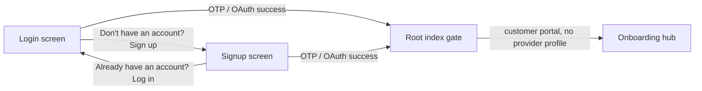

# Provider app – authentication

Every screen under `(app)/*` is behind authentication. There are no unauthenticated app routes.

## Flow

1. **Root**  
   User lands on `index` → if no session, redirect to `/(auth)/login`. If session, check portal (provider/customer/admin) and profile, then redirect to `(app)/(tabs)/dashboard` or `(app)/onboarding` (hub). **Full provider onboarding** runs in **`/(app)/onboarding/wizard`** (native steps + API draft/submit). Singular / deep links: `onboarding` → hub, `onboarding/wizard` or `screen=onboarding-wizard` → wizard.

2. **App layout** `(app)/_layout.tsx`  
   - If auth is still loading → show "Checking authentication…".  
   - If no session → `<Redirect href="/(auth)/login" />`.  
   - Otherwise render: `AccountStatusGuard` → `RoleGate` → `ProviderProvider` → app content.

3. **RoleGate**  
   Calls `GET /api/me/role`. If role is not `provider_owner` or `provider_staff`, shows "Provider access only" and Sign out. Prevents customer/admin sessions from using the provider app.

4. **AccountStatusGuard**  
   Calls `GET /api/me/account-status`. If suspended or deactivated, signs out and redirects to login with `?suspended=1` or `?deactivated=1`.

5. **Auth routes** `(auth)/*`  
   If user has a session, `(auth)/_layout` redirects to `/` so login/signup are not reachable when logged in.

### Login ↔ signup (provider app)

- **Login** (`/(auth)/login`): primary path is phone OTP; email supports login and signup via an `isSignup` toggle. Footer CTA **"Don't have an account? Sign up"** navigates to `/(auth)/signup` (with optional `return_to`).
- **Signup** (`/(auth)/signup`): real screen (not a redirect). Supports phone OTP, email/password + terms, and Google/Apple OAuth. Before verify, persists `PENDING_SIGNUP_SOURCE_KEY = "provider_mobile"` so post-auth profile patch can record signup source.
- **After auth**: both login and signup call `router.replace("/")`. Root `index` resolves portal via `/api/me/portal`; new users without a provider profile land on **`/(app)/onboarding`** (hub), then **`/(app)/onboarding/wizard`** for full setup.
- **Unified OTP on login**: Supabase may auto-create accounts on first OTP verify; explicit signup is still offered for users who prefer email/password or marketing deep links to `/(auth)/signup`.
- **Error paths**: when login OTP fails with no-account / signups-disabled errors, Alert may offer navigation to signup with prefilled phone/email (customer parity).

## API requests

- All requests go through `@/lib/api-client`, which:
  - Uses `getAccessToken()` (Supabase `getUser()` then `getSession()`) so the token is validated/refreshed before each request.
  - On 401: refreshes session, retries once; if still 401 or refresh fails with session error, calls `supabase.auth.signOut()`, so the app layout re-renders and redirects to login.
- Hooks `useApi`, `useApiMutation`, `useApiPost` use this client, so every screen that fetches data is authenticated.

## OAuth callback

- `auth/callback` receives the OAuth redirect, calls `exchangeCodeForSession` or `setSession`, then (on native) waits 50ms before `router.replace("/(app)/(tabs)")` so `AuthProvider`’s `onAuthStateChange` can run and the app layout sees the new session.

## Singular smart links & deep links

Routing is implemented in `src/lib/singular.ts` (`buildProviderRoute`) and wired from `SingularLinkHandler` in the `(app)` layout.

| Destination | `screen` URL parameter | Deeplink path (no leading slash; query stripped) |
|-------------|-------------------------|---------------------------------------------------|
| Onboarding hub | `onboarding` | `onboarding` |
| Full native wizard | `onboarding-wizard` or `onboarding_wizard` | `onboarding/wizard`, `onboarding-wizard`, or `onboarding_wizard` |

`buildProviderRoute` sets an internal `screen` value from the `screen` URL parameter when present, otherwise from the deeplink path; some routes (e.g. wizard) also match explicit path forms such as `onboarding/wizard`. Users without a session still hit the `(app)` auth gate and are sent to `/(auth)/login`.

## External browser links

- Used only for unavoidable hosted flows (for example subscription checkout, invoice documents, or hosted verification pages).
- The app opens these links in the **device browser** via deep-link/URL launch. Core onboarding and settings journeys remain native.

## Verification checklist

- **No session** → Open app or navigate to any (app) route (including via deep link) → must redirect to `/(auth)/login`.
- **Session + wrong role** (e.g. customer) → RoleGate shows "Provider access only" and Sign out.
- **Session + suspended/deactivated** → AccountStatusGuard signs out and redirects to login with query param.
- **OAuth sign-in** → After callback, user lands on (app)/(tabs) without flashing back to login.
- **401 from API** (e.g. token revoked) → Next request refreshes then retries; if still 401, sign out and redirect to login.
- **Logged in and opening /login** → (auth) layout redirects to `/`.
- **Singular link** → Opens mapped `(app)` route; unauthenticated users redirect to login (same as any deep link).
