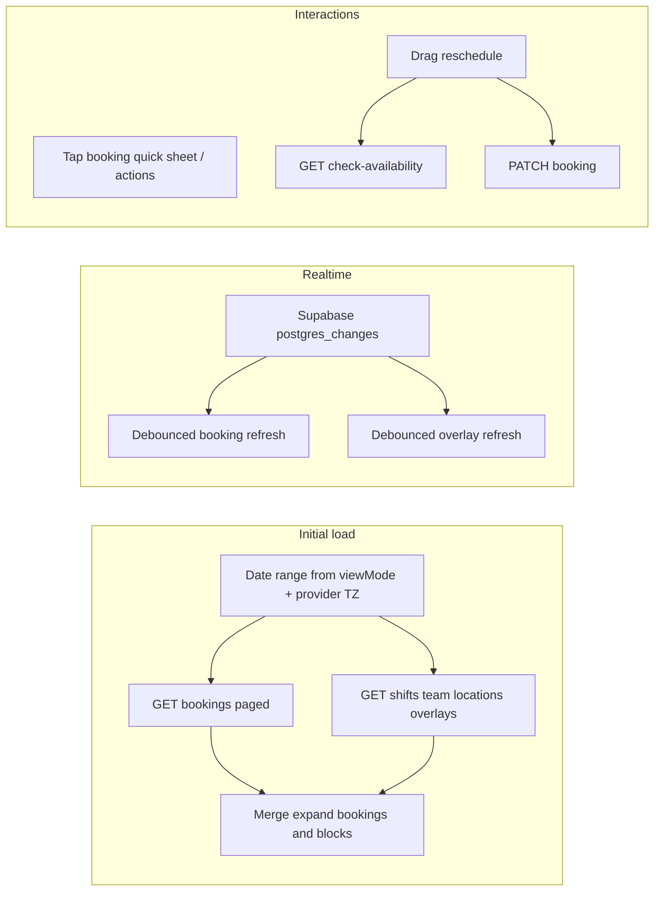

# Provider app calendar — audit outcome document

**Scope:** The primary implementation is [`apps/provider/app/(app)/(tabs)/calendar.tsx`](../app/(app)/(tabs)/calendar.tsx) (~3.8k lines), supported by hooks under [`apps/provider/src/hooks/`](../src/hooks/), calendar components under [`apps/provider/src/components/calendar/`](../src/components/calendar/), and Next.js API routes in [`apps/web/src/app/api/provider/`](../../web/src/app/api/provider/). External Google/Outlook/Apple **sync** is configured from **Settings → Calendar Integration**, not from the calendar tab itself ([`docs/CALENDAR_INTEGRATION.md`](../../../docs/CALENDAR_INTEGRATION.md)).

**Prior engineering audit:** [`apps/provider/docs/CALENDAR_HARDENING_REPORT.md`](./CALENDAR_HARDENING_REPORT.md) documents timezone/recurrence fixes and cache invalidation work (2026).

---

## 1. Functional intention

The provider calendar is the **operational schedule view** for a salon/mobile business: see appointments for a chosen date range, staff columns, location filters, and **non-booking overlays** (shifts, recurring time blocks, availability blocks, staff PTO/days off, checkout **booking holds**). It supports **drag reschedule** with server-side availability checks, **status workflows** (e.g. start/complete service, cancel with reason), **quick sheet** preview without leaving the tab, **preferences** (colors, grid, display), and **deep links** (`?date=`, `?booking_id=`) for notifications.

Design principle: **provider timezone** drives civil dates (“today”, deep links, hold expiry labels), matching web parity helpers in [`apps/provider/src/lib/provider-calendar-parity.ts`](../src/lib/provider-calendar-parity.ts).

---

## 2. API surface (used by or adjacent to the calendar tab)

### 2.1 Core schedule data

| Endpoint | Role |
|----------|------|
| `GET /api/provider/bookings?start_date=&end_date=` (+ optional `location_id`, `location_type=at_home`) | Paginated booking list for the visible window; [`usePagedProviderBookings`](../src/hooks/usePagedProviderBookings.ts) walks offset pages (max 1000/request per backend contract). Requires `view_calendar` permission on GET handler ([`apps/web/src/app/api/provider/bookings/route.ts`](../../web/src/app/api/provider/bookings/route.ts)). |
| `PATCH /api/provider/bookings/[id]` | Reschedule, status edits; ties into availability cache invalidation (see hardening report). |
| `POST /api/provider/bookings/[id]/start-service`, `.../complete-service` | Operational transitions from calendar actions. |
| `GET /api/provider/bookings/check-availability` | Pre-flight for drag reschedule / creates; uses [`evaluateProviderSlotAgainstGrid`](../../web/src/lib/provider-booking/compute-provider-slot-grid.ts) + hold overlap checks ([`apps/web/src/app/api/provider/bookings/check-availability/route.ts`](../../web/src/app/api/provider/bookings/check-availability/route.ts)). |

### 2.2 Team, locations, shifts

| Endpoint | Role |
|----------|------|
| `GET /api/provider/team` (+ optional `location_id`) | Staff list for columns/filtering. |
| `GET /api/provider/locations` | Location picker / filter. |
| `GET /api/provider/shifts?week_start=` | Operating hours overlay; two week-start values fetched when the visible range spans two ISO weeks. |
| `GET /api/provider/waiting-room/count` (+ optional `location_id`) | Badge/count ancillary to calendar context. |

### 2.3 Overlays (blocks, unavailability, holds)

| Endpoint | Role |
|----------|------|
| `GET /api/provider/time-blocks?date_from=&date_to=` (+ location params as implemented) | Raw rows including `recurring_pattern`; client expands via [`expandTimeBlocksForCalendarRange`](../src/lib/expand-time-blocks.ts). |
| `GET /api/provider/availability-blocks?...` | Provider-editable availability segments (mirrors public booking usage). |
| `GET /api/provider/calendar/staff-unavailability?date_from=&date_to=` | `staff_time_off` + `staff_days_off` merged into display segments ([`staff-unavailability/route.ts`](../../web/src/app/api/provider/calendar/staff-unavailability/route.ts)). |
| `GET /api/provider/calendar/booking-holds?date_from=&date_to=` | Active/consuming holds as ghost overlays ([`booking-holds/route.ts`](../../web/src/app/api/provider/calendar/booking-holds/route.ts)). |

### 2.4 Mutations from calendar UI

| Endpoint | Role |
|----------|------|
| `POST /api/provider/time-blocks`, `DELETE /api/provider/time-blocks/[id]` | Create/delete calendar time blocks. |
| `PATCH /api/provider/availability-blocks/[id]`, `DELETE ...` | Edit/delete availability blocks (when editing overlays). |

### 2.5 Preferences (display settings)

| Endpoint | Role |
|----------|------|
| `GET/PATCH /api/provider/settings/calendar-preferences` | Persists JSON in `provider_settings.calendar_preferences` ([`calendar-preferences/route.ts`](../../web/src/app/api/provider/settings/calendar-preferences/route.ts)); [`useCalendarPreferences`](../src/hooks/useCalendarPreferences.ts) merges server + AsyncStorage fallback. |

### 2.6 Not primary calendar grid but “calendar product” APIs

Under [`apps/web/src/app/api/provider/calendar/`](../../web/src/app/api/provider/calendar/) also exist **sync**, **links**, **color-schemes**, **auth/callback** — used by **Calendar Integration** and booking-link settings, not by [`calendar.tsx`](../app/(app)/(tabs)/calendar.tsx) tab logic directly.

---

## 3. Database entities (read/write paths)

Relevant **PostgreSQL / Supabase `public`** tables inferred from API routes and realtime subscriptions:

| Table | Calendar usage |
|-------|----------------|
| `bookings` | Appointment rows; filtered by `provider_id`. |
| `booking_services` | Multi-service expansion for stacked calendar rows (`expandBookingsForCalendar`). |
| `booking_holds` | Checkout ghost slots (`active`, `consuming`). |
| `time_blocks` | Breaks/blocks; recurrence expanded client-side. |
| `availability_blocks` | Staff availability / blocked segments. |
| `staff_time_off`, `staff_days_off` | PTO / single-day off → staff-unavailability API. |
| `staff_shifts`, `staff_schedules` | Shift overlay sources (via shifts API + realtime). |
| `provider_settings` | `calendar_preferences` JSON for persisted UI prefs. |

**External calendar connector storage** (separate feature): `calendar_syncs`, plus OAuth tokens — see [`docs/CALENDAR_INTEGRATION.md`](../../../docs/CALENDAR_INTEGRATION.md).

---

## 4. UI components (provider app)

| Component | Responsibility |
|-----------|----------------|
| [`CalendarDayGridColumn.tsx`](../src/components/calendar/CalendarDayGridColumn.tsx) | Day column layout / stacking. |
| [`CalendarBookingBlock.tsx`](../src/components/calendar/CalendarBookingBlock.tsx) | Rendered appointment blocks (colors, gestures). |
| [`CalendarDragGhost.tsx`](../src/components/calendar/CalendarDragGhost.tsx) | Drag feedback during reschedule. |
| [`CalendarBookingQuickSheet.tsx`](../src/components/calendar/CalendarBookingQuickSheet.tsx) | In-tab quick detail/actions. |
| [`CalendarActionRail.tsx`](../src/components/calendar/CalendarActionRail.tsx) | Floating actions (new booking, prefs, etc.). |
| [`CalendarPreferencesModal.tsx`](../src/components/calendar/CalendarPreferencesModal.tsx) | Preference toggles; deep link to full settings. |
| [`CurrentTimeIndicator.tsx`](../src/components/calendar/CurrentTimeIndicator.tsx) | “Now” line. |
| [`CalendarOverlayTimeBlock.tsx`](../src/components/calendar/CalendarOverlayTimeBlock.tsx), [`CalendarClosedHoursShading.tsx`](../src/components/calendar/CalendarClosedHoursShading.tsx) | Non-booking visuals. |
| [`calendar-layout.ts`](../src/components/calendar/calendar-layout.ts), [`calendar-booking-types.ts`](../src/components/calendar/calendar-booking-types.ts), [`calendar-overlay-colors.ts`](../src/components/calendar/calendar-overlay-colors.ts), [`calendar-booking-helpers.ts`](../src/components/calendar/calendar-booking-helpers.ts) | Layout math, types, color keys, helpers. |

---

## 5. Supporting hooks and libraries

- **[`usePagedProviderBookings`](../src/hooks/usePagedProviderBookings.ts):** Fetches all pages for the date-range query.
- **[`useCalendarBookingsRealtime`](../src/hooks/useCalendarBookingsRealtime.ts):** Supabase Realtime on `bookings`, `booking_services`, `time_blocks`, `availability_blocks`, `booking_holds`, `staff_time_off`, `staff_days_off`, `staff_shifts`, `staff_schedules` — debounced refresh (400ms bookings, 700ms overlays).
- **[`useCalendarPreferences`](../src/hooks/useCalendarPreferences.ts):** Server-first prefs + AsyncStorage cache.
- **[`provider-calendar-parity.ts`](../src/lib/provider-calendar-parity.ts):** Multi-service expansion and time normalization shared with web semantics.
- **[`expand-time-blocks.ts`](../src/lib/expand-time-blocks.ts):** Deterministic recurrence across YMD range (timezone-hardened per hardening report).

---

## 6. Flows (behavioural)

- **View modes:** `day`, `3day`, `week` — control `start_date` / `end_date` window (week loads full ISO week for strip dots even in day mode — see comments in `calendar.tsx`).
- **Location filter:** `all` vs specific location; when not `all`, merges main location bookings with `location_type=at_home` fetch to include mobile appointments.
- **Deep link:** `date` sets provider-TZ-safe selected day; `booking_id` highlights/opens context.
- **Drag reschedule:** Computes new `scheduled_at`, calls `check-availability`, then `PATCH` booking; optimistic UX with pending sets.
- **Pull-to-refresh / focus:** Refetches bookings; overlays loaded when tab focused (`secondaryEnabled`).

---

## 7. Parity and boundaries

- **Web portal calendar** ([`apps/web/src/app/provider/calendar/CalendarClient.tsx`](../../web/src/app/provider/calendar/CalendarClient.tsx)) shares concepts (bookings, blocks, availability) but is a separate React implementation; shared logic lives in API routes and libs like `provider-calendar-parity`, `reschedule-core`, slot grid.
- **Calendar Integration (OAuth)** is a **settings** concern; the mobile calendar tab does not implement external sync UI itself (see [`docs/CALENDAR_INTEGRATION.md`](../../../docs/CALENDAR_INTEGRATION.md)).

---

## 8. Audit observations (risks / follow-ups)

From code and [`CALENDAR_HARDENING_REPORT.md`](./CALENDAR_HARDENING_REPORT.md):

- **Large single file** [`calendar.tsx`](../app/(app)/(tabs)/calendar.tsx) is a regression hotspot; splitting is optional future work.
- **Staging verification** still recommended for realtime bursts, heavy schedules, and OAuth/sync flows (not covered by mobile calendar CI alone).
- **POST new booking** availability tag invalidation may lag in some paths (noted as optional follow-up in hardening report).

---

## 9. Suggested next steps (if you want implementation follow-up)

- Keep this audit beside [`CALENDAR_HARDENING_REPORT.md`](./CALENDAR_HARDENING_REPORT.md) and [`CALENDAR_MANUAL_VALIDATION.md`](./CALENDAR_MANUAL_VALIDATION.md) for release checks.
- Optional: generate an OpenAPI-style table from the route files for PM handoff.
