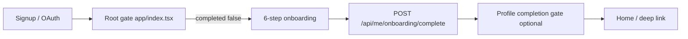
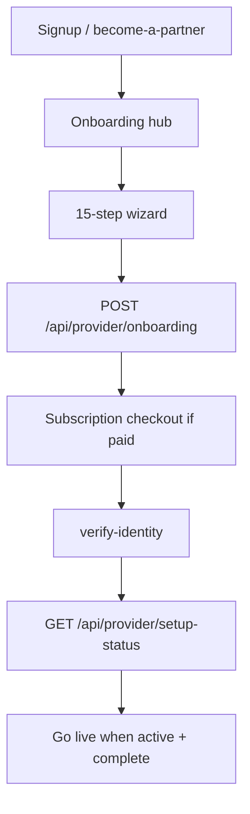
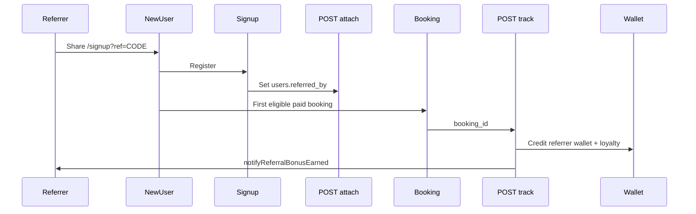

# Onboarding, Referrals & Didit — End-to-End Audit

**Date:** 2026-07-19  
**Scope:** Customer onboarding, provider onboarding, platform referral program, Didit KYC (with/without AML in workflow)

---

## Executive summary

| Area | Status | Notes |
|------|--------|-------|
| Customer onboarding | **Functional** | 6-step wizard gated by `customer_onboarding_completed_at`; web step order now aligned with mobile |
| Provider onboarding | **Functional** | 15-step wizard + setup checklist + identity verification; three-layer gating |
| Referrals | **Functional with gaps fixed** | Referrer-only rewards; notifications wired; manual code entry added |
| Didit KYC | **Functional** | No in-repo AML vendor; workflow-defined in Didit console; `pending_review` UX improved |

---

## 1. Customer onboarding (E2E)

### Flow

### Steps (aligned web + mobile)

| Step | Data collected | Required |
|------|----------------|----------|
| 1 | Preferred / full name | Yes |
| 2 | Profile photo | Yes |
| 3 | Date of birth | Yes |
| 4 | Home address | Yes (unless exists) |
| 5 | Beauty preferences | Skippable |
| 6 | Phone (+ email on mobile) verification | Yes |

### Key files

- Mobile wizard: `apps/customer/app/(app)/onboarding/index.tsx`
- Web wizard: `apps/web/src/app/onboarding/page.tsx`
- Root gate: `apps/customer/app/index.tsx` → `GET /api/me/onboarding/complete`
- Completion API: `apps/web/src/app/api/me/onboarding/complete/route.ts`
- DB flag: `users.customer_onboarding_completed_at` (migration `416`)

### Findings (addressed)

| ID | Severity | Issue | Resolution |
|----|----------|-------|------------|
| C1 | P1 | Web put phone at step 4; mobile at step 6 | Reordered web wizard to match mobile |
| C2 | P2 | Mobile lacked draft resumability | Added AsyncStorage draft (7-day TTL) |
| C3 | P2 | Web had localStorage draft; mobile did not | Parity via mobile draft key |

---

## 2. Provider onboarding (E2E)

### Flow

### Three layers of gating

1. **Wizard submit** — creates `providers` row; status `active` or `pending_approval`
2. **Setup checklist** — `identity-verification`, payout, services, hours, etc.
3. **Identity verification** — when `provider_verification` flag is on

Auto-approve is downgraded to `pending_approval` when verification is required but not yet approved (`apps/web/src/app/api/provider/onboarding/route.ts`).

### Key files

- Wizard steps: `apps/provider/src/features/provider-onboarding/state.ts`
- Setup checklist API: `apps/web/src/app/api/provider/setup-status/route.ts`
- Mobile hub: `apps/provider/app/(app)/onboarding/index.tsx`
- Web checklist: `apps/web/src/app/provider/get-started/page.tsx`
- Post-wizard verify: `apps/provider/app/(app)/onboarding/verify-identity.tsx`

### Findings

| ID | Severity | Issue | Resolution |
|----|----------|-------|------------|
| P1 | P2 | Go-live checklist CTA could be clearer on web | Added prominent "Continue setup" next-step banner |
| P2 | — | Hub already routes steps via `native_route` | No change needed |

---

## 3. Referrals (E2E)

### Platform user referral program

### Reward model (confirmed: referrer-only)

- **Referrer:** wallet credit + loyalty points after referred user's first eligible booking
- **Referred user:** no automatic wallet credit (copy updated to match)

### Key files

- Attach: `apps/web/src/app/api/me/referrals/attach/route.ts`
- Track: `apps/web/src/app/api/me/referrals/track/route.ts`
- Resolve code: `apps/web/src/lib/referrals/resolve-referrer.ts`
- Eligibility: `apps/web/src/lib/referrals/booking-qualifies-for-referral.ts`
- Program gate: `apps/web/src/lib/referrals/referral-program-enabled.ts`

### Findings (addressed)

| ID | Severity | Issue | Resolution |
|----|----------|-------|------------|
| R1 | P0 | FAQs/templates said "you both earn rewards" | Copy updated to referrer-only |
| R2 | P0 | `notifyReferralBonusEarned` never called | Wired in track route |
| R3 | P1 | No manual referral code field on signup | Added optional input web + mobile |
| R4 | P1 | `referral_program` feature flag unused | Enforced alongside `referral_settings.is_enabled` |

### Separate systems (not changed)

- **Provider referral sources** — client attribution for salons (`referral_sources` table)
- **Provider B2B referrals** — creates `provider_leads` with `source: 'referral'`

---

## 4. Didit KYC — with and without AML

### Architecture

AML/PEP/sanctions screening is **not implemented in this codebase**. It is configured in the **Didit workflow** (Didit console). The app observes normalized statuses only:

| Didit status | Internal status |
|--------------|-----------------|
| Approved | `approved` |
| In Review | `pending_review` |
| Declined | `rejected` |
| In Progress | `in_progress` |

### With AML disabled (basic KYC workflow)

1. User completes document + liveness in Didit SDK
2. Didit returns `Approved` quickly
3. Webhook → `identity_verification_sessions.status = approved`
4. Gates unlock; user can continue onboarding / book

### With AML enabled (extended workflow)

1. Same SDK flow
2. Didit may return `In Review` while AML/PEP checks run
3. Webhook (or reconcile cron) eventually sets `approved` or `rejected`
4. User sees **"Under review — you can continue"** (not blocked as failure)
5. Provider can skip to dashboard when `pending_review` if verification not hard-required for immediate go-live

### Verification modes (feature flags)

| Flag | Purpose |
|------|---------|
| `verification.didit.enabled` | Master Didit switch (+ env vars) |
| `verification.manual.enabled` | Manual upload fallback |
| `provider_verification` | Required for provider setup |
| `verification.didit.required_for_payouts` | Blocks payouts |
| `verification.required_for_customers` | First-booking gate |

Policy resolver: `apps/web/src/lib/verification/verification-policy.ts`

### Findings (addressed)

| ID | Severity | Issue | Resolution |
|----|----------|-------|------------|
| D1 | P1 | `pending_review` polling stopped after ~2 min | Extended polling for review state |
| D2 | P1 | Review state messaging could imply failure | Clarified copy + continue affordance |
| D3 | — | Reconcile cron covers missed webhooks | Verified existing cron at `/api/cron/identity-verification-reconcile` |

---

## 5. Prioritized issue list (all addressed in this pass)

### P0
- R1 Referral copy vs implementation mismatch
- R2 Referral notifications not sent

### P1
- R3 Manual referral code entry
- R4 Feature flag alignment
- C1 Web/mobile onboarding step order
- D1/D2 Didit pending_review UX and polling

### P2
- C2/C3 Mobile onboarding draft
- P1 Provider go-live checklist CTA clarity

---

## 6. Testing checklist

### Customer onboarding
- [ ] New customer signup → redirected to `/onboarding`
- [ ] Complete 6 steps → lands on home
- [ ] Draft survives app kill (mobile) and refresh (web)

### Provider onboarding
- [ ] Submit wizard → verify-identity → setup checklist
- [ ] `pending_review` allows continue when policy permits skip

### Referrals
- [ ] `?ref=CODE` attaches on signup
- [ ] Manual code field attaches same code
- [ ] First paid booking triggers wallet credit + notification to referrer
- [ ] Program disabled when flag OR settings off

### Didit
- [ ] Session create → SDK → webhook → status approved
- [ ] Simulated `In Review` shows under-review UI, user can continue (provider)
- [ ] Reconcile cron converges stale sessions
