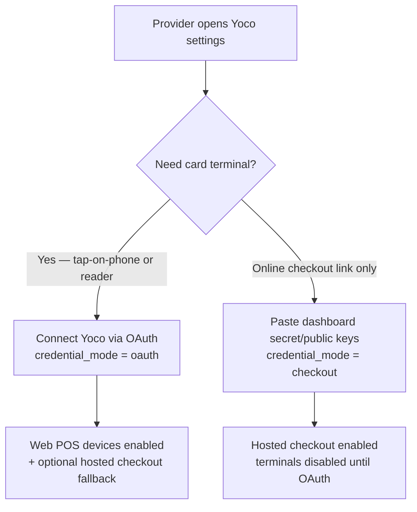

# Mobile Payments Compliance — Beautonomi customer + provider apps

**Owner**: Engineering + Compliance
**Last reviewed**: 2026-05-17
**Gateway**: [Paystack](https://paystack.com) (PCI DSS Level 1 service provider)

Single source of truth for two intersecting compliance regimes:

1. **PCI DSS v4.0 — SAQ A** (self-assessment for merchants where all card data is outsourced to a PCI-compliant gateway).
2. **App Store Review Guideline §3.1.3 / Google Play Billing carve-out** (why Beautonomi uses Paystack rather than Apple IAP / Play Billing for in-app purchases).

This file is intentionally written to be readable by both Apple/Google reviewers and a PCI QSA.

---

## 1. Scope summary

### Cardholder Data Environment (CDE)

| Surface | In CDE? | Justification |
|---|---|---|
| `apps/customer` (Expo React Native) | **No** | Card data is never entered, transmitted, or stored. Hosted checkout is opened in `ASWebAuthenticationSession` / Chrome Custom Tabs via `expo-web-browser.openAuthSessionAsync`. The app cannot inject JS into the Paystack page. |
| `apps/provider` (Expo React Native) | **No** | Same architecture as customer app. |
| `apps/web` Next.js API (`/api/paystack/initialize`, `/api/paystack/verify`, `/api/paystack/verify-reference`, `/api/payments/webhook`) | **Minimal** | Server holds the Paystack secret key, validates HMAC-signed webhooks, and reads tokens (`authorization_code`, `last4`, `bin`) returned by Paystack. Server **never** receives, stores, or logs PAN / CVV / PIN / magstripe / expiry. |
| Supabase database (`payment_methods`, `paystack_authorizations`, finance ledger) | **Minimal** | Stores only PCI DSS §3.4-permitted fields: `authorization_code` (Paystack token), `last_four`, `card_brand`, `bank`, `expiry_month`, `expiry_year`, `signature`. No PAN, no CVV. |
| Vercel hosting | Inherited | Vercel is PCI DSS attested for hosting. We rely on their AOC for the underlying network controls. |
| Paystack | **Out** | Paystack is a PCI DSS Level 1 service provider. Their AOC covers card capture, tokenization, 3DS, and vault. |

### Vendor responsibility matrix

| Control | Paystack | Beautonomi |
|---|---|---|
| Card capture form (PAN, CVV, expiry) | Yes | No |
| 3DS / OTP / EMV challenges | Yes | No |
| Tokenization + vault | Yes | No (we store the Paystack-issued `authorization_code` only) |
| Card brand network compliance (Visa, Mastercard, etc.) | Yes | No |
| Quarterly ASV scans of card-handling infrastructure | Yes (their AOC) | No |
| Webhook HMAC signing | Yes | No |
| Webhook HMAC verification | No | **Yes** — `apps/web/src/app/api/payments/webhook/route.ts` lines 75-94, `crypto.createHmac("sha512", secret)` + `crypto.timingSafeEqual` |
| Idempotent fulfillment by reference | No | **Yes** — `processSuccessfulPayment`, `recordProductOrderPayment`, `applyWalletTopupFromSuccessfulPaystackCharge`, etc. |
| Server secret storage | No | **Yes** — `PAYSTACK_SECRET_KEY` in Vercel env + KMS, never in mobile bundle. See [`docs/REGION_SECRETS_KMS_RUNBOOK.md`](./REGION_SECRETS_KMS_RUNBOOK.md). |
| TLS 1.2+ on all card-adjacent traffic | Yes (Paystack) | **Yes** (Vercel + RN default) |
| Logging without card data | N/A | **Yes** — `apps/{customer,provider}/src/lib/payments/safeLog.ts` strips forbidden fields; server-side scrubbers in `apps/web/src/lib/sentry/before-send.ts`, `apps/web/src/lib/utils/logger.ts`, `apps/web/src/lib/audit/audit.ts`, `apps/web/src/lib/analytics/amplitude/plugins/privacy.ts` |
| Annual PCI DSS SAQ A self-assessment | No | **Yes** — this document + the operational checklist below. |
| Incident response on payment breach | Joint | We follow PCI DSS §12.10 + the Paystack incident channel. |

---

## 2. PCI DSS SAQ A eligibility

SAQ A applies to merchants who **fully outsource** all cardholder data functions to a PCI DSS-validated third party. Beautonomi qualifies because:

1. **The merchant accepts only card-not-present e-commerce transactions.** All Beautonomi payments are CNP via Paystack hosted pages.
2. **All processing of cardholder data is entirely outsourced** to a PCI DSS-validated third-party service provider.
3. **The merchant retains no electronic cardholder data on any computer system or media.** We retain only PCI DSS §3.4-permitted tokens (`authorization_code`, `last4`, etc.).
4. **The merchant's payment processing functions are entirely outsourced.**
5. **All elements of the payment page(s) delivered to the consumer's browser are served from the Paystack-controlled domain.** Mobile apps open `https://*.paystack.com` in `ASWebAuthenticationSession` / Chrome Custom Tabs; web app uses Paystack hosted redirect.
6. **The merchant confirms the third party is PCI DSS-compliant** — Paystack publishes their AOC at <https://paystack.com/security>.

### Mapped to PCI DSS v4.0 SAQ A controls

| Control | Beautonomi response |
|---|---|
| **2.1** Vendor-supplied defaults — change before use. | Paystack credentials are bootstrapped per-tenant via the admin console; no shared default secrets in repo. |
| **3.2** Do not store sensitive authentication data after authorization. | We never receive CVV / PIN / magstripe / track data; Paystack handles it. Saved cards store `authorization_code`, `last_four`, `bin`, `brand`, `bank`, `expiry_month`, `expiry_year`, `signature` only. |
| **4.1** Encrypt cardholder data over open public networks. | All Paystack traffic is HTTPS (TLS 1.2+). RN defaults enforce TLS 1.2+. Vercel enforces TLS 1.2+. |
| **6.2** Develop secure applications. | Dependencies tracked via Dependabot + pnpm-lock.yaml + Expo SDK version pinning. Pre-commit hooks + CI lint + typecheck + test gates. |
| **6.3** Address common coding vulnerabilities. | OWASP Top 10 covered by Supabase RLS, Zod input validation, Sentry scrubbing, CSRF middleware on web (`apps/web/src/proxy.ts`). |
| **8.3** Multi-factor for non-console admin access. | Supabase MFA + Vercel SSO + admin role MFA enforcement (`requireAdminMfaIfRequired` in `apps/web/src/lib/supabase/api-helpers.ts`). |
| **9.3** Restrict physical access. | Vercel + Supabase + Paystack — vendor responsibility. We do not store payment data on-premise. |
| **11.1** Test security controls. | Vitest + Jest suites including auth-guard tests (`apps/web/src/__tests__/api/auth-guards.test.ts`), webhook signature tests, verify endpoint tests. Quarterly review of dependency CVE advisories. |
| **12.1** Maintain information security policy. | This document + [`docs/RELEASE_CHECKLIST.md`](./RELEASE_CHECKLIST.md) + [`docs/PLAYBOOKS/secret-rotation.md`](./PLAYBOOKS/secret-rotation.md). |
| **12.6** Security awareness training. | Engineering onboarding covers this checklist and the saveCard / WebView guardrails. |
| **12.8** Manage service provider responsibilities. | Vendor matrix above. Paystack AOC reviewed annually; Vercel and Supabase AOCs tracked in our compliance folder. |
| **12.9** Service providers acknowledge their responsibilities. | Paystack DPA + Vercel DPA + Supabase BAA on file. |
| **12.10** Incident response plan. | See §6 below. |

---

## 3. Mobile control statements (auditor-friendly)

The following are the **specific code-level controls** in the React Native apps:

1. **Hosted-only checkout.** `useInAppPaystackCheckout.waitForCheckout` calls `WebBrowser.openAuthSessionAsync(url, returnUrl)` — `ASWebAuthenticationSession` on iOS / Chrome Custom Tabs on Android — which is sandboxed from the app. The host of `url` is asserted against a Paystack allowlist (`checkout.paystack.com`, `standard.paystack.co`, `paystack.shop`, `api.paystack.co`, plus any `*.paystack.{com,co,shop}` subdomain) before opening; non-HTTPS or non-Paystack URLs throw before the browser opens.
   - Source: [`apps/customer/src/hooks/useInAppPaystackCheckout.tsx`](../apps/customer/src/hooks/useInAppPaystackCheckout.tsx), [`apps/provider/src/hooks/useInAppPaystackCheckout.tsx`](../apps/provider/src/hooks/useInAppPaystackCheckout.tsx).
2. **No `react-native-webview` based card forms.** Both `PaystackWebViewModal.tsx` shells (which previously could have hosted a tampered Paystack page with `injectedJavaScript` access) were deleted on 2026-05-17. Generic WebView is still imported by non-payment screens (legal pages, in-app browser) and may never be repurposed for `*.paystack.com` URLs — this is enforced by code review.
3. **No card data in mobile bundles.** `apps/{customer,provider}/src/lib/payments/safeLog.ts` strips `card_number`, `pan`, `cvv`, `cvc`, `card_pin`, `expiry`, `expiry_month`, `expiry_year`, `track_data`, `magstripe`, `card_data` before any `console.*` or analytics call. PCI DSS §3.4-permitted fields (`last4`, `bin`, `brand`, `bank`, `country_code`, `signature`, `authorization_code`) pass through unmodified.
4. **No Paystack secret in mobile.** `EXPO_PUBLIC_PAYSTACK_*` is forbidden — verified by `rg "EXPO_PUBLIC_PAYSTACK"` returning zero hits. The Paystack secret lives in `PAYSTACK_SECRET_KEY` server env only.
5. **Anonymous-by-reference verify endpoint.** `/api/paystack/verify` and `/api/paystack/verify-reference` use `optionalAuthInApi` (`apps/web/src/lib/supabase/api-helpers.ts`) so a long 3DS / OTP that expires the Supabase session does not lock the user out of confirmation. Server-side ownership checks still run when authentication is present.
6. **Deep-link tampering defense.** Mobile never trusts the deep-link content for fulfillment. Server-side `/api/paystack/verify` always re-confirms with Paystack via reference, and the webhook is the authoritative fulfillment trigger.
7. **Bearer-token-only mobile auth.** `apps/{customer,provider}/src/lib/api-client.ts` attaches `Authorization: Bearer <Supabase access token>` via `getAccessToken`; no cookies are involved on mobile. Paystack 3DS in the system browser is sandboxed and does not carry the app's Bearer.

---

## 4. App Store §3.1.3 / Play Billing carve-out

### Why Beautonomi uses Paystack instead of Apple IAP / Google Play Billing

Apple App Store Review Guideline §3.1.3 explicitly **exempts** services that fall into any of the following from the IAP requirement:

- **§3.1.3(b) Multiplatform Services**: services usable cross-platform may use any payment method.
- **§3.1.3(d) Person-to-Person Services**: payment for in-person, one-on-one services.
- **§3.1.3(e) Goods & Services Outside of the App**: physical or real-world services consumed outside the app (haircuts, beauty treatments, hotel stays, ride shares).
- **§3.1.3(f) Free Stand-Alone Apps with Optional In-App Purchases for Real-World Experiences**.
- **§3.1.3 Reader app provisions** for B2B SaaS where the subscription unlocks tools used to serve customers in the real world.

Google Play Billing has a near-identical carve-out for "physical goods or services" and "person-to-person payments".

| Beautonomi flow | Exemption clause | Notes |
|---|---|---|
| Customer **bookings** (haircut, massage, etc.) | §3.1.3(e) Goods & Services Outside of the App | Real-world appointment fulfilled by a human service provider. |
| Customer **gift cards** | §3.1.3(e) | Gift card redeemable for real-world services. |
| Customer **product orders** (retail / takeaway) | §3.1.3(e) | Physical goods shipped or collected. |
| Customer **memberships** (salon-specific) | §3.1.3(b) + §3.1.3(e) | Unlocks discounts for in-person services; usable on web + iOS + Android. |
| Customer **wallet top-up** | §3.1.3(e) | Funds future real-world bookings, refundable to source. |
| Customer **custom offers** | §3.1.3(d) | One-to-one negotiated price for a real-world service. |
| Provider **subscription** | §3.1.3 Reader / B2B SaaS exemption | Provider-side B2B SaaS — subscription unlocks tools the provider uses to serve their own customers in the real world. Equivalent to Squarespace, Square, Shopify, Mindbody, Fresha. |
| Provider **ads** (paid promotion) | §3.1.3(b) Multiplatform Services | Provider's ad spend appears on web + iOS + Android explore feeds; payment unlocks distribution outside the app. |

### Reviewer-facing summary (paste this in App Store / Play Store submission notes when asked)

> Beautonomi is a two-sided marketplace for real-world beauty and wellness services. The customer app books in-person appointments, gift cards redeemable for in-person services, retail products, and salon memberships. The provider app subscribes to a B2B SaaS that providers use to run their physical businesses, and lets providers buy paid promotion across web + iOS + Android. None of the in-app purchases unlock digital content consumed within the app. Per App Store Review Guideline §3.1.3 (specifically §3.1.3(b), §3.1.3(d), §3.1.3(e), and the Reader / Multiplatform Services exemptions) and the equivalent Google Play Billing physical-services carve-out, all payments use Paystack (a PCI DSS Level 1 hosted gateway) opened in `ASWebAuthenticationSession` / Chrome Custom Tabs. We do not link out to an external website for purchase — the entire purchase flow stays in-app within the system-managed authentication session.

---

## 5. Operational checklist

### Quarterly

- [ ] Rotate `PAYSTACK_SECRET_KEY` per [`docs/PLAYBOOKS/secret-rotation.md`](./PLAYBOOKS/secret-rotation.md). Update Vercel env + KMS + admin integration record.
- [ ] Confirm Vercel + Supabase + Paystack AOCs are still current.
- [ ] Run `rg "card_number|cardNumber|cvv|cvc|pan\\b|card_pin|track_data|magstripe" apps/` and confirm no new hits in payment-adjacent code paths. (Existing hits in `apps/web/src/lib/sentry/before-send.ts`, `apps/web/src/lib/utils/logger.ts`, `apps/web/src/lib/analytics/amplitude/plugins/privacy.ts`, `apps/web/src/lib/audit/audit.ts` are scrubber allowlists — expected.)
- [ ] Audit `paystack_authorizations` table for tokens belonging to deleted users or providers; purge.
- [ ] Confirm `EXPO_PUBLIC_PAYSTACK*` returns zero hits.

### Annually

- [ ] Re-run this SAQ A self-assessment and re-sign this document.
- [ ] Refresh Paystack DPA + Vercel DPA + Supabase BAA copies in the compliance folder.
- [ ] Confirm the `useInAppPaystackCheckout` host allowlist still matches Paystack's published domains.

### On release

- See [`docs/RELEASE_CHECKLIST.md`](./RELEASE_CHECKLIST.md) — the Paystack-related items include verifying the build contains no Paystack secret, no card field UI, and no WebView pointing at `*.paystack.com`.

---

## 6. Incident response (PCI DSS §12.10)

If we receive a Paystack breach notification, suspect token leakage, or detect anomalous webhook signature failures:

1. **Within 1 hour**: Page the on-call engineer. Rotate `PAYSTACK_SECRET_KEY` immediately per [`docs/PLAYBOOKS/secret-rotation.md`](./PLAYBOOKS/secret-rotation.md). This invalidates webhook signatures and forces Paystack-server re-pairing.
2. **Within 4 hours**: Notify Compliance + Legal. Disable Paystack initialize-payment routes if breach is confirmed (`apps/web/src/proxy.ts` feature gate).
3. **Within 24 hours**: Notify affected users if any cardholder data was exposed (it should not have been — we hold tokens only). Filing per local data-protection law.
4. **Within 72 hours**: File preliminary incident report with Paystack support.
5. **Within 30 days**: Full root-cause analysis published internally + remediation tracked to closure.
6. **Document everything** in the incident-response folder for the next PCI self-assessment.

---

## 7. Yoco card terminal integration (in-person card present)

Beautonomi providers can optionally accept in-person card payments via the **Yoco Web POS API**. Yoco is a PCI DSS Level 1 acquirer and processor; their hardware/SDK / hosted checkout pages handle PAN, CVV, EMV, and 3DS. Beautonomi never sees card data.

### Credential modes

A provider's Yoco integration is in exactly one of three credential modes (`provider_yoco_integrations.credential_mode`):

| Mode | Authenticates with | Surface used | What providers can do |
|---|---|---|---|
| `oauth` | OAuth 2.0 JWT bearer (auto-refreshed) issued by `iam.yoco.com` | `api.yoco.com/v1/webpos/...` | Real Web POS card terminals — tap-on-phone or paired card readers. |
| `checkout` | Dashboard secret key (`sk_live_…` / `sk_test_…`) | `payments.yoco.com/api/checkouts` | Hosted checkout link / QR — customer pays on Yoco's domain in their own browser. No physical terminal. |
| `none` | — | — | Not yet connected. UI prompts the provider to choose. |

The two modes are **not mutually exclusive in storage** — a provider can save Checkout keys *and* connect OAuth. When both are present, `credential_mode = 'oauth'` wins and Web POS device creation is enabled.

### Where the card data lives

| Surface | In CDE? | Justification |
|---|---|---|
| `apps/provider` Yoco Devices screen | **No** | Lists device names + amounts + status. No card data passes through. Charge actions either (a) open the Yoco Web POS SDK / device pairing flow on Yoco's hardware, or (b) open a Yoco-hosted checkout URL in `ASWebAuthenticationSession`. |
| `apps/web` `/api/provider/yoco/*` routes | **Minimal** | Server holds (i) the provider's Yoco OAuth tokens and (ii) optional Checkout API secret key. Calls `api.yoco.com/v1/webpos/{id}/payments` (server-to-server) to initiate a charge — Yoco then prompts the customer on the terminal / hardware. No PAN / CVV ever traverses our server. |
| `provider_yoco_oauth_tokens` table | **No** | Stores OAuth access + refresh tokens scoped to a Yoco *business*, not card data. Encrypted at rest by Supabase. Read restricted to service role + the owning provider via RLS. |
| `provider_yoco_devices` table | **No** | Stores Yoco-issued device IDs and display names. No card data. |
| `provider_yoco_payments` table | **No** | Stores Yoco payment intent IDs, amounts, currency, and statuses returned by Yoco. Last 4 digits and brand may be persisted if Yoco's API returns them — these are PCI DSS §3.4-permitted. |

### Yoco-specific control statements

1. **OAuth state CSRF defense.** `GET /api/provider/yoco/oauth/authorize` generates a 32-byte random `state`, persists it in `yoco_oauth_states` with a 10-minute TTL and the issuing provider/tenant, and `/callback` rejects any `state` that doesn't match a live row. Mismatched, expired, or replayed state values produce a `yoco_error=invalid_state` redirect and never exchange the auth code.
2. **No client secret in mobile.** The Yoco OAuth `client_secret` is loaded server-side only — from `tenant_yoco_oauth_apps.client_secret` or `YOCO_OAUTH_CLIENT_SECRET` env. The mobile app only ever sees `https://app.beautonomi.com/api/provider/yoco/oauth/authorize`, which it opens in `Linking.openURL` and returns via `AppState` foreground.
3. **OAuth token refresh is server-only.** `getValidAccessToken` in `apps/web/src/lib/payments/yoco-oauth.ts` checks the 5-minute expiry buffer, refreshes via `iam.yoco.com/oauth2/token`, and writes the new `access_token` / `refresh_token` back to `provider_yoco_oauth_tokens` using the service role client. Refresh failures are recorded in `last_refresh_error` and surfaced to the provider as a "reconnect Yoco" banner.
4. **Webhook signature verification.** Yoco webhook events arriving at `/api/provider/yoco/webhook` are HMAC-verified against the per-provider `webhook_secret` before any payment state is mutated. Both Yoco Checkout API style (`payment.notification`) and Yoco API style (`payment.succeeded` / `payment.failed` / `payment.refunded` / `payment.created`) events are handled.
5. **No card data in mobile bundles.** The same `safeLog.ts` stripper covers Yoco payloads — `card_number`, `pan`, `cvv`, `cvc`, `expiry*`, `track_data`, `magstripe` are scrubbed before any log.
6. **Per-tenant white-label.** White-label tenants can register their own Yoco OAuth app (their own `client_id` / `client_secret`) by inserting a row in `tenant_yoco_oauth_apps`. The resolver order is **tenant row → global row → env vars**, so platform defaults work out-of-the-box but tenants control their own brand on the Yoco consent screen.
7. **Hosted checkout URL allowlist.** When `credential_mode = 'checkout'` and the provider initiates a hosted checkout, the returned `redirectUrl` is asserted against the Yoco domain allowlist (`payments.yoco.com`, `payments.yocosandbox.com`) before the mobile app opens it in `ASWebAuthenticationSession` / Chrome Custom Tabs — same defense as the Paystack allowlist in `useInAppPaystackCheckout`.

### Decision matrix for providers

See [`docs/YOCO_OAUTH_SETUP.md`](./YOCO_OAUTH_SETUP.md) for the operator-facing setup, env vars, per-tenant overrides, and rollout / rollback steps.

---

## 8. Change log

| Date | Author | Change |
|---|---|---|
| 2026-05-17 | Engineering | Initial document. Mobile Paystack verify-with-retry hardening + dead `PaystackWebViewModal` removal + URL allowlist guard + `safeLog` stripper. |
| 2026-05-17 | Engineering | Added Yoco card terminal section: OAuth 2.0 vs Checkout API credential modes, CSRF state defense, per-tenant white-label, webhook signature verification, and hosted-checkout URL allowlist. |
