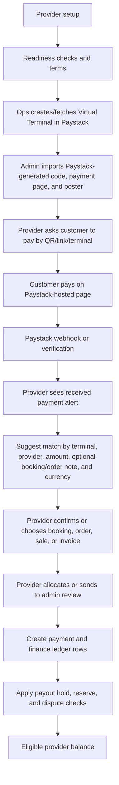

# Paystack Virtual Terminal Feasibility Advisory

## Executive Summary

Adding Paystack Virtual Terminal for provider in-person payments is technically feasible and strategically useful for Beautonomi, but it should not be treated as a silent replacement for Yoco. It is a different settlement model.

Yoco currently fits the provider-direct in-person payment pattern: the provider uses their own terminal/payment relationship, and Beautonomi records the payment for booking, receipt, and reporting purposes. Those direct walk-in payments are not added to the provider's payoutable balance because Beautonomi does not hold the money.

Paystack Virtual Terminal would likely be a platform-held in-person payment rail: the customer pays through Beautonomi's Paystack integration or Paystack platform setup, Beautonomi verifies and allocates the money, then credits the provider's payoutable balance after matching, ledger, hold, reserve, and dispute rules. That makes it viable as a second in-person payment option, but it increases Beautonomi's responsibility for reconciliation, refunds, chargebacks, customer receipts, provider payout timing, and operational support.

Recommended position:

- Build Paystack Virtual Terminal only if Beautonomi wants to intermediate in-person card/QR/link payments and include eligible proceeds in provider payout balances.
- Keep Yoco for provider-owned or provider-direct terminal settlement.
- Present Paystack Virtual Terminal as a distinct option, such as `Paystack Terminal` or `Beautonomi Terminal`, not as a generic "card machine".
- Gate the feature separately from normal online Paystack checkout.
- Launch only with Superadmin reconciliation, provider web/mobile visibility, amount mismatch handling, audit logs, and payout controls.

## Paystack Virtual Terminal Facts

Paystack's Virtual Terminal API supports:

- Creating a virtual terminal on a Paystack integration, typically by Ops/Admin for provider assignment.
- Listing, fetching, updating, and deactivating virtual terminals.
- Assigning WhatsApp notification destinations.
- Adding or removing a split code.
- Storing metadata and custom fields.
- Using a terminal `code`, `id`, `active` status, `currency`, and optional `connect_account_id` from API responses.

The Virtual Terminal API page itself does not document a terminal-payment listing endpoint. Paystack's general webhook documentation supports `charge.success`, and Paystack's Virtual Terminal guide shows successful VT payments carrying the terminal code in transaction metadata/source. Paystack's Transaction API also supports listing transactions by `terminalid`, where `terminalid` is the Paystack terminal ID returned when the terminal is created or fetched. Beautonomi should therefore:

- Use `charge.success` as the primary near-real-time ingestion path.
- Store both Paystack terminal `id` and terminal `code`.
- Use Transaction API `GET /transaction?terminalid=<paystack_terminal_id>` for admin reconciliation and missed-webhook recovery.
- Treat terminal `code` as the durable Beautonomi provider-mapping key inside the ingested transaction record.

If a webhook is delayed or missed, Superadmin reconciliation should poll the Paystack Transaction API by terminal ID where available, enrich the ingested row with the local terminal code/provider mapping, and only fall back to broader successful-transaction scanning when no local terminal ID exists.

WhatsApp destinations should use phone numbers Beautonomi already stores, subject to consent and formatting rules. The default destination can be the provider owner's verified business phone. For multi-location or staff-operated setups, destinations can be assigned from the location phone, front-desk/admin staff phone, or finance contact phone. The in-app provider alert remains the authoritative allocation workflow; WhatsApp should be treated as a human notification channel only, not the ledger, not the allocation source of truth, and not the provider-mapping key.

Provider setup requests should create a durable Ops queue item with the Paystack Create Virtual Terminal payload prefilled from Beautonomi data:

- `name`: inferred from provider business, location/front-desk label, and a provider suffix.
- `destinations`: inferred WhatsApp-capable provider phone or billing phone, with a human label.
- `currency`: provider currency, falling back to the integration/default currency.
- `metadata`: provider ID, tenant ID, location ID/name, source, and requesting user.
- `custom_fields`: optional booking/order note field for operational matching, not the Paystack transaction reference.

Ops can then click to create the Virtual Terminal through Paystack's API using those values. Paystack returns the terminal code and active/currency details; poster assets and dashboard-only details still need admin review/download where Paystack does not expose them in the API response.

Important unknowns to validate with Paystack before implementation:

- Whether the terminal payment page supports fixed expected amounts per payment attempt or only reusable/open customer-entered amounts.
- Whether custom fields and metadata reliably appear in transaction webhooks and settlement reports.
- Whether Paystack exposes abandoned QR/link attempts or only successful/failed transactions.
- Whether Paystack has limits, compliance review, pricing, or activation requirements for many provider-assigned terminals.
- Whether split codes should be used immediately, or whether Beautonomi should collect centrally and pay out via the existing payout infrastructure.

## Existing Beautonomi Accounting Context

Beautonomi's current accounting contract already gives the right principle for this decision:

- `booking_payments` records collected booking payment events.
- `payment_transactions` records gateway references and idempotency.
- `finance_transactions` is the operational source of truth for provider payoutable balance, provider finance, and most revenue reports.
- `payouts` records payout requests and settlement status.
- Provider payoutable balance is computed from `finance_transactions`, not from booking totals or denormalized provider earnings.

The key rule from `docs/PAYMENT_ACCOUNTING_CONTRACT.md` and `docs/ADDITIONAL_CHARGES_AND_PAYOUT_RULES.md` is:

- If Beautonomi or Paystack holds the money, create provider earnings that can become payoutable.
- If the provider collected the money directly through cash/Yoco/manual card, record it for audit/reporting, but do not add it to payoutable balance.

Therefore Paystack Virtual Terminal should be classified as platform-held in-person collection unless the commercial Paystack setup proves otherwise. It should not be recorded as generic walk-in `card` or provider-direct `other`.

Current system touchpoints that should guide implementation:

| Area | Existing reference |
| --- | --- |
| Accounting contract | `docs/PAYMENT_ACCOUNTING_CONTRACT.md` |
| Additional charges and payout rules | `docs/ADDITIONAL_CHARGES_AND_PAYOUT_RULES.md` |
| Payout balance calculation | `apps/web/src/lib/provider/available-payout-balance.ts` |
| Paystack booking settlement pattern | `apps/web/src/lib/bookings/record-booking-paystack-payment.ts` |
| Paystack webhook handling | `apps/web/src/app/api/payments/webhook/_handlers/charge-success.ts` |
| Yoco provider payment API | `apps/web/src/app/api/provider/yoco/payments/route.ts` |
| Yoco webhook/reconciliation pattern | `apps/web/src/app/api/provider/yoco/webhook/route.ts` |
| Yoco feature gate | `apps/web/src/lib/payments/yoco-feature-gate.ts` |
| Subscription entitlements | `apps/web/src/lib/subscriptions/feature-access.ts` |
| Provider payment settings | `apps/web/src/app/api/provider/settings/payments/route.ts` |
| Provider settings hub | `apps/web/src/app/provider/settings/page.tsx` |
| Yoco web settings | `apps/web/src/app/provider/settings/sales/yoco-integration/page.tsx` |
| Yoco device/location settings | `apps/web/src/app/provider/settings/sales/yoco-devices/page.tsx` |
| Web Yoco payment dialog | `apps/web/src/components/provider-portal/YocoPaymentDialog.tsx` |
| Web sale collection | `apps/web/src/components/provider-portal/NewSaleDialog.tsx` |
| Front desk collection | `apps/web/src/components/provider/front-desk/PaymentActions.tsx` |
| Booking mark-paid | `apps/web/src/app/api/provider/bookings/[id]/mark-paid/route.ts` |
| Additional charge mark-paid | `apps/web/src/app/api/provider/bookings/[id]/additional-charges/[chargeId]/mark-paid/route.ts` |
| Product order collection | `apps/web/src/app/api/provider/product-orders/[id]/mark-collected/route.ts` |
| Provider payment summary | `apps/web/src/app/api/provider/reports/payments/summary/route.ts` |
| Recorded takings | `apps/web/src/lib/reports/recorded-takings.ts` |
| Payment methods report | `apps/web/src/lib/reports/build-payment-methods-report.ts` |
| Provider finance | `apps/web/src/app/api/provider/finance/route.ts` |
| Provider transactions/export | `apps/web/src/app/api/provider/transactions/route.ts`, `apps/web/src/app/api/provider/transactions/export/route.ts` |
| Provider receipts | `apps/web/src/lib/receipts/build-booking-receipt.ts`, `apps/web/src/lib/receipts/pdf-design.ts` |
| Admin Yoco reconciliation | `apps/web/src/app/admin/reports/yoco-reconciliation/page.tsx`, `apps/web/src/app/api/admin/reports/yoco-reconciliation/route.ts` |
| Admin finance/disputes/payouts | `apps/web/src/app/api/admin/finance/summary/route.ts`, `apps/web/src/app/admin/disputes/page.tsx`, `apps/web/src/app/admin/payouts/page.tsx` |
| Provider mobile Yoco hook/sheet | `apps/provider/src/hooks/useYoco.ts`, `apps/provider/src/components/YocoPaymentSheet.tsx` |
| Provider mobile reports | `apps/provider/src/features/reports/PaymentMethodsReportView.tsx`, `apps/provider/src/features/reports/EndOfDayReportView.tsx`, `apps/provider/src/features/reports/RefundsReportView.tsx`, `apps/provider/src/features/reports/YocoReconciliationReportView.tsx` |

Recommended classification:

- Keep `payment_provider = paystack` for gateway consistency.
- Add a first-class channel/source, for example `payment_channel = virtual_terminal`, or metadata such as `paystack_channel = virtual_terminal`.
- Reports should distinguish `Paystack Online`, `Paystack Link`, `Paystack Virtual Terminal`, `Yoco`, `Cash`, and `Other`.

## Proposed Flow

The source of truth must be Paystack verification/webhook data plus Beautonomi allocation and ledger rows. A provider opening a QR page or telling a customer to pay is not proof of payment.

The provider assurance layer is intentional. Whenever a confirmed Paystack Terminal payment arrives, provider web and mobile should surface it immediately, for example: `Customer Thandi M. made a Paystack Terminal payment of R850. Suggested allocation: Booking BKG-1042.` The provider should be able to confirm the suggested match or choose a different eligible booking, product order, sale, invoice, or group booking. This gives the provider operational confidence that the money is being attached to the right customer visit while keeping Paystack verification, amount rules, and Superadmin controls as the final safety rails.

## Provider As Agent Of Beautonomi

If providers collect in-person payments through Beautonomi's Paystack terminal, they are effectively acting as service providers or agents using Beautonomi's payment infrastructure.

Practical consequences:

- Beautonomi may be treated as merchant of record, payment facilitator, marketplace/platform intermediary, or collection agent depending on the Paystack contract and legal setup.
- Beautonomi needs provider terms that explain collection authority, payout timing, reserves, chargebacks, refunds, and reconciliation authority.
- Provider acceptance should confirm the operational context, such as "this payment belongs to this booking/invoice/sale"; it must not override failed Paystack verification.
- Customer disputes, chargebacks, wrong references, overpayments, duplicate payments, and refunds become Beautonomi operational workflows.
- Finance and legal should confirm VAT/tax invoice treatment and whether Beautonomi, the provider, or both issue receipts/invoices.

## Product Fit Versus Yoco

Paystack Virtual Terminal makes sense when Beautonomi wants:

- More than one in-person payment integration.
- A lower-hardware or QR/link-like collection flow.
- Platform-controlled settlement, reporting, and payout eligibility.
- A Paystack-native path for providers that do not use Yoco.
- Superadmin-managed in-person collection with centralized reconciliation.
- A stronger ledger story where eligible in-person card payments can flow into payout balances.

It is less suitable when Beautonomi wants:

- Provider-owned settlement with minimal platform liability.
- Classic card-machine behavior where the provider's own merchant account receives the money directly.
- No additional finance/reconciliation operations.
- Instant provider access to funds without payout holds, reserves, or chargeback controls.

The correct product framing is side-by-side choice:

| Rail | Customer context | Who holds money | Payout treatment | Best use |
| --- | --- | --- | --- | --- |
| Paystack Online | Online booking/checkout | Platform/Paystack | Provider earnings after ledger rules | Remote checkout |
| Paystack Link | Customer pays from link | Platform/Paystack | Provider earnings after ledger rules | Remote or in-person follow-up |
| Paystack Virtual Terminal | In-person QR/link/open terminal | Platform/Paystack | Provider earnings after matching and controls | In-person platform-held collection |
| Yoco | In-person POS | Provider/Yoco setup | Audit/reporting, normally not payoutable | Provider-direct terminal |
| Cash/Other | In-person manual | Provider | Audit/reporting, not payoutable | Offline/manual collection |

Provider-facing product language should be direct and consistent:

- Payment method name: `Paystack Terminal` or `Beautonomi Terminal`.
- Short description: `Take in-person card/QR payments through Beautonomi. Funds are verified, allocated, and paid out through your Beautonomi payout balance.`
- Availability copy when enabled: `Available for bookings, invoices, sales, product orders, walk-ins, and group bookings where terminal payments are supported.`
- Settlement copy: `Unlike Yoco or cash, this payment is processed through Beautonomi and becomes available for payout after verification, allocation, payout holds, and dispute checks.`
- Disabled copy: `Paystack Terminal is not available on your account. Contact support or upgrade your plan if this should be enabled.`
- Suspended copy: `Paystack Terminal collection is temporarily paused because your account needs review. Existing received payments remain visible and will be reconciled.`

The provider should experience it as another in-person option beside Yoco and Cash, but every UI must explain that Paystack Terminal funds do not instantly belong to the provider. They move through Beautonomi's platform-held payout process.

## Collection UX: QR, Link, Share, And Print

Paystack Terminal should support practical in-person collection modes, because providers will use it differently at a salon counter, during a house call, in a walk-in shop flow, or from the mobile app.

Collection modes:

| Mode | Description | Best for | Allocation risk |
| --- | --- | --- | --- |
| Dynamic QR for a specific item | Provider opens a booking, invoice, sale, order, or additional charge and shows a QR/link generated with expected amount and reference context | Checkout at counter, booking balance, product order, walk-in sale | Lowest if Paystack supports metadata/custom fields |
| Share payment link for a specific item | Provider sends the payment URL by WhatsApp, SMS, email, copy link, or native share sheet | Customer not standing at counter, house call, follow-up balance | Low if metadata/reference travels with the link |
| Reusable provider terminal QR | Provider shows or prints a QR for their assigned Paystack Terminal; Paystack generates the transaction reference and may collect optional form fields if configured | Salon reception desk, printed till sign, market stall, shop counter | Higher; requires provider assurance and matching queue |
| Reusable location terminal QR | Location-specific QR for a branch/location terminal | Multi-location salons and stores | Medium; location helps matching |
| Staff/front-desk QR | QR shown by front-desk staff or staff device for that provider/location | Busy reception desk, delegated checkout | Medium; requires staff permission and audit |
| Static printed QR on receipt/counter | Printed QR customers can scan after service | Self-pay flow, reception queue reduction | Higher; customer may pay the wrong amount or omit the booking/order note |

Recommended UX by surface:

- Booking detail: `Collect with Paystack Terminal` opens a modal with expected amount, booking reference, customer, QR, share link, and `Mark as awaiting payment`.
- Appointment sidebar/front desk: show a quick `Show QR` action next to `Yoco`, `Paystack Link`, `Cash/Other`, and other payment actions.
- New sale/walk-in sale/product order: after cart total is known, show a dynamic QR and share link tied to the sale/order ID.
- Group booking: allow payment collection for the group total or individual participant balance, with QR/link clearly showing which allocation is expected.
- Additional charges: show QR/link for the add-on balance and keep the main booking payment status separate.
- Provider mobile booking/order/sale screens: show QR full screen with brightness boost, amount, reference, and a `Share link` button.
- Provider mobile More tab: add a `Paystack Terminal` entry for terminal status, default QR, payment inbox, and recent terminal payments.
- Provider mobile Settings: add terminal setup, destinations/phone numbers, print/download QR, feature availability, and settlement explanation.
- Provider web Settings: add a Paystack Terminal settings page with default terminal, location terminals, notification destinations, print assets, terminal health, and support links.

Dynamic QR/link screens should show:

- Provider/business name.
- Location, if applicable.
- Amount requested.
- Booking/order/invoice/sale reference.
- Customer name when known.
- Expiry time if the generated link is temporary.
- Settlement note: `Paid through Beautonomi. Payout after allocation and checks.`
- Clear fallback: `If the customer pays a different amount, it will appear for review.`

Reusable/printed QR screens should show:

- Provider/business name.
- Terminal name and location.
- Instructions should not imply the customer can control the Paystack transaction reference. Use copy such as: `Pay the amount due. Add the booking/order note only if Paystack asks for it.`
- Warning to provider: reusable QR payments need matching/confirmation.
- Download options: `Print counter QR`, `Download poster`, `Copy terminal link`, `Share terminal link`.
- Optional template variants: counter card, A4 poster, receipt insert, small sticker, and mobile share image.

Printed QR assets should be managed carefully:

- Superadmin/provider should be able to deactivate or rotate a terminal QR if it is misused, stale, or assigned to the wrong location.
- Printed assets should include terminal code/location label and a short customer instruction, but should not expose secret keys or sensitive metadata.
- A reprinted QR should have version/date metadata so support can identify which asset was used.
- If a provider is disabled/suspended, the QR should remain non-collectable or show a safe unavailable page, while historical payments remain visible.

Practical scenarios:

- Salon counter checkout: provider opens booking, taps `Paystack Terminal`, turns screen to customer, customer scans QR, payment alert pops up, provider confirms exact match.
- House call: provider opens mobile booking, shares link by WhatsApp or shows full-screen QR, customer pays, provider confirms allocation before leaving.
- Walk-in product sale: provider creates cart, shows dynamic QR for cart total, payment completes, sale is finalized and stock updates after verification/allocation.
- Printed shop QR: customer scans reusable QR; payment lands in inbox with Paystack's transaction reference and any optional booking/order note, then provider confirms or assigns.
- Customer pays later from shared link: payment appears as received even if provider is offline; provider gets push/inbox item and confirms on next app open.
- Busy front desk: staff can show QR and collect, but only permitted roles can reassign, decline, waive balances, or send admin review.

## Provider Web And Mobile Visibility

Paystack Virtual Terminal should appear everywhere Yoco appears today as an in-person collection option, with copy that explains the settlement difference.

Provider web must cover:

- Settings hub and payment settings.
- Sales settings with a Paystack Terminal integration page.
- Terminal list/management, initially one default terminal per provider and later per-location terminals.
- Setup checklist and provider portal gates.
- Booking list, booking detail, appointment sidebar, front desk, group bookings, new booking, POS sale, ecommerce orders, and walk-in sales.
- Provider finance, payouts, transactions, reports, receipts, and reconciliation.
- Support entry points from every Paystack Terminal payment, including `Report issue`, `Request allocation help`, `Request refund`, and `Dispute status`.

Provider mobile must cover:

- Settings index, payment settings, finance/billing hub, and terminal management.
- Booking detail, new booking, sales tab, walk-in sale, product orders, group bookings, payouts, transactions, and next-step cards.
- Mobile report catalog and report detail views.
- Push/in-app notifications for terminal payments, mismatches, partials, overpayments, disputes, refunds, and payout holds/releases.
- The same support actions as web, because providers will often discover payment issues while serving the customer in-person.

Every provider-facing payment detail should show these as separate fields:

- Expected amount.
- Requested amount.
- Amount paid.
- Allocated amount.
- Remaining balance.
- Overpayment amount.
- Payment status.
- Allocation status.
- Provider acceptance status.
- Payout eligibility status.

The provider app and web portal need a `Paystack Terminal Payments` inbox for:

- Unmatched payments.
- Amount mismatches.
- Partial payments.
- Overpayments.
- Pending Paystack confirmation.
- Provider acceptance required.
- Admin review required.
- Disputed or charged-back payments.

Provider-facing real-time behavior:

- A toast, modal, inbox item, and optional push notification should appear when Paystack confirms a terminal payment.
- The message should show payer name/phone/email when available, amount paid, amount due for the suggested target, amount difference, currency, Paystack-generated transaction reference, terminal/location, optional booking/order note, suggested booking/order/sale/invoice, confidence level, and mismatch warnings.
- The provider should be able to choose from eligible open bookings, invoices, product orders, walk-in sales, group bookings, or additional charges for that provider.
- The assignment UI should prioritize likely matches by Paystack terminal, amount due, optional booking/order note, customer identity, recent checkout activity, booking date/time, location, staff member, and open balance.
- If there is one high-confidence exact match, the system may preselect it, but the provider should still see the payment and allocation event in the timeline.
- If the provider chooses a different eligible target than the system suggestion, require a reason when the amount, booking/order note, or customer does not line up cleanly.
- The provider should be able to decline the suggested allocation with a reason, such as `wrong customer`, `wrong booking/order`, `wrong amount`, `duplicate payment`, `already paid another way`, or `needs admin review`.
- If the provider cannot find the right target, they should send the payment to `Needs admin review` with notes instead of forcing an unsafe allocation.
- Staff permissions should control who can allocate, reallocate, waive balances, or send admin review requests.

The assurance layer should not become a loophole. Provider assignment confirms where the payment belongs operationally; it does not bypass Paystack verification, idempotency, payout holds, amount mismatch checks, or Superadmin review thresholds.

Declining an incoming Paystack Terminal payment means declining the suggested allocation, not pretending the money was not received. A verified payment remains in the provider's terminal payment inbox or Superadmin reconciliation queue until it is allocated, refunded, disputed, or otherwise resolved by policy. The decline action should freeze auto-allocation for that suggestion, capture the provider's reason, notify Superadmin/support when required, and keep the money out of payoutable balance until resolved.

The provider UX should be easy enough to use while standing with a customer at the counter:

- Use a single primary card: `Payment received: R850`.
- Show a plain-language status line: `Matches Booking BKG-1042: R850 due`.
- Use three primary actions: `Confirm`, `Choose another booking/order`, and `Decline suggestion`.
- Hide advanced details behind `View details`, such as Paystack reference, gateway fee, raw metadata, webhook ID, and ledger state.
- Show a green confidence state for exact matches, amber for partial/over/ambiguous matches, and red for wrong-provider/currency/no-balance issues.
- Never ask providers to understand accounting terms before they can act. Use operational copy first, then settlement copy second.
- After confirmation, show a short result: `Allocated to Booking BKG-1042. R850 received. Available for payout after checks.`
- After decline, show a short result: `Suggestion declined. Payment is still received and will remain in review until assigned, refunded, or resolved.`
- If the provider takes no action, keep the item in `Needs allocation` and remind them without blocking unrelated booking/sale work.

Suggested alert copy by match type:

| Match type | Provider copy | Primary action |
| --- | --- | --- |
| Exact | `R850 received from Thandi M. This matches Booking BKG-1042: R850 due.` | `Confirm booking` |
| Partial | `R500 received from Thandi M. Booking BKG-1042 has R850 due. R350 will remain outstanding.` | `Allocate partial` |
| Overpayment | `R900 received. Booking BKG-1042 has R850 due. R50 needs refund or review.` | `Allocate R850 and review R50` |
| Ambiguous | `R850 received. We found 2 possible matches.` | `Choose booking/order` |
| No balance | `R850 received, but Booking BKG-1042 has no balance due.` | `Send to review` |
| Low confidence | `R850 received, but amount/note does not match an open item.` | `Choose item or review` |

Amount-match confidence should be visible directly on the provider alert:

| Match status | Detection rule | Provider alert wording | Default action |
| --- | --- | --- | --- |
| `exact_match` | Paid amount equals open amount due within currency rounding tolerance | `Amount matches: R850 paid / R850 due` | Preselect target; provider confirms |
| `partial_payment` | Paid amount is less than amount due | `Partial payment: R500 paid / R850 due. R350 still due` | Allocate partial or request balance |
| `overpayment` | Paid amount is greater than amount due | `Overpayment: R900 paid / R850 due. R50 excess` | Allocate balance; excess to refund/suspense |
| `zero_or_no_balance` | Suggested target has no outstanding balance | `No balance due on suggested booking/order` | Require provider/admin review |
| `amount_only_match` | Amount matches one or more open balances but reference/customer is weak | `Amount matches possible open item, please confirm` | Provider selects target |
| `ambiguous_amount_match` | Amount matches multiple open items | `Multiple possible matches found` | Provider selects target or admin review |
| `mismatch` | Amount does not match any expected/open balance | `Amount does not match open balances` | Provider review or admin review |
| `currency_mismatch` | Currency differs from target/provider currency | `Currency mismatch` | Admin review |

The alert should show the calculated difference, not only a badge. Providers should see `paid`, `due`, `difference`, and `after allocation` values before they confirm, decline, or send to admin review.

Payment method presentation rules:

- Show `Paystack Terminal` only in contexts where the feature gate is enabled, the provider is ready, and the entity supports platform-held terminal allocation.
- If Yoco and Paystack Terminal are both available, show them as separate options with different settlement labels: `Yoco - provider-settled` and `Paystack Terminal - Beautonomi payout`.
- If Paystack Terminal is enabled but blocked by readiness, show a disabled option with the missing requirement, such as payout account, terms acceptance, KYC review, subscription plan, or terminal sync.
- If Paystack Terminal is globally or tenant-disabled, hide the option from normal provider collection flows but keep historical terminal payments visible in reports, receipts, transactions, and support queues.
- If the provider is suspended from new terminal collection, hide or disable new collection actions but keep allocation, support, refund, dispute, and payout-status visibility available.
- If an entity is not eligible, for example a fully refunded/cancelled booking, show Paystack Terminal only through admin review or not at all, depending on policy.

## Customer-Entered Amount Scenarios

QR/link-style payment flows are riskier than fixed-amount terminal charges because customers may pay an unexpected amount or omit/enter an optional booking/order note incorrectly. Paystack generates the immutable transaction reference; Beautonomi must be built around amount and allocation mismatch handling.

Recommended payment lifecycle states:

| State | Meaning | Payout impact |
| --- | --- | --- |
| `expected` | Provider/Beautonomi created an expected payment request, but Paystack has not confirmed payment | None |
| `received` | Paystack confirms money was received | Not payoutable until matched/allocated |
| `matched` | System suggested a target from terminal, provider, amount, optional note, and currency rules | Still needs provider review/allocation |
| `allocated` | Payment is allocated to booking/invoice/sale/order | Can create ledger rows |
| `accepted` | Provider confirms operational allocation where required | Supports audit/reconciliation |
| `payout_eligible` | Hold, reserve, dispute, provider status, and ledger rules allow payout | Included in payoutable balance |

Scenario matrix:

| Scenario | System behavior | Provider visibility | Superadmin visibility |
| --- | --- | --- | --- |
| Full payment, exact amount, clear target | Suggest a match after Paystack verification, but require provider allocation/confirmation | Payment received, held until allocated | Normal reconciled payment after allocation |
| Full payment, no booking/order note | Keep as unmatched until allocated | Payment in inbox, needs allocation | Unmatched queue |
| Correct amount, ambiguous or missing booking/order note | Suggest likely targets but require provider confirmation | Popup/inbox asks provider to pick booking/order | Ambiguous match metric |
| Correct amount, provider chooses different target | Allow only if target is eligible; require reason when note/customer differs | Reassignment reason and timeline entry | Reallocation audit |
| Correct amount, provider declines suggestion | Keep payment received but unallocated; stop auto-allocation for that suggestion | Declined allocation reason and admin/support option | Declined suggestion queue |
| Clear target, no balance due | Do not allocate automatically | Alert says no amount due; provider can send to admin review | No-balance exception |
| Clear target, partial amount | Provider can allocate partial, keep balance due | Partially paid, remaining balance, request balance action | Partial payment metric |
| Partial amount, no booking/order note | Keep unmatched | Needs allocation | Unmatched/partial queue |
| Underpayment where full settlement expected | Do not close invoice unless policy allows | Short paid, balance due, collect remainder/waive/escalate | Amount mismatch queue |
| Overpayment with clear target | Allocate up to balance, route excess to suspense/refund policy | Paid with overpayment note | Overpayment queue |
| Overpayment with no booking/order note | Keep full amount in suspense | Needs allocation | Unmatched overpayment |
| Customer typo amount | Require review based on threshold | Amount mismatch | Mismatch analytics |
| Wrong provider terminal | Do not let provider claim automatically | Not visible to wrong provider as claimable | Wrong-provider queue |
| Wrong invoice/order note under same provider | Require allocation workflow | Proposed match/reassign | Reallocation audit |
| Multiple payments for one invoice | Aggregate allocated verified payments | Partially paid until complete | Multi-payment trail |
| One payment for multiple invoices | Require split allocation | Split allocation needed | Allocation review |
| Abandoned QR/link attempt | No paid ledger entry | Optional expected/pending attempt only | Abandonment analytics if Paystack exposes it |
| Payment after cancellation/refund | Route to suspense | Needs admin/provider decision | Closed-entity exception |
| Duplicate webhook delivery | Idempotent by Paystack-generated reference | No duplicate inbox row | Duplicate webhook audit |
| Split tender | Allocate Paystack portion only as platform-held | Shows cash/Yoco/Paystack split | Split tender report |
| Currency mismatch | Reject allocation pending admin | Currency issue | Currency exception |
| Chargeback/refund | Claw back ledger/payout eligibility | Refunded/disputed/chargeback | Dispute and payout impact |

Automatic allocation should be strict:

- Terminal code must map to the provider.
- The optional booking/order note, when present, must map cleanly to one open booking/invoice/sale/order before the UI can suggest a target.
- Currency must match.
- Amount must equal the outstanding amount or comply with an explicit partial-payment rule.
- Paystack verification must succeed.
- If a target has zero outstanding balance, do not allocate without provider/admin review, even when the optional note matches.
- If multiple targets have the same amount due, use note/customer/location/time signals for confidence, but still require provider confirmation.

Provider review should be required for every Paystack Virtual Terminal payment before it becomes allocated. Superadmin review should be required when the provider is mismatched, the entity is closed, customer identity conflicts, payment is duplicated, amount exceeds a threshold, or allocation affects already-reported payouts.

Provider allocation should be allowed only inside a controlled candidate set:

- The payment terminal must belong to the provider, tenant, and supported currency.
- Candidate entities must belong to the same provider and should normally be open, recent, unpaid/partially paid, or explicitly eligible for allocation.
- The UI should show why each candidate is suggested, such as same booking/order note, same customer phone, same amount due, same location, or recent payment request.
- The UI should warn when the chosen entity differs from the optional booking/order note, customer identity, location, staff member, or expected amount.
- The UI should let the provider decline a candidate without losing the payment record. Declined candidates should remain visible in the audit trail so support can understand why auto-allocation was rejected.
- Reallocation after ledger creation should require stronger permissions and may require Superadmin approval, especially after payout eligibility, refund, dispute, or export/report inclusion.

## Mark-Paid And Acceptance Rules

Providers should not be able to manually mark a Paystack Virtual Terminal payment as complete. The payment must first arrive from a Paystack `charge.success` webhook or verified Paystack transaction reference, then be allocated from the terminal payment inbox.

Rules:

- `Mark paid` should not accept Paystack Terminal as a manual payment method; final paid status must come from Paystack verification plus allocation.
- Paystack Terminal allocation payloads should reference the existing terminal payment row, target entity ID, allocation amount, and provider/admin decision.
- Missing Paystack webhook/verified reference means the provider must use `Cash/Other` or another non-Paystack manual method.
- Existing Paystack references must be idempotent and must not double-credit ledger rows.
- If a terminal payment arrives before the provider marks paid, the provider should allocate it from the terminal payments inbox.
- Additional charges, group bookings, product orders, sales, and walk-in sales need the same webhook-first, allocation-second rule.
- Underpayments should mark only the paid allocation as complete and keep `balance_due`.
- Overpayments should allocate only the valid balance and send excess to refund/suspense handling.
- If a provider wants to accept a partial payment as final settlement, use a permissioned waive/write-off/discount flow with audit logging.
- Provider allocation from the terminal inbox should be treated as the Paystack Terminal equivalent of mark-paid, but only for the allocated amount and only after Paystack verification.
- The provider allocation modal should show `paid amount`, `target outstanding amount`, `amount to allocate`, `remaining balance after allocation`, `overpayment after allocation`, and `payout status`.
- The same payment reference cannot be assigned to multiple targets unless the system explicitly supports split allocation and records each allocation line.
- If the provider confirms the system-suggested target, record the confirmation as an audit event, even when no manual override was needed.
- If the provider assigns the payment to a different target, record old suggestion, chosen target, reason, user, timestamp, and mismatch warnings displayed at the time.
- If the provider declines the suggested allocation, record suggested target, decline reason, user, timestamp, amount comparison, and whether the payment was routed to admin review, left unmatched, or refunded.

Recommended statuses for booking/invoice/sale UI:

- `Awaiting customer payment`.
- `Pending Paystack confirmation`.
- `Received, needs allocation`.
- `Suggestion declined`.
- `Partially paid`.
- `Paid, payout hold`.
- `Paid, available for payout`.
- `Overpaid, refund/review needed`.
- `Disputed`.
- `Chargeback`.
- `Refunded`.

## Superadmin, Admin, And Operations

This feature should not launch as provider-only UI. Superadmin needs first-class management and exception handling.

Superadmin must be able to:

- Enable/disable Paystack Virtual Terminal globally, per tenant, and per provider.
- View all terminals by provider, status, currency, code, location, notification destination, split code, active state, created date, and last payment date.
- Create, sync, deactivate, or reassign terminals where Paystack and policy allow it.
- View provider readiness: feature flag, subscription entitlement, accepted terms, payout account, KYC/compliance status, supported country/currency, unresolved disputes, payout hold status, and terminal suspension.
- Review payments by status: matched, unmatched, partial, overpaid, underpaid, duplicate, failed webhook, disputed, chargeback, refunded, payout-held, payout-released.
- Review declined provider allocation suggestions and see the amount-match evidence that was shown to the provider.
- Drill from payment to Paystack reference, terminal, provider, customer, booking/invoice/sale/order, ledger rows, payout rows, webhook events, receipt, and audit log.
- Override allocation with reason and role permission.
- Force payout hold/reserve, release hold, block provider terminal collection, or suspend a terminal.
- Export terminal transactions, reconciliation exceptions, provider readiness, and payout impact.
- Monitor queue SLAs for unmatched payments, amount mismatches, overpayments, partials, webhook failures, provider response delays, disputes, refunds, and chargebacks.
- Configure thresholds for auto-match, provider review, Superadmin review, refund approval, and payout hold.

Declined allocation management:

- Declined suggestions should land in a dedicated Superadmin queue, not disappear into generic unmatched payments.
- Each queue item should show the original system suggestion, the provider's decline reason, amount due at match time, paid amount, amount difference, candidate match reasons, confidence score, provider notes, staff user, timestamp, and any mismatch warnings the provider saw.
- Superadmin should be able to approve the provider's decline and leave the payment unallocated, assign the payment to the correct entity, ask the provider for more information, request customer/provider evidence, initiate a refund, place a payout hold, split the payment across entities, or escalate to finance/compliance.
- Superadmin should see safe action recommendations based on state. For example, `unallocated and not payout eligible` can be reassigned more easily than `already ledgered`, `included in pending payout`, `paid out`, `disputed`, or `refunded`.
- If Superadmin overrides the provider's decline and allocates the payment, the provider should receive a clear notification explaining where the payment was allocated and why.
- If Superadmin agrees with the decline, the payment should remain in suspense/unmatched, move to refund, or be assigned to another entity with a full audit trail.
- If the provider repeatedly declines high-confidence exact matches, this should be visible as an operational/compliance signal.
- If a provider declines because the customer already paid by cash/Yoco, Superadmin should check for duplicate collection and decide whether to refund the Paystack payment or keep it as an overpayment/credit according to policy.

Superadmin full management requirements:

- Terminal management: create, sync, deactivate, reactivate, rename, assign location, assign destinations, view split code, view last successful payment, and view failed webhook/sync state.
- Provider control: enable/disable terminal collection, apply provider-level payout hold, require KYC/support review, force terms re-acceptance, and set terminal limits.
- Payment control: allocate, reallocate, split allocate, unallocate before ledger finalization, refund, partially refund, reserve, release reserve, mark dispute state, and link support cases.
- Payout control: see whether a payment is unavailable, held, eligible, reserved for pending payout, included in payout, paid out, clawed back, or blocked by dispute.
- Audit control: every Superadmin action needs actor, timestamp, reason, before/after state, affected reports, and provider/customer notification status.

Operational runbooks are mandatory for:

- No payment/abandoned QR attempts.
- Underpayment follow-up.
- Overpayment refunds.
- Wrong reference.
- Wrong provider terminal.
- Provider declined suggested allocation.
- Duplicate payment.
- Split allocation.
- Delayed Paystack webhook.
- Provider rejection.
- Refund request.
- Chargeback.
- Provider suspension after receiving payment but before payout.

## Support, Disputes, And Payout Controls

Support, dispute, and payout controls are part of the product, not back-office afterthoughts. Because Paystack Terminal is platform-held in-person collection, Beautonomi must be able to answer provider and customer questions with a complete timeline and must be able to hold or release funds safely.

Support case model:

- Every Paystack Terminal payment should have a support context drawer showing terminal, provider, payer details if available, Paystack reference, gross amount, fees, net amount, suggested allocation, provider assignment, ledger rows, payout status, receipt, webhook events, and audit timeline.
- Providers should be able to open a support case directly from a terminal payment, booking, invoice, sale, product order, payout item, report row, or receipt.
- Support case categories should include `payment not visible`, `wrong allocation`, `customer paid wrong amount`, `customer paid wrong reference`, `duplicate payment`, `refund request`, `overpayment`, `underpayment`, `chargeback`, `payout hold`, `terminal disabled`, and `settlement question`.
- Support should see whether the payment is safe to edit: unallocated, allocated but not payout eligible, payout eligible but unpaid, included in pending payout, paid out, refunded, disputed, or charged back.
- Provider-facing support responses should distinguish `payment received`, `payment allocated`, `payment held`, `payment available for payout`, and `payment paid out`.

Dispute and chargeback controls:

- A Paystack dispute or chargeback should immediately mark affected terminal payments as disputed and block payout release for those funds.
- If the payment was not yet paid out, reserve the disputed amount and remove it from available payout balance.
- If the payment was already paid out, create a clawback path against future provider earnings or require manual recovery, depending on policy and terms.
- Dispute evidence should attach booking/order details, customer receipt, provider acceptance event, allocation history, service completion evidence, refund history, and customer/provider communications.
- Providers should see a dispute banner on the payment and related booking/order with status, amount at risk, evidence deadline if known, and payout impact.
- Superadmin should control evidence submission, dispute status updates, provider communication, and final ledger treatment.
- If a dispute is won, release reserves and update payout eligibility. If lost, finalize the clawback/refund/chargeback ledger effect and notify the provider.

Refund controls:

- Refunds should be initiated from the allocated payment, not from a generic booking/order action that loses the Paystack reference.
- Full refunds reverse the allocated provider earnings and related platform/gateway fee treatment according to Paystack settlement facts.
- Partial refunds should reduce remaining provider payable first if unpaid, or create clawback/reserve if already paid out.
- Overpayment refunds should refund only the excess unless the provider/admin chooses to refund the full payment.
- Refund permissions should differ by role: provider can request, Superadmin/finance approves and executes where required.
- Refund state must be visible in receipts, finance reports, payout center, transaction history, and reconciliation.

Payout controls:

- A Paystack Terminal payment should move through `received`, `allocated`, `ledgered`, `held`, `eligible`, `reserved`, `included_in_payout`, and `paid_out` states as separate concepts.
- New terminal payments should be held for the configured payout hold period, even after allocation, to allow webhook verification, refunds, and dispute signals.
- Unmatched, amount-mismatched, disputed, refunded, chargeback, unsupported-currency, wrong-provider, and admin-review payments must be excluded from payoutable balance.
- Pending payout requests should reserve eligible terminal funds so they cannot be paid twice or released while a dispute arrives.
- Superadmin should be able to place provider-level or payment-level payout holds with reason, expiry/review date, and audit log.
- Payout releases should show the provider which terminal payments contributed to the payout, including gross, fees, commission, reserves, refunds, and net paid out.
- If Paystack settlement is delayed or reconciliation is incomplete, the provider should see `received but not payout eligible yet`, not a silent missing balance.

Provider communication:

- Payment detail copy should say: `Received through Paystack Terminal. This amount is being processed through Beautonomi and will become payout eligible after allocation and checks.`
- Payout center copy should say: `Paystack Terminal payments appear here after verification, allocation, payout hold, and dispute checks. Yoco and cash takings are not paid out by Beautonomi because you collect those directly.`
- Dispute copy should say: `This payment is under review. The disputed amount is held and may affect your available payout balance.`
- Refund copy should say: `Refunds reduce the payoutable amount for this payment. If already paid out, the refund may be recovered from future payouts.`

## Feature Gating And Availability

Paystack Virtual Terminal needs its own gate. It should not be inferred from normal `payment_paystack`.

Recommended layered gates:

- Platform flag: `payment_paystack_virtual_terminal`.
- Tenant flag: Superadmin-controlled market/tenant availability.
- Subscription entitlement: plan-level capability such as `paystack_virtual_terminal.enabled`.
- Limits: `max_terminals`, `per_location_terminals`, `advanced_reconciliation`, and possibly `split_settlement`.
- Provider readiness: active provider account, accepted terminal terms, payout account, supported country/currency, required KYC/compliance state, no unresolved compliance block, no terminal suspension.
- Server-side API enforcement on every Paystack Terminal route.
- Client-side UI gating in provider web and mobile.
- Superadmin provider-level override with reason and audit log.

Recommended unavailable states:

- Platform disabled.
- Tenant disabled.
- Subscription does not include terminal payments.
- Provider missing payout account.
- Provider has not accepted terms.
- Provider KYC/compliance incomplete.
- Provider suspended.
- Currency/country unsupported.
- Terminal inactive or not synced.
- Outstanding dispute/chargeback threshold exceeded.

Hide/unhide behavior:

| Gate state | Provider collection UI | Settings UI | Existing payment visibility |
| --- | --- | --- | --- |
| Globally disabled | Hide Paystack Terminal as a new payment option | Hide or show `Unavailable in your market` based on launch strategy | Keep historical payments visible |
| Tenant disabled | Hide from collection flows | Show disabled tenant message if provider had seen it before | Keep reports, receipts, and support visible |
| Plan not entitled | Show disabled upgrade/plan prompt where useful | Show upgrade path and feature explanation | Keep historical payments visible |
| Provider not ready | Show disabled option with exact missing requirement | Show checklist: terms, payout account, KYC, terminal sync | Keep allocation/support visible |
| Terminal inactive | Disable collect action | Show reconnect/sync/deactivate state | Keep terminal history visible |
| Provider suspended | Disable new collection | Show compliance/support message | Keep payment inbox, disputes, refunds, and payouts visible |
| Enabled and ready | Show as in-person payment option | Show active integration and terminal controls | Full visibility |

Do not remove historical visibility when a gate turns off. Feature gates should control new collection and configuration, not erase existing payments from provider support, receipts, reports, finance, disputes, or payouts.

## Reporting, Analytics, Receipts, And Exports

Reporting must be designed before payment code is written. Every report should understand that Paystack Virtual Terminal is platform-held in-person money, distinct from online Paystack and from provider-direct Yoco/cash.

Reporting invariant:

- Every terminal payment must be traceable from Paystack reference to terminal, provider, customer if known, source entity, ledger rows, payout row if paid out, receipt, webhook event, and audit log.
- Every report must separate gross received, allocated amount, provider net, platform commission, gateway fee, reserved amount, refunded amount, and payoutable amount.
- Pending/unmatched terminal payments must be visible in reconciliation, but excluded from provider revenue and payoutable balance until allocation rules are satisfied.

Provider web surfaces:

| Surface | Required Paystack Terminal behavior |
| --- | --- |
| Finance overview | Show allocated terminal earnings in payout balance only after eligibility; show pending/unmatched separately |
| Finance CSV export | Include provider, channel, terminal code, reference, gross, fee, net, commission, allocation status, payout status, dispute/refund state |
| Transactions | Add `Paystack Terminal` channel with drill-through to entity, receipt, and ledger |
| End-of-day | Separate cash, Yoco, Paystack Terminal, Paystack Link, and Paystack Online |
| Payment summary | Include received, matched, unmatched, partial, overpaid, refunded, disputed, held, and payout-eligible amounts |
| Payment methods | Add `Paystack Terminal`; do not merge with generic card or online Paystack |
| Refunds | Show terminal refunds/chargebacks with original Paystack reference |
| Payout center | Show terminal earnings, holds, reserves, and blocked amounts |
| Product/sales/group reports | Include only allocated ledgered amounts according to source entity rules |
| Receipts/PDFs | Label channel clearly; show split payments, partials, balance due, overpayment/refund notes, and reference where appropriate |

Provider mobile surfaces:

- Payment Methods report.
- End Of Day report.
- Refunds report.
- Payouts report.
- Revenue report.
- Transactions.
- Product Sales report.
- Business Overview.
- Paystack Terminal Reconciliation report when feature is enabled.
- Booking, sale, order, invoice, payout, and transaction screens with the same statuses as web.
- Push/in-app notifications for received, matched, needs allocation, partial, overpaid, disputed, chargeback, refund completed, payout held, and payout released.

Superadmin/admin reporting:

- Global Paystack Terminal reconciliation.
- Provider terminal health.
- Admin finance summary with terminal liabilities separated from provider-direct takings.
- Admin payouts with terminal contributions and reserves.
- Admin disputes linked to terminal/provider/entity/ledger/payout impact.
- Admin exports for terminal transactions, exceptions, readiness, and payout impact.
- Integration health: API capability, webhook status, terminal sync status, last successful event, failed event count.

Analytics events:

- Terminal feature enabled/disabled.
- Terminal created/synced/deactivated.
- Provider opened terminal collect flow.
- QR/link displayed or shared.
- Payment received.
- Payment auto-matched.
- Suggested allocation shown to provider.
- Manual allocation started/completed.
- Provider accepted/rejected allocation.
- Provider assigned payment to a different target.
- Provider sent payment to admin review.
- Superadmin override.
- Partial payment.
- Overpayment.
- Unmatched payment.
- Refund initiated/completed.
- Dispute/chargeback received.
- Payout hold applied/released.
- Payout included terminal earnings.

Analytics should also report adoption, conversion, abandoned attempts if available, provider notification delivery/open rate, suggestion acceptance rate, manual reassignment rate, admin escalation rate, mismatch rate, partial payment rate, overpayment/refund rate, dispute rate, chargeback rate, average allocation time, and payout impact.

## Data Model And Technical Direction

Minimum Paystack-specific tables:

- `provider_paystack_virtual_terminals`: provider, optional location, Paystack terminal ID/code, name, currency, status, active flag, destinations, split code, metadata, sync timestamps.
- `provider_paystack_terminal_payments`: terminal, provider, Paystack reference, gross amount, currency, fee, net, expected amount, paid amount, outstanding before payment, allocated amount, overpayment amount, remaining balance, customer-entered fields, raw verified payload, webhook event ID, match status, allocation status, provider notification status, provider assignment status, payout eligibility status, dispute/refund status.
- `provider_terminal_payment_allocations`: one row per allocation line when a payment is assigned to a booking, invoice, sale, product order, group booking, or additional charge. This supports split allocation, reassignment audit, and partial allocation without mutating the original payment record.

Recommended longer-term abstraction:

- `provider_payment_integrations`.
- `provider_payment_terminals`.
- `provider_terminal_payments`.
- Gateway-specific adapters for Yoco and Paystack.

This lets reporting, mark-paid contracts, receipts, terminal inboxes, and reconciliation use one in-person terminal model while retaining provider-specific API calls.

Required fields or metadata:

- `payment_provider`.
- `payment_channel`.
- `collection_context`.
- `terminal_type`.
- `terminal_code`.
- `terminal_location_id`.
- `initiated_from`.
- `expected_amount`.
- `paid_amount`.
- `amount_match_status`.
- `allocation_status`.
- `auto_match_reason`.
- `manual_review_reason`.
- `suggested_entity_type`.
- `suggested_entity_id`.
- `suggestion_confidence`.
- `provider_notification_status`.
- `provider_notified_at`.
- `provider_seen_at`.
- `provider_assigned_entity_type`.
- `provider_assigned_entity_id`.
- `provider_assignment_reason`.
- `provider_assigned_by`.
- `provider_assigned_at`.
- `provider_declined_suggestion`.
- `provider_decline_reason`.
- `amount_due_at_match_time`.
- `amount_difference`.
- `amount_match_tolerance`.
- `amount_match_confidence`.
- `candidate_match_reasons`.
- `allocation_lines`.
- `payout_eligibility_status`.
- `paystack_reference`.
- `paystack_transaction_id`.
- `webhook_event_id`.
- `analytics_event_id`.

Required exception statuses:

- `unmatched`.
- `amount_mismatch`.
- `partial_payment`.
- `overpayment`.
- `wrong_provider`.
- `wrong_reference`.
- `duplicate_reference`.
- `abandoned`.
- `disputed`.
- `chargeback`.
- `refund_pending`.

Do not rely on freeform metadata for reporting. Webhook and mark-paid flows must write structured fields needed by finance, reports, receipts, exports, analytics, and reconciliation.

## Implementation Scope Checklist

Feature flags and entitlements:

- Add `payment_paystack_virtual_terminal`.
- Add tenant/admin controls.
- Add subscription plan entitlement and limits.
- Add provider readiness checks.
- Add server-side gate helper similar to Yoco's platform gate.

Provider web:

- Settings page entry.
- Paystack Terminal integration/settings page.
- Terminal management page.
- Print/download QR assets for provider, location, and reusable terminal QR.
- Dynamic QR/share-link modal for booking, invoice, sale, order, walk-in sale, group booking, and additional charge balances.
- Payment settings card/toggle.
- Setup checklist step.
- Booking, front desk, appointment, group booking, sale, order, and walk-in collection actions.
- Terminal payment inbox.
- Simple payment received alert with `Confirm`, `Choose another booking/order`, and `Decline suggestion`.
- Declined suggestion status, timeline, support action, and provider notes.
- Reconciliation and reports.

Provider mobile:

- Settings entry.
- Terminal management.
- More tab entry for Paystack Terminal status, default QR, payment inbox, and recent terminal payments.
- Full-screen QR display with amount/reference, share link, copy link, and native share actions.
- Payment settings.
- Booking/sale/order/walk-in/group booking collection.
- Terminal payment inbox.
- Same simple alert/actions as web, optimized for fast in-person use.
- Declined suggestion status, timeline, support action, and provider notes.
- Report catalog and detail views.
- Notifications.

Superadmin/admin:

- Paystack integration page extension.
- Terminal registry.
- Provider terminal summary.
- Readiness dashboard.
- Reconciliation queue.
- Dedicated declined allocation queue with approve, assign, ask provider, refund, hold, split, and escalate actions.
- Disputes/refunds/payout impact views.
- Export tools.
- Feature flag and provider override UI.

Backend/API:

- Paystack Virtual Terminal create/list/fetch/update/deactivate/sync.
- Destination assign/unassign if needed.
- Split-code assignment strategy if approved.
- Initiate/expected payment request if Paystack supports it.
- Webhook/verification handler.
- Terminal payment matching/allocation APIs.
- Decline suggested allocation API and Superadmin resolution API.
- Mark-paid integration for bookings, additional charges, group bookings, sales, product orders, and walk-in sales.
- Reconciliation APIs.
- Admin override APIs.

Accounting:

- Extend the payment accounting contract.
- Add channel-aware Paystack ledger behavior.
- Create provider earnings only after verification/allocation.
- Reserve pending/unmatched/disputed funds.
- Claw back refunds/chargebacks.
- Include payout holds and pending payout reservations.

Reports:

- Payment summary.
- Payment methods.
- End-of-day.
- Finance overview/export.
- Transactions/export.
- Payouts.
- Refunds.
- Revenue/business dashboard.
- Product sales.
- Group booking reports.
- Receipts/PDFs.
- Provider mobile report parity.
- Superadmin reconciliation and exports.

## Recommended Rollout

1. Confirm Paystack commercial, compliance, legal, and API details.
2. Define terms for providers acting as collection agents/service providers.
3. Design feature gates, Superadmin controls, and provider readiness checks.
4. Design reporting, analytics, receipts, exports, and reconciliation before payment code.
5. Design ledger, payout, refund, dispute, reserve, and amount mismatch rules.
6. Build MVP for booking/invoice terminal payments only, one terminal per provider, provider web first, with Superadmin reconciliation.
7. Add provider mobile booking/invoice support, pending terminal payment inbox, notifications, and mobile reports.
8. Add sales, product orders, walk-in sales, group bookings, front desk, receipts, report buckets, analytics events, and transaction exports.
9. Add per-location terminals, split-code strategy, terminal sync, thresholds, and automated exception workflows.
10. Decide whether provider routing should recommend Yoco or Paystack Terminal based on settlement preference, risk tier, and provider readiness.

## Final Decision

Feasible: yes.

Makes sense: yes, if Beautonomi intentionally wants a platform-held in-person payment rail and is prepared to operate the reconciliation, support, dispute, and payout controls that come with it.

Main risk: not API difficulty. The main risk is finance correctness, customer-entered amount mismatches, provider expectation management, Superadmin operational load, refunds, chargebacks, and payout liability.

Best first implementation: Paystack Virtual Terminal for bookings/invoices only, with one terminal per provider, strict feature gates, verified Paystack references, provider review, Superadmin reconciliation, payout holds, complete reporting, and receipts.

Not recommended: presenting it as a transparent Yoco replacement. It should be a side-by-side in-person option with clear settlement and payout semantics.

Mandatory before launch:

- Superadmin controls.
- Provider readiness gates.
- Separate feature flag and subscription entitlement.
- Reference-required mark-paid flow.
- Customer-entered amount mismatch handling.
- Idempotent webhook/verification processing.
- Terminal payment inbox for provider web and mobile.
- Reconciliation reports and exports.
- Analytics events.
- Receipt/report/export coverage.
- Audit logs.
- Refund, dispute, chargeback, reserve, and payout hold policies.
- Provider terms acceptance.

