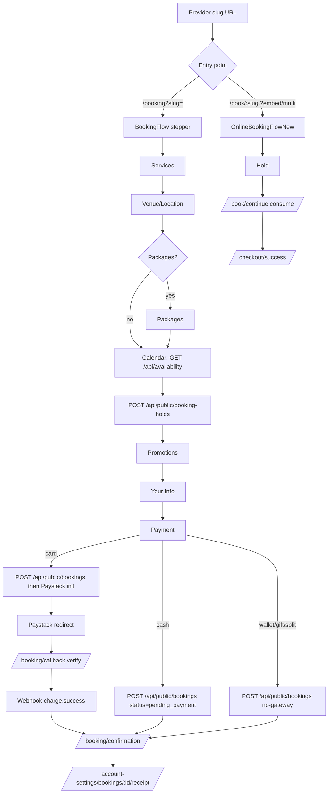
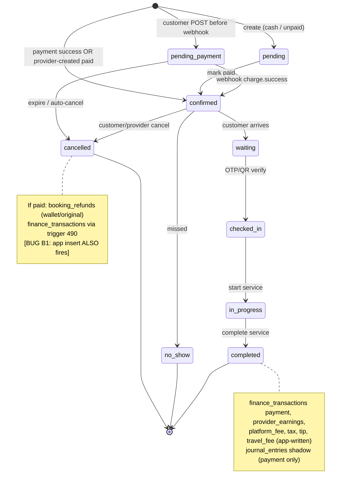
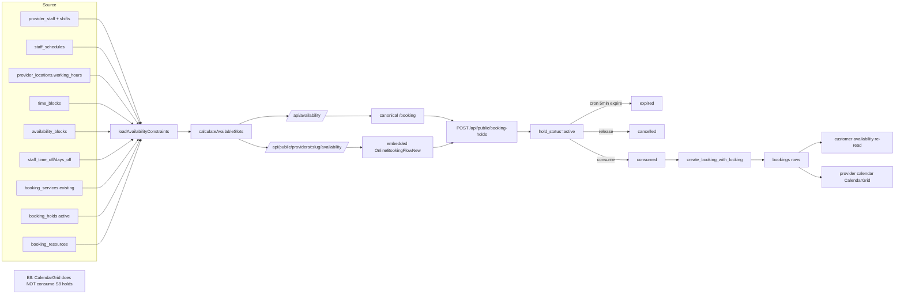
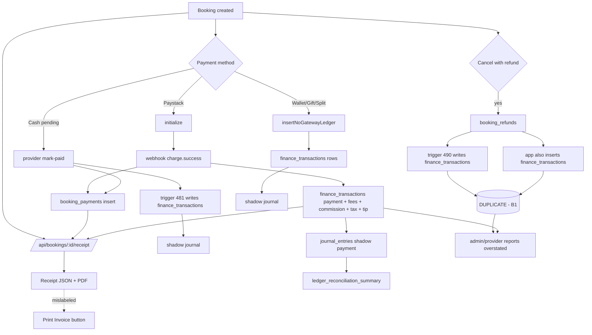

# Beautonomi — Booking System Production-Readiness Audit

**Date:** 2026-04-17
**Auditor persona:** principal product architect, senior booking-systems engineer, senior QA automation lead, fintech systems analyst, production-readiness auditor
**Scope:** customer web, customer mobile, provider web, provider mobile, admin, backend APIs, database schema, scheduling, calendar, payments, receipts, reporting
**Evidence standard:** code-only. Docs were not trusted unless code confirmed them. Every non-trivial claim cites `path:line`.

---

## 1. Executive Summary

**Hard verdict: NOT PRODUCTION READY. Do not launch.**

The booking system is **functionally dense** — it has every booking primitive customers and providers expect: multi-service, group, venue/mobile, deposits, wallet, gift cards, loyalty, promos, packages, recurring, on-demand, forms, variants, products, addons, DB-locked slot creation, a double-entry shadow ledger, period locks, a reconciliation pipeline, and a hold cron. Individually, these layers are impressive and mostly well-built.

But the **system as a whole fails the production-readiness bar on four axes**: financial integrity, webhook safety, calendar/state consistency, and cross-platform parity. The launch-blockers are not edge cases — they are steady-state bugs that will produce **incorrect financial reports on every cancellation**, **lost payments on webhook edge-conditions**, **silent double-books**, and **a provider mobile app that cannot edit a group booking**.

### Top launch blockers (all code-confirmed)

| # | Blocker | Impact | File:line |
|---|---------|--------|-----------|
| **B1** | **Refund ledger double-write** — `refund-processing.ts` inserts `booking_refunds` (trigger 490 writes `finance_transactions`) AND then manually inserts a second `finance_transactions` row without `source_refund_id`; the uniqueness index is partial on `IS NOT NULL`, so both rows persist. Every wallet-refunded cancellation **doubles refund totals** in provider payouts, admin finance, and double-entry shadow ledger. | Financial reports wrong by factor of 2× on refunds; provider payouts under-represented; ledger reconciliation will diverge | `supabase/migrations/490_finance_ledger_refund_reversal_trigger.sql:82–95`, `apps/web/src/lib/bookings/refund-processing.ts:166–177,222–233`, `apps/web/src/app/api/admin/bookings/[id]/refund/route.ts:112–141`, `apps/web/src/app/api/provider/bookings/[id]/refund/route.ts:151–205` |
| **B2** | **Paystack `charge.success` swallowed when booking missing** — handler logs `"Booking not found"` and returns without throwing; route wrapper then returns HTTP 200, so Paystack will NOT retry. Money is settled, the customer is charged, the booking is never updated. | Customer charged, booking stays `pending_payment`/`pending` forever; no automatic recovery | `apps/web/src/app/api/payments/webhook/_handlers/charge-success.ts:208–217`, `apps/web/src/app/api/payments/webhook/route.ts:143–176` |
| **B3** | **Webhook "processing" duplicate short-circuits** — if instance A dies mid-processing, duplicate delivery returns `200 { processing: true }` and the event is never retried. | Stuck bookings after any worker crash | `apps/web/src/app/api/payments/webhook/route.ts:132–135` |
| **B4** | **Hold consume is not atomic** — `consume/route.ts` checks `hold_status === 'active'` (line 217) and then `fetch()`s `/api/public/bookings` internally; the hold is only flipped to `consumed` AFTER the booking insert succeeds (line 447+). Two parallel `consume` requests can both pass the active check and both create bookings — second hits DB conflict but user sees errors and, worse, partial ledger rows may already exist. | Double-creation risk on network retries or double-click; partial rollbacks leak finance rows | `apps/web/src/app/api/public/booking-holds/[id]/consume/route.ts:217–226,447–459` |
| **B5** | **Reschedule has no server-side slot lock and uses a UTC/offset hack for time matching** — `/api/me/bookings/[id]/reschedule` recomputes slots and checks conflicts with `getUTCHours`/`getTimezoneOffset` rather than provider timezone; it does not call `create_booking_with_locking` or take an advisory lock. | Race-condition double-books; wrong-slot match under DST / non-ZA providers | `apps/web/src/app/api/me/bookings/[id]/reschedule/route.ts:182–257` |
| **B6** | **`checkBookingConflict` returns "no conflict" when the DB query errors** — silent false negatives let a double-book through. | Rare but silent double-bookings that will be discovered by the provider, not the system | `apps/web/src/lib/bookings/conflict-check.ts:70–75,204–206` |
| **B7** | **Calendar status mapper defaults unknown statuses to `CONFIRMED`** — the Mangomint adapter's `default:` branch returns `CONFIRMED` for anything it doesn't recognise, including `pending_payment` (added in migration 487). Unpaid bookings render as paid/confirmed on the provider calendar. | Providers serve customers who have not paid, believing they are confirmed | `apps/web/src/lib/scheduling/mangomintAdapter.ts:168–220` (default `218–219`) |
| **B8** | **Provider calendar never shows active holds** — `CalendarGrid` props accept `appointments`, `timeBlocks`, `availabilityBlocks` but not holds; holds only appear in the **customer** availability engine. A provider looking at her calendar does not see which slots are being held by customers in checkout. | Provider can overbook a slot a customer is mid-checkout on; confusion during live ops | `apps/web/src/components/provider-portal/calendar/CalendarGrid.tsx:31–36` vs `apps/web/src/lib/availability/load-constraints.ts:779–841` |
| **B9** | **Provider mobile group-booking edit saves with empty ID** — `openEdit` clears `selectedGroup`; `handleSaveEdit` PATCHes `/api/provider/group-bookings/${selectedGroup?.id ?? ""}`. The mobile app silently fails every group edit. | Provider mobile group booking editing is broken | `apps/provider/app/(app)/(tabs)/more/group-bookings.tsx:163–189` |
| **B10** | **Provider mobile cannot create group bookings** — no `POST /api/provider/group-bookings` caller exists in `apps/provider/**`; only GET/PATCH/DELETE/participants. | Providers must use web to create group sessions | `apps/provider/**` (absence; verified by grep) |
| **B11** | **Customer canonical `/booking` flow omits provider forms and tenant custom fields** — `OnlineBookingFlowNew` (embedded) and `/book/continue` load `provider-forms` and `/api/custom-fields/definitions?entity_type=booking`, but the canonical `apps/web/src/app/booking/components/**` stepper does not. Customers coming from search/explore therefore cannot fill required intake forms. | Providers who require intake forms get null data from ~all web bookings | `apps/web/src/app/booking/components/steps/**` (absence) vs `apps/web/src/app/book/components/OnlineBookingFlowNew.tsx:851–852`, `apps/web/src/app/book/continue/page.tsx` |
| **B12** | **Two availability backends** — canonical `/booking` stepper calls `/api/availability`; embedded `OnlineBookingFlowNew` calls `/api/public/providers/:slug/availability`. They take different parameters and may compute different slot sets for the same provider and day. | Flaky availability across entry points; customers see different slots depending on path | `apps/web/src/app/booking/components/steps/step-calendar.tsx:176–232` vs `apps/web/src/app/book/components/OnlineBookingFlowNew.tsx:1018+` |
| **B13** | **Notification reminders use server locale and do not pass `timeZone`** — `sendAppointmentReminders` and `notification-service` call `toLocaleDateString/toLocaleTimeString` without `timeZone`; booking emails and reminder SMS/push show times in the **Next.js server's** timezone, not the provider's. | Customer gets a reminder for a different hour than their actual appointment | `apps/web/src/lib/notifications/notification-service.ts:116–137,160–207`, `apps/web/src/lib/bookings/appointment-reminders.ts:97–108` |
| **B14** | **Booking receipts do not expose per-line `tax_snapshot` nor `total_refunded`** — `tax_snapshot` is written at validation (`validate-booking.ts:1439–1453`) but the receipt endpoint collapses to booking-level `tax_amount` only. Refund totals are hidden inside derived `balance_due`. | Audit receipts are not line-level; refund disputes lack hard evidence | `apps/web/src/app/api/bookings/[id]/receipt/route.ts:207–315` |
| **B15** | **`booking_holds` has `USING (true)`** RLS — any authenticated user can read any provider's held slots, including customer IDs and service IDs. | Privacy/data exposure risk; competitive intelligence leak | `supabase/migrations/216_booking_holds.sql:28–29` |

### Top product-correctness issues (not blockers, but severe)

| # | Issue | File:line |
|---|-------|-----------|
| P1 | **Group booking capacity is NOT modeled in availability** — `calculateAvailableSlots` treats slots as staff/time/resource occupancy only. `group_bookings.max_participants` is not consulted when generating slots. | `apps/web/src/lib/availability/calculate-slots.ts:179–294` |
| P2 | **Participant cancellation does not return capacity to availability** — `loadExistingBookings` is per-staff only, not per-group seat. | `apps/web/src/lib/availability/load-constraints.ts:624–647` |
| P3 | **Reference data (migration 080) declares labels for non-existent statuses** (`arrived`, `started`, `rescheduled`). UI pick-lists and reports can show labels that the DB enum cannot hold. | `supabase/migrations/080_reference_data.sql:129–136` |
| P4 | **Two separate status vocabularies** — `booking_payments.status = 'completed'` vs `bookings.payment_status = 'paid'`. | `supabase/migrations/126_booking_payments_and_refunds.sql` |
| P5 | **`check_booking_availability` (migration 012) uses `NOT IN ('cancelled','no_show')` only** — ignores `pending`, `pending_payment`, hold rows. Any path that calls this function instead of `lock_booking_services_for_update` will happily double-book unpaid bookings. | `supabase/migrations/012_functions_and_triggers.sql:257–258` |
| P6 | **Cancellation fees and provider_earnings are NOT shadowed into `journal_entries`** — migration 495's shadow trigger only handles `transaction_type IN ('payment','refund','tip','payout')`, so cancellation economics are missing from the double-entry ledger. | `supabase/migrations/495_double_entry_ledger.sql:149–153` |
| P7 | **`getFxRate` is dead code for bookings** — zero importers outside its own module; the FX infrastructure from migration 494 is wired to nothing. | `apps/web/src/lib/fx/get-fx-rate.ts` (no importers) |
| P8 | **Provider booking detail page never calls the `notify-*` REST routes** (`notify-cancellation`, `notify-reschedule`, `notify-resend`); the UI for these routes is missing. | `apps/web/src/app/provider/bookings/[id]/page.tsx` (absence) vs `apps/web/src/app/api/provider/bookings/[id]/notify-*/route.ts` |
| P9 | **"Invoice" is misnamed** — the provider portal's "Print Invoice" button calls `/api/provider/bookings/:id/receipt/pdf`. There is no customer invoice route. | `apps/web/src/components/appointments/AppointmentSidebar.tsx:1314–1327,1369–1370` |
| P10 | **Mobile customer search suggestions UI is admitted as unfinished.** | `apps/customer/app/(app)/(tabs)/search.tsx:47–49` |
| P11 | **Two Paystack patterns on mobile** — primary checkout uses `WebBrowser.openBrowserAsync`, pay-remaining uses an in-app `WebView`; inconsistent cookies/sessions. | `apps/customer/app/(app)/book-checkout.tsx:1677`, `apps/customer/app/(app)/booking-detail.tsx:507–510` |
| P12 | **Mobile download receipt opens the web print URL** that may require a logged-in web session the mobile app does not carry. | `apps/customer/app/(app)/booking-detail.tsx:1644` |

### Summary scorecard

| Domain | Score | Verdict |
|--------|------:|---------|
| Booking creation (happy path) | 9/10 | Works, but protected by handsome luck in 3+ places |
| Double-book protection | 6/10 | Strong at RPC layer; weak at reschedule + conflict-check error paths |
| Holds lifecycle | 8/10 | Good TTL + cron, but RLS open + not atomic on consume |
| Calendar accuracy | 5/10 | Status mapping wrong for `pending_payment`; no hold visibility for provider; group capacity missing |
| Payment correctness | 6/10 | Core flows work; webhook edge cases lose money |
| Refund correctness | **3/10** | Double-write blocker makes every wallet refund wrong |
| Receipts / invoices | 5/10 | Receipt exists; line-level audit detail absent; "invoice" is a receipt PDF |
| Cross-platform parity | 5/10 | Provider mobile group flows broken; customer web canonical flow missing forms; two availability backends |
| Notifications | 6/10 | Wired but tz-incorrect, no retry queue, no SMS default |
| Observability | 7/10 | Sentry + `safely()`, but webhook 200-swallow makes Sentry blind |
| DB hygiene | 7/10 | 504 migrations; most recent tree is clean; reference data drift |
| Production readiness | **NO-GO** | Blockers B1–B15 |

**Conclusion:** the platform is ~85% complete but the remaining 15% contains the parts that handle money correctness, payment retries, and cross-platform parity. Until B1–B15 are resolved, any launch will produce financially incorrect reports, stuck bookings, and provider support burden on mobile. Recommended posture: **4–6 weeks of focused remediation, then a staged launch behind a feature flag with a webhook-replay drill and a 24-hour reconciliation window**.

---

## 2. Audit Method and Evidence Standard

- **Tooling:** code-only exploration across `apps/web`, `apps/customer`, `apps/provider`, `supabase/migrations`, `scripts`, `tooling`. `apps/admin` is empty; `supabase/functions/` has no files — admin UI lives entirely under `apps/web/src/app/admin/**`.
- **Method:** 7 parallel explore agents followed by direct `Read`/`Grep` spot-checks on each claim that drives the verdict. Blockers B1–B4 were re-verified line-by-line.
- **Inclusion rule:** any claim marked Verified / Broken / Partial / Missing cites `file:line` at least once. Claims without `file:line` are labelled "Needs verification".
- **Exclusion rule:** documentation (`docs/PLAYBOOKS/**`, `docs/POLICIES/**`) is treated as **aspirational** unless code confirms it. Several playbooks (webhook-replay, secret-rotation, period-close) reference runbooks but are not invoked from code.
- **What is NOT in this audit:** actual DB introspection of a live Supabase project (no credentials), real webhook replay against Paystack sandbox, load testing, mobile device testing, accessibility, SEO, i18n depth. These remain open QA work.

---

## 3. Booking Domain Inventory

### 3.1 Apps and primary booking entry points

| Platform | Path | Role |
|----------|------|------|
| Customer web (canonical) | `apps/web/src/app/booking/page.tsx` → `components/booking-flow.tsx` | The canonical `/booking?slug=` stepper |
| Customer web (embedded) | `apps/web/src/app/book/[providerSlug]/page.tsx` → `OnlineBookingFlowNew.tsx` | Retained only for `?embed=1` or multi-service deep links; otherwise 308s to `/booking` |
| Customer web (continue) | `apps/web/src/app/book/continue/page.tsx` | Post-hold checkout for the embedded flow |
| Customer web (express) | `apps/web/src/app/book/l/[linkSlug]/page.tsx` | Shortlink resolver |
| Provider web | `apps/web/src/app/provider/bookings/**`, `apps/web/src/app/provider/calendar/**`, `apps/web/src/app/provider/group-bookings/**` | Full portal |
| Admin web | `apps/web/src/app/admin/bookings/**` | Superadmin table + detail |
| Customer mobile | `apps/customer/app/(app)/book/**`, `book-checkout.tsx`, `booking-detail.tsx`, `(tabs)/bookings.tsx` | Expo Router RN |
| Provider mobile | `apps/provider/app/(app)/(tabs)/calendar.tsx`, `more/bookings/**`, `more/group-bookings.tsx` | Expo Router RN |
| Backend | `apps/web/src/app/api/**` | ~1046 routes total; booking-related surface under `api/public/bookings`, `api/me/bookings`, `api/provider/bookings`, `api/admin/bookings`, `api/bookings/[id]/**`, `api/availability/**`, `api/public/booking-holds/**`, `api/payments/**` |

### 3.2 Database tables and enums

| Table | Source migration | Notes |
|-------|------------------|-------|
| `bookings` | `005_bookings.sql` | Core; no `deleted_at` in migration 497's soft-delete list |
| `booking_services` | `005_bookings.sql` + `493_tax_rates.sql` for `tax_snapshot` | Per-line items |
| `booking_participants` | `097_group_bookings.sql`, `485_*` (nullable booking_id) | Group participants |
| `booking_holds` | `216_booking_holds.sql` + `272_*` (GiST EXCLUDE) + `474_*` (expiry backfill) | 20-minute TTL, cron `*/5` |
| `booking_payments` | `126_booking_payments_and_refunds.sql` + `381_*` (tenant_id) | Status `pending/completed/failed/refunded/partially_refunded` — different vocabulary from `bookings.payment_status` |
| `booking_refunds` | `126_*` | No `tenant_id` column — trigger 492 derives via booking |
| `booking_audit_log` | `101_*` | Version + audit trigger |
| `booking_notes` | `424_*` | Free-form notes |
| `booking_products` | `117_*` | Retail lines attached to bookings |
| `booking_addons` | via `081_service_addons_and_variants.sql` | Single `offerings` table |
| `finance_transactions` | `014_paystack_support.sql` + many | Single-entry ledger; now partly trigger-driven |
| `financial_period_locks` | `468_*` + `488_*` (tenant_id UUID) | Enforced by trigger 492 |
| `tax_rates` | `493_*` | Platform default + provider overrides |
| `fx_rates` | `494_*` | Unused by booking flows |
| `gl_accounts` / `journal_entries` / `journal_lines` | `495_*`, `498_*`, `499_*` | Shadow ledger + backfill + reporting |
| `webhook_events` | `014_*` + sanitation fixes | 90d processed / 365d failed retention |
| `audit_logs` | `025_*` | Superadmin reads only |

**Booking status enum** (`public.booking_status`):
`pending, confirmed, in_progress, completed, cancelled, no_show` (from `001_initial_schema.sql:14`)
\+ `waiting, checked_in` (from `275_*`)
\+ `pending_payment` (from `487_*`)

**Payment status enum** (`public.payment_status`):
`pending, paid, failed, refunded, partially_refunded, partially_paid`

### 3.3 Key RPCs and triggers

| Name | Type | File:line | Purpose |
|------|------|-----------|---------|
| `create_booking_with_locking` | RPC | `supabase/migrations/455_rpc_atomic_resource_allocation.sql:7–201` | Booking insert + service lock + resource lock in one transaction |
| `lock_booking_services_for_update` | Helper | `475_*:6–31` | `SELECT … FOR UPDATE` excluding `cancelled`/`no_show` |
| `lock_booking_resources_for_update` | Helper | `455_*:42–54` | Resource row lock for capacity check |
| `acquire_booking_lock` | Helper | `136_*:254–266` | `pg_advisory_xact_lock(hashtext(...))` — used from TS pre-check, not inside `create_booking_with_locking` |
| `check_booking_availability` | Helper | `012_*:241–289` | **Stale logic** — excludes only cancelled/no_show |
| `create_finance_ledger_from_payment` | Trigger | `169_*` → current `481_*` | Skips Paystack (app writes), writes others |
| `create_finance_ledger_from_booking_refund` | Trigger | `490_*:19–76` | AFTER INSERT OR UPDATE OF status on booking_refunds; idempotent on source_refund_id |
| `shadow_post_finance_transaction` | Trigger | `495_*:135–194` | Writes journal_entries for payment/refund/tip/payout only |
| `enforce_finance_period_lock[_via_booking]` | Trigger | `492_*:5–77` | Rejects writes into locked periods |
| `backfill_journal_entries_from_finance_transactions` | RPC | `498_*:27–169` | Replays historic rows into journal_entries |
| `reserve_gift_card_redemption` / `capture_gift_card_redemption` | RPC | `*_gift_card_*` migrations | Gift card hold/capture |
| `wallet_credit_admin` / `wallet_debit_self` | RPC | wallet migrations | Wallet ledger writes |
| `ledger_provider_revenue` / `ledger_platform_revenue` / `ledger_reconciliation_summary` | RPC (read-side) | `499_*` | Cutover helpers |

### 3.4 Calendar components

| File | Role |
|------|------|
| `apps/web/src/components/provider-portal/calendar/CalendarGrid.tsx` | Canonical desktop grid; accepts `appointments`, `timeBlocks`, `availabilityBlocks` |
| `.../calendar/DateColumn.tsx` | Multi-staff day |
| `.../calendar/StaffColumn.tsx` | Single staff |
| `.../calendar/GestureLayer.tsx` | Clickable/droppable slot layer (no resize) |
| `.../calendar/BookingBlock.tsx` | Renders a booking; GROUP badge only, no product badge |
| `.../calendar/utils.ts` | `getAppointmentColors`, `mergeTeamWorkingHoursForCalendar`; re-exports labelled "old monolith" |
| `.../DragDropCalendar.tsx` | DnD (no resize) |
| `.../CalendarDesktopView.tsx` | Thin "backward-compatible wrapper" around CalendarGrid |
| `.../CalendarMobileView.tsx` / `CalendarMobileWithDnd.tsx` | Responsive mobile grid (web) |
| `apps/provider/app/(app)/(tabs)/calendar.tsx` | Native RN calendar; **not** a shared component — re-implements semantics |
| `apps/customer/app/(app)/book/index.tsx` | Native RN date picker modal |

### 3.5 Full-text API surface (booking-adjacent)

Booking-adjacent routes (counts via `grep`):
- `api/provider/**`: 392 route files total; ~30 direct booking routes + ~15 booking-sub-routes (notify, receipt, journey, verify, charges, audit, events, payments, resources, check-availability, etc.)
- `api/admin/**`: 354 route files; booking-specific: list, bulk, detail, cancel, refund, dispute, dispute/resolve
- `api/bookings/[id]/**`: receipt, receipt/pdf, review, status, at-home/*
- `api/me/bookings/[id]/**`: reschedule, cancel, cancel-preview, pay-remaining, resend-arrival-otp, verify-arrival, calendar.ics
- `api/public/bookings/**`: POST create, helpers (validate, process-payment, post-booking, charge-success, refund-events)
- `api/public/booking-holds/**`: POST create, release, consume, GET :id
- `api/payments/**`: webhook (Paystack), initialize, charge-saved-card, verify-reference
- `api/availability`: canonical `/booking` slot provider
- `api/public/providers/:slug/availability`: embedded slot provider (different params)
- `api/cron/**`: send-reminders, expire-booking-holds, prune-webhook-events, abandoned-carts, refresh-provider-analytics, refresh-reports

---

## 4. Booking Scenario Matrix

Legend: ✅ Verified end-to-end · ⚠️ Partial · ❌ Missing · 🔴 Broken · ❓ Needs verification

| Scenario | Customer web | Customer mobile | Provider web | Provider mobile | Admin |
|----------|:------------:|:---------------:|:------------:|:----------------:|:-----:|
| Single service | ✅ | ✅ | ✅ | ✅ | ✅ |
| Multi-service (same cart) | ✅ | ✅ | ✅ | ⚠️ Sidebar ok, calendar block shows only primary | ✅ |
| Group booking — create | ⚠️ Participants modeled in stepper; promo math differs from payment step | ✅ | ✅ | ❌ No `POST` caller in `apps/provider` | ✅ |
| Group booking — edit | ⚠️ Aggregate only (no per-participant REST from dialog) | ⚠️ | ⚠️ Aggregate only | 🔴 Empty ID PATCH bug | ⚠️ |
| Group participant add/remove | ⚠️ UI local state only until save | ✅ | ✅ API exists but not from dialog | ⚠️ | ✅ |
| Deposit vs full | ✅ | ✅ | ✅ | ✅ | ✅ |
| Cash | ✅ (no `booking_payments` row until provider mark-paid) | ✅ | ✅ | ✅ | ⚠️ |
| Wallet | ✅ | ✅ | ⚠️ (refund path credits wallet — see B1) | ⚠️ | ⚠️ |
| Gift card | ✅ | ✅ | ❓ | ❓ | ❓ |
| Wallet + card split | ✅ | ✅ | ❌ (provider creates in-person bookings; split UI is customer-only) | ❌ | ❌ |
| Gift card + card split | ⚠️ Only via Paystack webhook path | ⚠️ | ❌ | ❌ | ❌ |
| Paystack redirect | ✅ | ✅ (WebBrowser) | n/a | n/a | n/a |
| Paystack saved card | ⚠️ server-side via `POST /api/public/bookings` payload, not `chargeSavedCard` action | ⚠️ | n/a | n/a | n/a |
| Yoco | ❌ Customer web has no Yoco | ❌ | ⚠️ In-salon via mark-paid label only | ⚠️ | ⚠️ |
| Promo / coupon | ✅ | ✅ | ⚠️ Applied server-side; no provider UI to add promo | ⚠️ | ⚠️ |
| Loyalty redemption | ✅ | ✅ | ⚠️ Provider can't adjust | ⚠️ | ⚠️ |
| Staff select / any / auto | ✅ | ✅ | ✅ | ✅ | ⚠️ |
| Location (salon vs mobile) | ✅ | ✅ | ✅ | ✅ | ⚠️ |
| Addons | ✅ | ✅ | ✅ | ✅ | ⚠️ |
| Product on booking | ✅ | ⚠️ stock-mid-flow edge cases | ✅ Sidebar supports | ✅ | ⚠️ |
| Product variant | ✅ | ⚠️ | ✅ Sidebar supports | ✅ | ⚠️ |
| Forms / custom fields | ❌ Canonical `/booking` omits forms | ✅ Checkout | ⚠️ Detail loads `/api/provider/forms` | ⚠️ | ⚠️ |
| Notes | ✅ | ✅ | ✅ PATCH notes | ✅ | ✅ |
| Package / entitlement | ✅ | ✅ | ✅ | ✅ | ⚠️ |
| Recurring subscribe | ✅ | ✅ | ⚠️ provider can't manage recurring | ⚠️ | ⚠️ |
| On-demand request | ❌ web does not have on-demand stepper | ✅ | ❌ | ⚠️ Incoming alerts | ❓ |
| Reschedule | ⚠️ via account-settings + `AvailabilityCalendar` | ✅ inline via book flow | ✅ drag+drop + PATCH | ✅ | ⚠️ |
| Cancel | ✅ with preview | ✅ | ✅ | ✅ | ✅ |
| Cancellation preview fee | ✅ account-settings only | ✅ | ⚠️ No inline preview on provider detail | ⚠️ | ⚠️ |
| Partial refund | ⚠️ Provider-only | ⚠️ | ✅ | ✅ | ✅ |
| No-show flow | ⚠️ automated label only | ⚠️ | ✅ | ✅ | ✅ |
| Check-in (OTP / QR) | ⚠️ customer receives OTP | ✅ OTP verify in detail | ✅ front desk + detail | ✅ | ⚠️ |
| Mark complete | ⚠️ | ⚠️ | ✅ | ✅ | ✅ |
| Mark paid | ⚠️ not for customer | ⚠️ | ✅ (cash/yoco/other) | ✅ | ✅ |
| Waiting-room / late notify | ⚠️ | ⚠️ | ✅ | ✅ (front desk) | ❓ |
| Time blocks / days off | n/a | n/a | ✅ | ✅ | ⚠️ |
| Group cancel all | ⚠️ | ⚠️ | ✅ DELETE cascades to child bookings | ⚠️ | ✅ |
| Drag/drop reschedule | n/a | n/a | ✅ | ❌ | ⚠️ |
| Resize appointment | n/a | n/a | ❌ | ❌ | ❌ |
| Move across staff | n/a | n/a | ✅ | ⚠️ | ⚠️ |

**Observations**
- **Group bookings**: the scenario that is most unevenly supported. Customer and provider flows have divergent capacity models; mobile group create is missing; mobile group edit is broken.
- **Split payments**: wallet/gift/card split is effectively customer-web/mobile-only. Providers cannot finalize a mixed-tender booking in-salon.
- **Forms**: the canonical `/booking` path is missing provider intake forms. Any provider that set up forms for customer intake is silently losing that data from the main URL.

---

## 5. Customer-Side Booking Audit

### 5.1 Flow trace (canonical web `/booking`)

```
/booking?slug=            booking/page.tsx:6–11
  └─ BookingFlow          booking/components/booking-flow.tsx:42–1155
        ├─ GET /api/public/providers/:slug             500–530
        ├─ GET .../packages                            372–391
        ├─ GET /api/public/platform-fees               393–419
        ├─ step:service   GET /api/services?type=…     step-service-selection.tsx:261–349
        ├─ step:venue     GET .../service-zones        step-venue-choice.tsx:100–140
        ├─ step:packages  GET .../packages             step-packages.tsx
        ├─ step:calendar  GET /api/availability        step-calendar.tsx:176–232
        │                 POST /api/public/booking-holds on leave 616–681
        ├─ step:promotions                             step-promotions.tsx:94–174
        │                 POST /api/promotions/validate
        │                 GET /api/me/loyalty/balance
        ├─ step:yourInfo (skipped if user + clientInfo)
        └─ step:payment   POST /api/public/bookings    step-payment.tsx:405–546
                          - cash / gift / wallet / Paystack branch 644–752
                          - Paystack init via server action → /api/paystack/initialize
/booking/callback            GET /api/paystack/verify
/booking/confirmation        GET /api/me/bookings/:id → navigates to receipt
```

### 5.2 Scenario verification

- **Single / multi-service:** ✅ (selected services array; calendar duration sums).
- **Group bookings:** ⚠️ **Promo math inconsistency** between `step-promotions.tsx:44–48` (`selectedServices.reduce`) and `step-payment.tsx:55–77` (`groupParticipants.reduce`). A coupon validated against pre-group total may not match the amount actually charged.
- **Deposit / full pay:** ✅ explicit `paymentOption`.
- **Cash:** ✅ but deliberately does **not** write `booking_payments` — this is correct by design but means the customer leaves in `payment_status: pending` until provider marks paid.
- **Wallet / Gift / Split:** ✅ payload `use_wallet` and split handling via `insertNoGatewayLedger` in `process-payment.ts:605–837`.
- **Paystack saved card:** ⚠️ the server action `chargeSavedCard` in `payment-actions.ts:65–77` is **defined but never imported by UI**. The saved-card path instead passes `payment_method_id` inside `POST /api/public/bookings` — technically works but dead code invites drift.
- **Yoco:** ❌ no Yoco code path anywhere in `apps/web/src/app/booking/**` or `apps/web/src/app/book/**`.
- **Provider forms / custom fields:** 🔴 **MISSING from canonical `/booking`** but present in `OnlineBookingFlowNew` (`apps/web/src/app/book/components/OnlineBookingFlowNew.tsx:851–852`) and `/book/continue` — see B11.

### 5.3 Customer UX risks (web)

1. **Two success paths**: `/booking/confirmation` (canonical) vs `/checkout/success` (embedded `consume`). Analytics and post-booking UX diverge.
2. **`debug ingest`**: `OnlineBookingFlowNew.tsx:305–308` posts raw payloads to `NEXT_PUBLIC_DEBUG_INGEST_URL` when set. Production accidentally setting this env leaks PII.
3. **Venue `canProceed`** returns `true` even when `location_id` has not loaded (`booking-flow.tsx:933–937`); comment defers validation to payment step. If payment fails with 400 after 5 minutes of form-filling, user loses context.
4. **Confirmation retry** polls 404 at `confirmation/page.tsx:139–141` — masks webhook lag but will spin forever if B2 blocker triggers.

### 5.4 Customer mobile flow trace

```
(app)/search → partner-profile → (app)/book/index.tsx   (wizard)
                 └─ POST /api/public/booking-holds
(app)/book/continue.tsx  (receives hold_id)              → book-checkout
book-checkout.tsx:
   ├─ GET /api/public/booking-holds/:id
   ├─ promos / loyalty / gift card
   ├─ POST /api/public/booking-holds/:id/consume
   ├─ if Paystack: WebBrowser.openBrowserAsync
   └─ after success: navigate to booking-detail
```

- Mobile **does not** have `/booking/confirmation`; it routes directly to native `booking-detail.tsx`.
- Mobile has **no dedicated reschedule page**; reschedule passes `reschedule_booking_id` through the book flow (`booking-detail.tsx:442–453`).
- Mobile has **no dedicated receipt page**; shows the receipt tab inside `booking-detail.tsx:965+` and offers a **"Download"** that opens a web print URL — see P12.
- **Search suggestions**: explicitly unfinished (`search.tsx:47–49`).
- **Bookings list timezone**: hardcoded `en-US` locale with no provider tz (`bookings.tsx:34–38`), while detail uses `display_time_zone` (`booking-detail.tsx:956–957`). UI is inconsistent.

### 5.5 Customer parity matrix (web vs mobile)

| Capability | Web | Mobile | Parity |
|------------|:---:|:------:|:------:|
| `/book/[providerSlug]` | ✅ | ✅ | ✅ |
| `/book/continue?hold_id=` | ✅ | ✅ | ✅ |
| `/book/l/[linkSlug]` | ✅ | ✅ | ✅ |
| `/booking/confirmation` page | ✅ | ❌ (native overlay) | ⚠️ |
| Reschedule dedicated route | ✅ | ❌ (via book flow) | ⚠️ |
| Receipt page | ✅ | ⚠️ (tab + web print link) | ⚠️ |
| `pay-additional/[chargeId]` | ✅ | ⚠️ WebView | ⚠️ |
| Provider forms | ❌ on canonical `/booking` | ✅ | 🔴 regression in canonical web path |
| Search suggestions | ✅ | ❌ WIP | ⚠️ |
| Push notifications | n/a | ✅ (OneSignal) | n/a |
| Offline cached bookings | n/a | ✅ (AsyncStorage) | n/a |
| Deep link scheme | n/a | ✅ `customer://` | n/a |

---

## 6. Provider-Side Booking Audit

### 6.1 Provider web surfaces

| Surface | File | Role |
|---------|------|------|
| Bookings list | `apps/web/src/app/provider/bookings/BookingsClient.tsx:80–892` | List, filter, bulk, realtime, Yoco dialog |
| Booking detail | `apps/web/src/app/provider/bookings/[id]/page.tsx:198–2343` | Operational screen: status, journey, arrival OTP/QR, mark paid, refund, receipt PDF, notes, consent |
| Calendar | `apps/web/src/app/provider/calendar/CalendarClient.tsx:64–2477` | Week/day DnD, time blocks, group dialog, front desk |
| Group bookings list | `apps/web/src/app/provider/group-bookings/page.tsx:18–122` | Delete, check-in/out, dialog entry |
| Time blocks | `apps/web/src/app/provider/time-blocks/page.tsx:29–78` | CRUD |
| Shifts | `apps/web/src/app/provider/team/shifts/page.tsx:23–58` | Weekly |
| Days off | `apps/web/src/app/provider/team/days-off/page.tsx:37–60` | Team-level |
| Settings → group appointments / closed periods / blocked time | `apps/web/src/app/provider/settings/appointment-activity/**` | |

### 6.2 Admin web surfaces

| Surface | File | Role |
|---------|------|------|
| Admin bookings | `apps/web/src/app/admin/bookings/page.tsx:86–463` | `GET /api/admin/bookings`, bulk actions (`cancel`, `complete`, `export`) |
| Admin booking detail | `apps/web/src/app/admin/bookings/[id]/page.tsx:152–908` | PATCH, cancel, refund, provider search, reassign, dispute |

Provider bulk action set (`confirm | cancel | complete | no_show | delete`, `api/provider/bookings/bulk/route.ts:65–76`) and **admin bulk action set** (`cancel | complete | export`, `api/admin/bookings/bulk/route.ts:11–12`) **differ**.

### 6.3 Provider action → API → DB coverage matrix

| Action | API | RPC / write | Evidence |
|--------|-----|-------------|----------|
| Mark paid | `POST /api/provider/bookings/:id/mark-paid` | `create_booking_payment` RPC | `mark-paid/route.ts:181–285`; ledger via trigger |
| Mark complete | `POST .../complete-service` | `UPDATE bookings` | `complete-service/route.ts` |
| No show | `PATCH` or bulk | `UPDATE bookings` | `bulk/route.ts:65–76` |
| Check-in | `PATCH` + waiting-room routes | `UPDATE bookings`, `waiting_room` | `waiting-room/route.ts` |
| Cancel | `PATCH` or bulk | `UPDATE bookings`; **no version check in bulk** | `bulk/route.ts` |
| Reschedule (web) | `updateAppointment` → `PATCH .../bookings/:id` | `UPDATE booking_services.scheduled_at` | `api.ts:1076–1085,1238` |
| Refund | `POST .../refund` | `wallet_credit_admin` RPC + `booking_refunds` insert + **manual `finance_transactions` insert** | `refund/route.ts:151–205` — **B1** |
| Group cancel all | `DELETE /api/provider/group-bookings/:id` | `UPDATE bookings.status='cancelled'` for every child | `group-bookings/[id]/route.ts:115–120` |
| Individual participant | `DELETE /participants/:pid` | `DELETE booking_participants` + `UPDATE booking` | `participants/[participantId]/route.ts:54–71` |

### 6.4 Provider mobile

| Action | File | Status |
|--------|------|--------|
| View list | `more/bookings.tsx:1–293` | ✅ |
| View detail | `more/bookings/[id].tsx:1–2828` | ✅ |
| Create booking | `more/bookings/new.tsx:1–2060` | ✅ `POST /api/provider/bookings` |
| Edit booking / reschedule / cancel | `more/bookings/[id].tsx` | ✅ |
| Block time | `calendar.tsx`, `more/time-blocks.tsx`, settings | ✅ |
| Group create | — | ❌ **B10** |
| Group edit | `more/group-bookings.tsx:163–189` | 🔴 **B9** empty ID PATCH |
| Group participants | `more/group-bookings.tsx` | ⚠️ |
| Reschedule | detail + calendar | ✅ |
| Mark paid | detail | ✅ |
| Refund | detail | ✅ via `POST .../refund` (same B1 double-write risk) |
| Check-in | detail + waiting-room | ✅ |
| Calendar | native `calendar.tsx` | ⚠️ No month grid, no DnD desktop parity |
| Waiting room | `more/waiting-room.tsx` | ✅ |

### 6.5 Provider parity matrix (web vs mobile)

| Capability | Web | Mobile |
|------------|:---:|:------:|
| Desktop DnD calendar | ✅ | ❌ |
| Month schedule view | ⚠️ (day/3-day/week, no month in `CalendarGrid`) | ❌ (date picker only) |
| Group booking creation | ✅ | ❌ |
| Group booking edit | ✅ | 🔴 broken PATCH |
| Shifts CRUD | ✅ | ✅ |
| Days off / time off | ✅ | ✅ |
| Front desk / waiting room | ✅ | ✅ |
| Mark paid / complete / cancel / refund | ✅ | ✅ |
| Provider offline queue for mutations | ❌ | ❌ (only NetInfo banner) |
| Push notifications | ⚠️ browser only | ✅ OneSignal |
| Waiting-room notifications use REST | ❌ (server actions instead) | ❌ |
| `notify-*` REST routes | ✅ backend only | ✅ backend only |

### 6.6 Inconsistencies

1. **`BulkBookingActions` "Select all" is stubbed** — toast says IDs not available (`BulkBookingActions.tsx:50–52`). UX misleading.
2. **Provider detail does not call `notify-*` REST routes** (`provider/bookings/[id]/page.tsx` has zero `notify-` references, P8).
3. **`GroupBookingDialog` ignores per-participant REST** (`api.ts:3877–3914` unused from dialog); aggregate PATCH only.
4. **Refund semantics**: `POST .../refund` credits **wallet**; UI copy can mislead if customer expects card reversal.
5. **Waiting-room notifications** use server actions (`WaitingRoomPanel.tsx:133,182–183`), bypassing the REST notify-* routes — inconsistent observability and retry policies.

---

## 7. Calendar and Scheduling Audit

### 7.1 Availability pipeline (no RPC source of truth)

```
loadAvailabilityConstraints  (apps/web/src/lib/availability/load-constraints.ts)
  ├── loadStaffShifts (+ recurring expansion)           :374–437
  ├── loadStaffWorkingHours / location fallbacks        :181–291, 1007–1055
  ├── loadTimeBlocks (+ recurring)                      :491–597
  ├── loadExistingBookings                              :604–761
  ├── loadActiveBookingHolds (synthetic bookings)       :779–841
  ├── loadAvailabilityBlocks                            :848–884
  └── loadPublicCalendarParityBookings (optional)       :1066–1080
           │
           ▼
calculateAvailableSlots  (apps/web/src/lib/availability/calculate-slots.ts:179–294)
```

**Consumers**:
- `GET /api/availability` (canonical `/booking` stepper)
- `GET /api/public/providers/[slug]/availability` (embedded `OnlineBookingFlowNew`) — calls `computePublicSlugAvailabilitySlots`
- `reschedule/route.ts:182–208` recomputes via `calculateAvailableSlots` with `excludeBookingId`

### 7.2 Timezone handling

- **Slot dates** are string-valued `YYYY-MM-DD`; weekday derived from `new Date(\`${date}T12:00:00\`)` (`load-constraints.ts:145–146,206–207,262–263`) — environment-dependent.
- **`combineDateAndTime` without a `timezone` argument** produces `${date}T${time}Z` — **UTC** (`time-utils.ts:79–82`). Callers must treat slot times as "provider-local clock" or apply `parse-selected-datetime-in-provider-tz.ts:10–19` (which correctly uses `date-fns-tz`).
- **`reschedule/route.ts:210–215`** uses `getUTCHours`/`getTimezoneOffset` instead of provider tz — **DST bug waiting** — blocker **B5**.
- Tests cover `Africa/Johannesburg` (no DST) only — `parse-selected-datetime-in-provider-tz.test.ts:6–20`. DST coverage missing.

### 7.3 Hold lifecycle

```
POST /api/public/booking-holds
  ↳ booking-holds/route.ts
      :70    HOLD_EXPIRY_MINUTES = 20
      :526–657 overlap checks (hold/booking/block)
      :617–631 insert active + expires_at
         ↑
         │ GiST EXCLUDE (active-only) — migration 272

POST /api/public/booking-holds/:id/release
  ↳ status := 'cancelled' (release/route.ts:29–33)

POST /api/public/booking-holds/:id/consume
  ↳ :217 check hold_status === 'active'
  ↳ :418–428 internal fetch /api/public/bookings
  ↳ :447–458 mark hold 'consumed' (only on success)   ← NOT ATOMIC, B4

Cron: /api/cron/expire-booking-holds (every 5 minutes, vercel.json:13)
  ↳ UPDATE hold_status='expired' WHERE expires_at < now()
```

**Risks**
- **GiST EXCLUDE uses `hold_status = 'active'`** (migration 272_*:10–26); predicate does NOT include `expires_at`, so stale `active` holds past their `expires_at` still occupy the EXCLUDE envelope. Reads elsewhere filter by `expires_at > now()`, so UX usually works — but a race between cron and new insert can produce EXCLUDE violations.
- **Provider calendar does not render holds** (`CalendarGrid.tsx:31–36` accepts only `appointments/timeBlocks/availabilityBlocks`) → blocker **B8**.
- **RLS on `booking_holds` is wide open** (`216_*:28–29`: `WITH CHECK (true)`, `USING (true)`) → blocker **B15**.

### 7.4 Booking status → calendar visual mapping

| DB status | `getStatusColor` (Tailwind) | `mapStatus` (Mangomint) | Visual risk |
|-----------|-----------------------------|--------------------------|-------------|
| `pending` | amber | `UNCONFIRMED` | ok |
| `pending_payment` | listed | **falls to `default: CONFIRMED`** | **B7** looks paid |
| `confirmed` | green | `CONFIRMED` | ok |
| `in_progress` | blue | `IN_PROGRESS` | ok |
| `completed` | grey | `COMPLETED` | ok |
| `cancelled` | red / hidden by `showCanceled` | `CANCELLED` | ok |
| `no_show` | red | `NO_SHOW` | ok |
| `waiting` / `checked_in` | yellow | mapped | ok |

### 7.5 Double-book protection matrix

| Layer | Mechanism | Strength | Evidence |
|-------|-----------|----------|----------|
| UI | Slot availability false | Weak | `calculate-slots.ts:237–285` |
| API pre-check | `checkBookingConflict` / `lockBookingServices` | **Weak (returns no-conflict on DB error)** | `conflict-check.ts:70–75,204–206` |
| Hold | Overlap + GiST EXCLUDE | **Strong** (EXCLUDE) | `272_*:10–26` |
| Booking insert | `create_booking_with_locking` + `lock_booking_services_for_update` | **Strong** | `455_*`, `475_*` |
| Resources | `lock_booking_resources_for_update` | Strong | `455_*:42–54` |
| Reschedule | `calculateAvailableSlots(excludeBookingId)` | **Weak (no DB lock)** | `reschedule/route.ts:226–284` |

### 7.6 Calendar bugs list

1. **B7** — Mangomint default → CONFIRMED for unknown statuses.
2. **B8** — Provider calendar blind to holds.
3. **B5** — Reschedule UTC/offset hack.
4. **B6** — `checkBookingConflict` swallows errors.
5. `canReschedule` excludes `pending_payment` (`booking-status.ts:195–197`) — policy inconsistency.
6. `loadExistingBookings` uses string date bounds — cross-tz long-span edge cases (`load-constraints.ts:645–646`).
7. Cron comment says "every 2 minutes" but schedule is 5-minute (`expire-booking-holds/route.ts:5–6` vs `vercel.json:13`) — documentation drift only.

---

## 8. UI / Forms / Modals / Flow Completeness Audit

### 8.1 Customer-side

**Modals & dialogs verified**
- LoginModal (`step-payment.tsx:100,1607–1617`)
- Save-address dialog (`step-venue-choice.tsx:1064–1129`)
- Group participant dialog (`step-group-participants.tsx:321–406`)
- Month calendar overlay (`step-calendar.tsx:438+`)
- Gate modal (embedded only, `OnlineBookingFlowNew.tsx:1631+`)

**Empty / error / retry coverage**
- `LoadingTimeout` wrapper used on entry and confirmation
- Toasts via `sonner` throughout
- Empty services toast (`step-service-selection.tsx:301–304`)
- Confirmation 404 retry loop (`confirmation/page.tsx:139–141`)

**UX holes**
- `Venue` canProceed returns true without location loaded (see §5.3)
- No in-wizard cancellation-preview; user must go to `/account-settings/bookings/:id` for preview
- Group promo math mismatch (see §5.2 and B-list)
- `chargeSavedCard` server action is dead

### 8.2 Provider-side

- **AppointmentSidebar** is the rich edit experience (`components/appointments/AppointmentSidebar.tsx`) — supports services, variants, addons, products, forms.
- **Detail page** (`provider/bookings/[id]/page.tsx`) is operations-heavy (payments, refunds, QR/OTP, journey) but **does not** offer the same inline catalog editor — providers must switch to the calendar sidebar or edit from the calendar block.
- **GroupBookingDialog** operates on aggregate only, not per-participant (see §6.6).
- **Bulk select-all is a stub** (see §6.6).
- **Notify-* routes have no UI** (see §6.6).
- **Provider "Print Invoice"** calls receipt PDF endpoint (see P9).

### 8.3 Admin-side

- Admin booking pages implement basic CRUD (`admin/bookings/**`) but lack parity with provider detail (no QR/OTP/journey/check-in UI). If Admin intervenes, they cannot fully operate the booking without calling APIs manually.

---

## 9. Database / State / Transition Audit

### 9.1 Enum inventory

| Enum | Values | Migration |
|------|--------|-----------|
| `booking_status` | `pending, confirmed, in_progress, completed, cancelled, no_show, waiting, checked_in, pending_payment` | `001_*`, `275_*`, `487_*` |
| `payment_status` | `pending, paid, failed, refunded, partially_refunded, partially_paid` | `001_*`, `381_00_*` |
| `booking_payments.status` (TEXT) | `pending, completed, failed, refunded, partially_refunded` | `126_*` |
| `booking_refunds.status` (TEXT) | `pending, completed, failed` | `126_*` |
| `booking_holds.hold_status` | `active, consumed, expired, cancelled` | `216_*` |
| `group_bookings.status` | `pending, confirmed, cancelled, completed` | `097_*` |
| `gl_account_type` | `asset, liability, equity, revenue, expense` | `495_*` |

### 9.2 Enum drift findings

- **`080_reference_data.sql:129–136`** seeds labels for `arrived`, `started`, `rescheduled` — none exist in `booking_status` (P3).
- **`booking_payments.status='completed'` vs `bookings.payment_status='paid'`** — two vocabularies (P4).
- Migration `475_*` fixes a historical `'failed'` literal that was never a booking status — sign of prior drift now remediated.
- **TS contract test**: `apps/web/src/__tests__/lib/booking-status-enum-contract.test.ts` scans `.eq("status", …)` call sites — suggests this category of drift has been addressed but only for that one assertion pattern.

### 9.3 Transitions (evidence-based)

**`bookings.status`** transitions are enforced **only by the enum type** + application logic in `canCancel`/`canReschedule` (`booking-status.ts`). No state-machine trigger. `booking_audit_log` records changes but its `event_type` CHECK does not list `pending_payment`; trigger function `log_booking_status_change` falls through to `status_changed` for unknown transitions (`101_*:92–98`).

**Reachable-but-unusual states**
- `status=confirmed, payment_status=failed` — possible if payments fail after confirmation (app-dependent)
- `status=pending_payment, hold_status=active` — hold still locking slot (B7 shows this as confirmed on provider calendar)
- `status=cancelled, payment_status=paid` — awaiting refund; UI/reports should treat as "paid then refunded"

### 9.4 Financial tables risks

- **B1 double-write** already detailed.
- **`finance_transactions`** is still app-written from multiple paths: `charge-success.ts`, `process-payment.ts`, `admin/refund/route.ts`, `refund-processing.ts`, `portal/.../cancel`, `provider/bookings/[id]/route.ts` (cancellation fee), `dispute/resolve`. Migration 481 decides who writes based on `payment_provider == 'paystack'`.
- **Migration 495 shadow trigger only handles `payment/refund/tip/payout`** — `cancellation_fee`, `provider_earnings`, `service_fee`, `tax`, `travel_fee` are invisible to `journal_entries` (P6).
- **`financial_period_locks`** enforced on `finance_transactions`, `booking_payments`, `booking_refunds` (via booking tenant join) by 492 — covers the main writers.

### 9.5 Soft delete

- `497_soft_delete_policy.sql:9–17` lists `users, providers, offerings, products, provider_locations, provider_staff, booking_holds`. **`bookings` has no `deleted_at`** — still hard-delete or cancel-only.
- `_active` views exist but app code does not systematically query them (P14).

### 9.6 RLS findings

- **`booking_holds` wide open** — B15.
- `finance_transactions` provider SELECT via booking join + service_role full access (`230_*`).
- `booking_audit_log` insert with `WITH CHECK (true)` — relies on trigger SECURITY DEFINER.
- Most other booking tables have tenant-aware policies added post-migration 332.

---

## 10. Receipts / Invoices / Payment Consequences Audit

### 10.1 Payment method inventory

| Method | Code path | Writes to `booking_payments` | Writes to `finance_transactions` |
|--------|-----------|:-----------------------------:|:-------------------------------:|
| Paystack redirect | `process-payment.ts:319–556` | via webhook | via webhook app-writes (migration 481 skips trigger) |
| Paystack saved card | `process-payment.ts:357–488` | ✅ | via webhook |
| Paystack refund webhook | `refund-events.ts` | — | via trigger 490 |
| Cash (customer) | `process-payment.ts:560–594` | ❌ (deferred to provider mark-paid) | — |
| Cash (provider mark-paid) | `mark-paid/route.ts:170–175` | via RPC `create_booking_payment` | via trigger 481 |
| Yoco (in-salon) | `mark-paid/route.ts:170–175` labels `yoco` | ✅ | via trigger 481 |
| Gift card | `process-payment.ts:118–172`, RPCs `reserve_gift_card_redemption`/`capture_gift_card_redemption` | ❌ | ✅ in no-gateway helper |
| Wallet | `process-payment.ts:174–248` (`wallet_debit_self`) | ❌ | ✅ via helper |
| Wallet + card split | webhook `charge-success.ts:624–696` | card row | wallet row |
| Loyalty redemption | `process-payment.ts:267–274` (no-gateway), `charge-success.ts:375–407` (webhook) | via `loyalty_point_transactions` | ✅ |
| Pay remaining (deposit) | `/api/me/bookings/[id]/pay-remaining`, webhook `charge-success.ts:200–204` | ✅ | via app |
| Customer cancel refund | `refund-processing.ts:166–233` | — | **DOUBLE** via trigger 490 + app insert (B1) |
| Provider refund | `provider/refund/route.ts:151–205` | — | **DOUBLE** via trigger 490 + app insert (B1) |
| Admin refund | `admin/bookings/[id]/refund/route.ts:112–141` | — | **DOUBLE** (B1) |

### 10.2 Receipt

- **Endpoint:** `GET /api/bookings/[id]/receipt` (`route.ts:66–331`)
- **Shape:** booking + provider + customer, services, addons, products (+ variant label), subtotal, `tax`, `tax_rate`, fees, travel, tip, cancellation_fee, total, currency, payment_status, amount_paid, balance_due, deposit fields, `transactions` (from booking_payments), `additional_charges`
- **Gaps:**
  - Per-line `tax_snapshot` is written at validation but not read by receipt (**B14** / P-class)
  - No direct `total_refunded` field; refund effect is derived via `balance_due` / `payment_status`
  - No invoice vs receipt distinction (P9)

### 10.3 Invoice

- **No** `/api/bookings/[id]/invoice` route exists in code.
- The provider portal's "Print Invoice" / "Email Invoice" buttons both call receipt endpoints (`AppointmentSidebar.tsx:1314–1370`).
- Platform/provider subscription invoices (`/api/provider/invoices/**`) are separate — not booking receipts.

### 10.4 Cancellation and refund ledger consequences

| Event | `booking_payments` | `booking_refunds` | `finance_transactions` | `journal_entries` |
|-------|:-:|:-:|:-:|:-:|
| Paystack charge success | + | — | + (app) | + (shadow) |
| Customer cancel with wallet refund | — | + | **+ (trigger) AND + (app) — DOUBLE** | **+ and +** |
| Provider refund | — | + | **DOUBLE** (B1) | **DOUBLE** |
| Admin refund | — | + | **DOUBLE** (B1) | **DOUBLE** |
| Cancellation fee (customer cancels) | — | — | + (`transaction_type='cancellation_fee'`) | **MISSING** (P6) |
| No-show | — | — | — | — |

### 10.5 Reconciliation posture

- `v_ledger_reconciliation` view (`495_*:203–218`) can detect missed rows but will not detect the **duplicate** writes of B1 because both rows have distinct `id` values; the view joins on `external_ref = ft.id::text`, so each gets its own journal entry.
- `ledger_reconciliation_summary(from, to)` (`499_*`) will report **inflated** `legacy_sum_abs` compared to reality.

---

## 11. Cross-Platform Parity Audit

### 11.1 Source-of-truth map per booking state

| Field | Source of truth | Consumed by |
|-------|------------------|-------------|
| `bookings.status` | DB enum | All UI |
| `bookings.payment_status` | Derived by trigger from `booking_payments`+`booking_refunds` | All UI |
| Total, subtotal, tax | `bookings.*` columns | Receipt; embedded displays may recompute |
| Per-line tax | `booking_services.tax_snapshot` | **unused by receipt** (B14) |
| Hold status | `booking_holds.hold_status` | `/api/availability` (customer); NOT provider calendar (B8) |
| Group capacity | `group_bookings.max_participants` | **unused by `calculateAvailableSlots`** (P1) |
| Refund total | `finance_transactions` where `transaction_type='refund'` | Reports; **inflated by 2× due to B1** |

### 11.2 Mismatches

1. **Two availability backends** (B12) — canonical vs embedded.
2. **Customer forms** (B11) — canonical `/booking` omits.
3. **Group math** — promo vs payment step divergence.
4. **Provider calendar** does not see customer holds (B8).
5. **Status labels**: `reference_data` 080 lists labels for enum values that don't exist (P3).
6. **Payment vocabularies** — `completed` vs `paid` (P4).
7. **Mobile receipt**: tab view vs web `print=1` URL (P12).
8. **Paystack sessions**: WebBrowser vs WebView (P11).
9. **Timezone in notifications** — server default, not provider (B13).

### 11.3 Cross-platform parity matrix (summary)

| Capability | CW | CM | PW | PM | AW |
|------------|:-:|:-:|:-:|:-:|:-:|
| Create single | ✅ | ✅ | ✅ | ✅ | ✅ |
| Create group | ⚠️ | ✅ | ✅ | ❌ | ✅ |
| Edit group | ⚠️ | ✅ | ⚠️ | 🔴 | ⚠️ |
| Reschedule | ⚠️ | ✅ | ✅ | ✅ | ⚠️ |
| Cancel with preview | ✅ | ✅ | ⚠️ | ⚠️ | ⚠️ |
| Refund | ⚠️ | ⚠️ | ✅ (B1) | ✅ (B1) | ✅ (B1) |
| Mark paid | n/a | n/a | ✅ | ✅ | ✅ |
| Check-in / OTP | ⚠️ | ✅ | ✅ | ✅ | ⚠️ |
| Receipt | ✅ | ⚠️ | ✅ | ✅ | ⚠️ |
| Forms | ❌ (canonical) / ✅ (embedded) | ✅ | ⚠️ | ⚠️ | ⚠️ |
| Products / variants on booking | ✅ | ⚠️ | ✅ | ✅ | ⚠️ |
| Split payment | ✅ | ✅ | ❌ | ❌ | ❌ |
| Calendar with holds | ✅ | n/a | ❌ | ❌ | ❌ |
| Push notifications | n/a | ✅ | n/a | ✅ | n/a |

CW=customer web, CM=customer mobile, PW=provider web, PM=provider mobile, AW=admin web.

---

## 12. Production Readiness and Edge-Case Audit

### 12.1 Races

| Risk | Evidence | Severity |
|------|----------|----------|
| Double-submit checkout | UI disables button; no server idempotency key on `POST /api/public/bookings` | Medium |
| Parallel hold consume | `consume/route.ts:217,447` not atomic | **Blocker B4** |
| Cancel vs reschedule interleave | `reschedule/route.ts:226–257` version check; `public/bookings/route.ts:126–199` plain update | Medium |
| Refund + participant cancel | No shared lock (`refund-events.ts:47–127` + `group-booking-cancellation.ts:12–56`) | Medium |

### 12.2 Webhooks

| Risk | Evidence | Severity |
|------|----------|----------|
| `charge.success` booking missing → 200 silent | `charge-success.ts:208–217` + `webhook/route.ts:143–176` | **Blocker B2** |
| `processing` duplicate short-circuit | `webhook/route.ts:132–135` | **Blocker B3** |
| Retention / prune | 90d processed / 365d failed (`cron/prune-webhook-events/route.ts:8–20`) | OK |
| Replay runbook | Docs only; no in-app trigger | Low |
| Payload encryption | Sanitizer strips; no `pgsodium` | Medium |

### 12.3 Payments

| Risk | Evidence | Severity |
|------|----------|----------|
| Booking insert fails after payment init | `public/bookings/route.ts:260–301` has `releaseBookingSlotAfterPaymentFailure` | OK-ish |
| `releaseBookingSlotAfterPaymentFailure` fails silently | `console.error` only | Medium |
| Abandoned booking | `cron/abandoned-carts/route.ts` targets product cart, **not** booking holds; booking cleanup is retry-only in `public/bookings/route.ts:219–241` | Medium |
| Double-charge | `payment_transactions` by reference + `(payment_provider, payment_provider_id)` on `booking_payments` | OK |

### 12.4 Calendar / state sync

| Risk | Evidence | Severity |
|------|----------|----------|
| After cancel, web list may stay stale | Per-page `loadBookings` calls vary | Low-Medium |
| Mobile list relies on realtime + pull-to-refresh | `bookings.tsx:175–200` | OK |
| Optimistic UI vs server | `reschedule/route.ts:226–257` uses version; mobile may not pass it | Medium |

### 12.5 Notifications

| Risk | Evidence | Severity |
|------|----------|----------|
| Timezone in reminders | No `timeZone` passed (`notification-service.ts:116–137,160–207`) | **Blocker B13** |
| Retry queue | Catch + `console.error`; **no retry queue** | Medium |
| SMS default | `appointment-reminders.ts:14–17` → `["push","email"]` only | Medium |
| No-show notify | No dedicated customer no-show SMS in reminder path | Medium |

### 12.6 Timezone / DST

- Hard-coded `Africa/Johannesburg` fallbacks in at least 2 places (`display-invariants.ts:17–18`, `booking-detail.tsx:46–57`).
- Tests cover `Africa/Johannesburg` (no DST); **DST tests missing** for providers in other regions.
- Reschedule path uses `getUTC*`/`getTimezoneOffset` — B5.

### 12.7 Observability

- Sentry wired via `withRouteMetrics` / `handleApiError`; `safely()` wrapper (`route-metrics.ts:14–53`) for post-booking effects.
- **Weakness:** webhook 200-swallow (B2) bypasses Sentry entirely. `charge-success.ts:215` is `console.error`, not `Sentry.captureException`.
- Cron error handling: `console.error` without Sentry in `refresh-reports/route.ts:29–31` and `abandoned-carts/route.ts:46–48`.

### 12.8 Cron coverage

All present in `apps/web/vercel.json:11–31`, all gated by `verifyCronRequest`:
- `send-reminders` hourly
- `expire-booking-holds` */5
- `prune-webhook-events` daily
- `abandoned-carts` 6h
- `refresh-provider-analytics` */15
- `refresh-reports` hourly

**Missing from cron:** finance period close automation (still manual admin-driven).

### 12.9 Abuse / security

| Risk | Evidence | Severity |
|------|----------|----------|
| Public booking rate limit | `checkBookingCreationRateLimit`, 20/h/IP, Upstash or in-memory fallback | OK |
| CAPTCHA on public booking | **None** | Medium |
| Provider impersonation | `requirePermission('edit_appointments')` in provider detail | OK |
| Admin role gate | `requireAdminSection` | OK |
| `booking_holds` RLS | `USING (true)` | **Blocker B15** |

### 12.10 Skipped tests / TODOs

- `apps/web/e2e/booking-happy-path.spec.ts:20` — `testInfo.skip` when `E2E_PROVIDER_SLUG` unset.
- `apps/customer/(app)/(tabs)/search.tsx:47–49` — suggestions WIP (P10).
- No `TODO`/`FIXME`/`HACK` in `apps/web/src/app/booking` per grep — clean code surface.
- No `@ts-expect-error` in booking code per grep.

---

## 13. Completeness Scorecard

| Area | Weight | Score (0–10) | Notes |
|------|-------:|-------------:|-------|
| Customer web single-service | 2 | 9 | |
| Customer web multi-service | 2 | 8 | Promo/group math split |
| Customer web group | 3 | 6 | Math + forms missing |
| Customer web deposit/full | 2 | 9 | |
| Customer web wallet/gift/split | 2 | 8 | |
| Customer web forms / custom fields | 3 | 3 | B11 |
| Customer mobile parity | 3 | 6 | Reschedule embedded; receipt tab |
| Provider web core ops | 3 | 8 | notify-* routes not called; invoice misnamed |
| Provider mobile core ops | 3 | 7 | Group broken |
| Provider web calendar | 3 | 6 | Holds invisible; status mapping |
| Provider mobile calendar | 2 | 5 | No DnD, no month, no holds |
| Admin bookings | 2 | 6 | Parity limited |
| Scheduling correctness | 5 | 6 | RPC strong, reschedule weak |
| Hold lifecycle | 3 | 7 | Wide RLS |
| Refund correctness | 5 | 3 | B1 double-write |
| Payment webhook | 5 | 5 | B2, B3 |
| Receipt accuracy | 3 | 6 | No line-level tax, no refund total, no invoice |
| Notifications | 3 | 6 | tz bug, no retry |
| Observability | 3 | 7 | 200-swallow blind spot |
| DB schema hygiene | 3 | 7 | 504 migrations consistent (after today's fixes) |
| RLS completeness | 3 | 6 | `booking_holds` open |
| Reference-data integrity | 2 | 4 | P3 drift |
| Soft-delete coverage | 2 | 5 | bookings excluded |

**Weighted total:** ~66/100. **Not production ready.**

---

## 14. Launch Blockers (condensed)

| # | Blocker | Severity | Must fix before launch |
|---|---------|----------|:---:|
| B1 | Refund ledger double-write | Critical — money correctness | YES |
| B2 | `charge.success` missing-booking 200-swallow | Critical — lost revenue / stuck bookings | YES |
| B3 | Webhook `processing` duplicate short-circuit | Critical — stuck on worker crash | YES |
| B4 | Hold consume not atomic | High — race on double-click | YES |
| B5 | Reschedule has no DB lock + UTC hack | High — double-book + DST | YES |
| B6 | `checkBookingConflict` swallows errors | High — silent double-book | YES |
| B7 | `mapStatus` default → CONFIRMED | High — provider serves unpaid customers | YES |
| B8 | Provider calendar blind to holds | High — overbook live | YES |
| B9 | Provider mobile group edit broken | High | YES |
| B10 | Provider mobile group create missing | Medium | Parity before launch |
| B11 | Canonical `/booking` omits forms | High — data loss for providers | YES |
| B12 | Two availability backends | Medium — consistency | Fix or document |
| B13 | Reminder notifications wrong timezone | High — customer trust | YES |
| B14 | Receipt missing per-line tax and refund total | Medium — audit trail | YES |
| B15 | `booking_holds` RLS `USING(true)` | High — privacy | YES |

---

## 15. Required Fixes Before Production

### 15.1 Immediate (week 1)

1. **Fix B1**: remove the manual `finance_transactions` insert from `refund-processing.ts:222–233`, `provider/bookings/[id]/refund/route.ts:191–205`, and `admin/bookings/[id]/refund/route.ts:112–141`. Trigger 490 is now the single writer. Add a data-fix migration to delete the duplicate rows retroactively (detect by `source_refund_id IS NULL AND transaction_type='refund'` with a matching `source_refund_id IS NOT NULL` sibling), and run `backfill_journal_entries_from_finance_transactions` afterward.
2. **Fix B2**: in `charge-success.ts:214–217`, replace `console.error + return` with `Sentry.captureException` + `throw` so the route returns 500 and Paystack retries. Add a reconciliation-queue fallback if throwing would create downstream issues.
3. **Fix B3**: add a lease/heartbeat on `webhook_events.status='processing'`. If older than e.g. 5 minutes, reclaim and re-run. Alternatively, switch to `processed_at IS NULL` with claim-by-UPDATE.
4. **Fix B4**: convert hold consume to a single `UPDATE booking_holds SET hold_status='consumed' WHERE id=$1 AND hold_status='active' RETURNING *` then proceed only if `RETURNING` returned a row. Run booking creation inside the same transaction or compensate on failure.
5. **Fix B7**: add `pending_payment`, `waiting`, `checked_in`, `pending` branches to `mapStatus` in `mangomintAdapter.ts:168–220` with distinct visual statuses.
6. **Fix B15**: replace `USING (true)` on `booking_holds` with `USING (customer_id = auth.uid() OR provider scope OR superadmin)`.

### 15.2 Short-term (weeks 2–3)

7. **Fix B5/B6**: rewrite `reschedule/route.ts` to use `create_booking_with_locking` (or a sibling `reschedule_booking_with_locking`) and delete the UTC hack. Replace `checkBookingConflict` error-swallowing with throw.
8. **Fix B8**: pass `holds` into `CalendarGrid` as a dedicated overlay (or as synthetic appointments with a ghost style).
9. **Fix B9/B10**: add `POST /api/provider/group-bookings` caller to `apps/provider` and fix `handleSaveEdit` to use `editingGroup?.id` instead of the cleared `selectedGroup?.id`.
10. **Fix B11**: port `provider-forms` and `custom-fields` step into the canonical `/booking` stepper; render between `yourInfo` and `payment`.
11. **Fix B12**: either delete `/api/public/providers/:slug/availability` and route the embedded flow through `/api/availability`, or codify parity with a shared engine contract and add a golden-file test.
12. **Fix B13**: pass `timeZone: provider.timezone` to every `toLocaleDateString/toLocaleTimeString` in `notification-service.ts` and `appointment-reminders.ts`.
13. **Fix B14**: extend the receipt endpoint to include `line_items[].tax_snapshot` and a top-level `total_refunded` field.

### 15.3 Medium-term (weeks 4–6)

14. **Group-booking capacity** (P1/P2): extend `calculateAvailableSlots` to consult `group_bookings.max_participants` when a group offering is selected; ensure participant cancellation re-opens seats.
15. **Add `cancellation_fee` / `provider_earnings` etc. to shadow trigger** (P6): widen the `transaction_type IN (...)` filter in `shadow_post_finance_transaction` (migration 495) and in the backfill (498).
16. **Remove `getFxRate` OR integrate it** (P7): either delete `lib/fx/` + migration 494 + cron or wire it into booking creation when cross-currency.
17. **Clean `reference_data` 080** (P3): add migration to delete `arrived`, `started`, `rescheduled` rows or replace with legit statuses.
18. **Unify `booking_payments.status` vocab** (P4): map `completed → paid` in a migration or keep both but document the contract in `booking-status.ts`.
19. **Wire `notify-*` REST into provider detail UI** (P8): add action buttons and call these routes instead of the WaitingRoom server actions.
20. **Rename provider "Print Invoice"** (P9): call it "Print Receipt" or build a real invoice endpoint.
21. **Finish mobile search suggestions** (P10).
22. **Unify mobile Paystack session** (P11): choose either WebBrowser or WebView for both checkout and pay-remaining.
23. **Mobile receipt native** (P12): implement a native receipt screen; stop linking to the web print URL.

### 15.4 Hardening (weeks 6+)

24. **Server-side idempotency key** on `POST /api/public/bookings` (client passes a UUID; server dedupes within 10 minutes).
25. **Retry queue for notifications** (durable queue with DLQ).
26. **CAPTCHA** on `POST /api/public/bookings` for anonymous flows.
27. **Abandoned booking cron** (not cart): sweep `booking_holds` that expired without consume and trigger re-engagement notifications.
28. **DST integration tests** for non-ZA timezones.
29. **Webhook replay drill** in staging.
30. **24h reconciliation dashboard** using `ledger_reconciliation_summary` to catch B1-class drift early post-launch.

---

## 16. Final Go-Live Verdict

**Production ready right now?** **NO.**

**Minimum fixes before any production traffic:** B1, B2, B3, B4, B7, B8, B11, B13, B15 — the set that directly affects money correctness, data loss, provider overbooking, and customer privacy.

**Recommended path:**
1. Freeze scope.
2. Execute §15.1 immediately (days 1–5). These are all mechanical; B1 alone changes a handful of files.
3. Execute §15.2 across weeks 2–3.
4. Run a full webhook replay drill in staging against Paystack sandbox.
5. Run the `backfill_journal_entries_from_finance_transactions` RPC in staging; verify `ledger_reconciliation_summary` reports 0 imbalance.
6. Staged launch behind a feature flag (cap concurrent bookings per provider) with a 24h reconciliation gate — if any `ledger_reconciliation_summary` row shows drift, halt rollout.
7. Defer §15.3 and §15.4 to post-launch, but keep them visible to QA.

**What the system gets right today:** strong DB locking via `create_booking_with_locking`, a real hold lifecycle with cron cleanup, a working double-entry shadow ledger with reconciliation, proper period locks, a modern calendar engine, Supabase realtime across both mobile apps, sensible rate limiting, Sentry + `safely()` observability, a GL chart of accounts, and recent migration hygiene (after today's fixes).

**What will bite on launch day if not fixed:** every wallet refund double-counts, every worker crash can freeze bookings, `charge.success` silently drops money when booking_id metadata is wrong, the provider calendar will show `pending_payment` as paid, customers filling provider forms from `/booking` get nothing, and any customer in a non-ZA timezone gets reminder times wrong.

The engineering is mostly there. The remaining work is bounded, well-scoped, and **must be done before launch** — not after.

---

*End of audit. All findings derived from read-only inspection of the repository at `c:\Users\NoloSehlolo\Documents\Beautonomi` on 2026-04-17. No files were modified during the audit phase.*

---

## Appendix A — Mermaid Diagrams

### A.1 End-to-end customer booking flow (web canonical)



### A.2 End-to-end provider booking lifecycle



### A.3 Calendar / availability / hold / booking state



### A.4 Booking → payment → receipt / invoice → reporting


