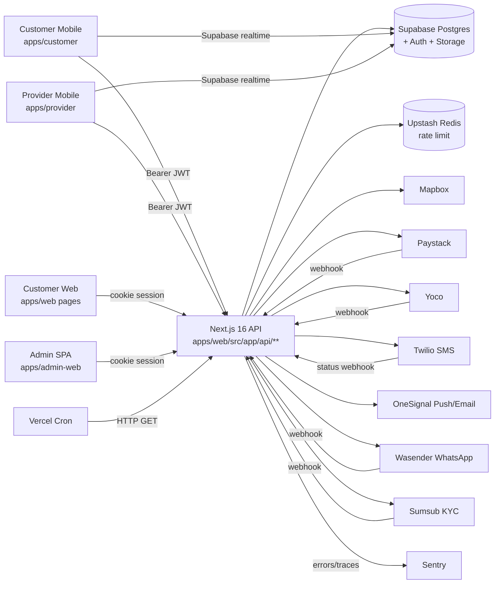
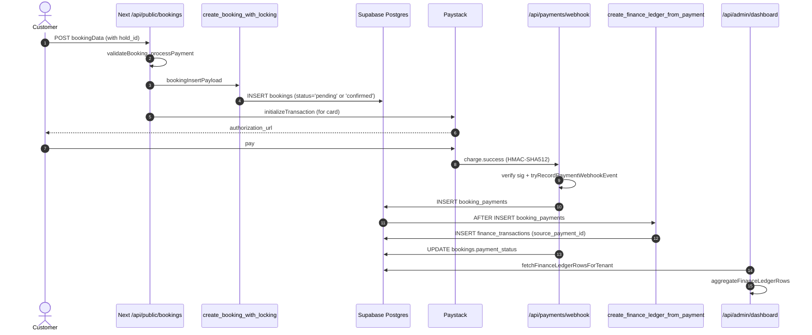
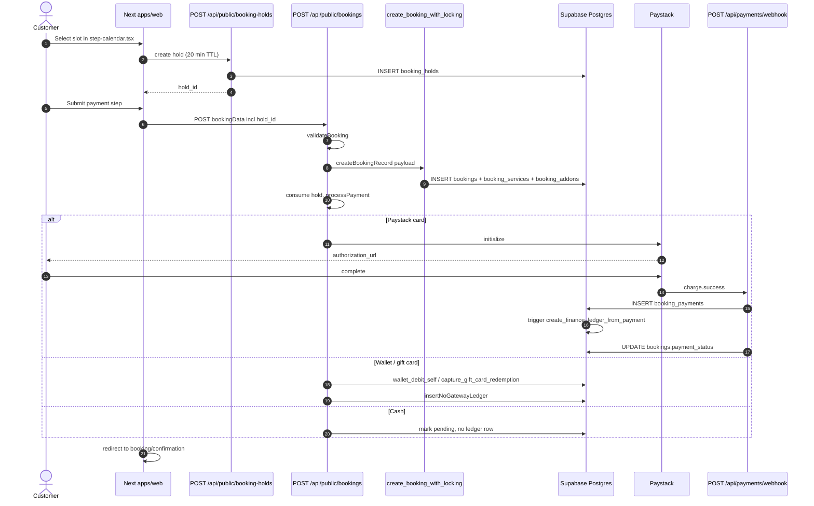
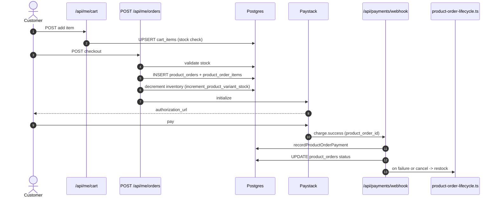
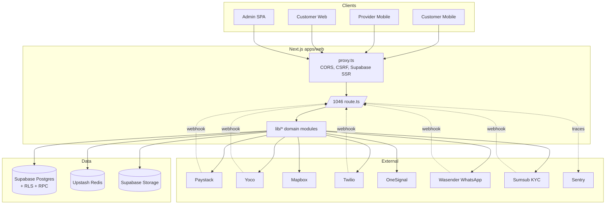

# Beautonomi — Comprehensive Technical & Architectural Audit

Date: 2026-04-17
Repository: `C:\Users\NoloSehlolo\Documents\Beautonomi`
Auditor role: Principal software architect / staff backend / staff frontend / fintech systems analyst / QA lead / technical auditor.

> All claims in this report are traced to files in the repository with paths and (where practical) line numbers. Where a claim cannot be fully verified from the code alone, it is explicitly labelled **Needs verification**, **Likely implemented but not proven**, or **Missing from repo**.

---

## 1. Executive Summary

Beautonomi is a **multi-tenant beauty / salon marketplace** built as a **monolithic Next.js 16 backend + SPA admin + two Expo mobile apps**, backed by a **single Supabase Postgres** database. The codebase is large, active, and unusually mature for a monorepo of its size (≈1,046 Next.js route handlers, ~490 SQL migrations, 68+ mobile customer screens, 198+ provider mobile screens, extensive RLS coverage, Sentry, Upstash rate-limit, Vercel crons, Paystack + Yoco + Mapbox + Twilio + OneSignal + Wasender integrations).

High-level verdict:

- **Architecture**: Intentional modular monolith. Sound for current scale; already stressed by organic growth (dual migration trees, dual admin UIs, dual calendar grid implementations, cross-surface duplicated logic).
- **Functional completeness**: Core marketplace flows (booking search → hold → booking create → payment → confirmation → ledger row → dashboard) are **end-to-end implemented**, not scaffolded. Ecommerce (products, cart, orders, Paystack verify, stock RPCs) is also wired end-to-end. Refund webhooks, cancellation refund computation, receipt endpoint, group bookings, gift cards, wallet, loyalty, promotions, memberships all have both DB and code surfaces.
- **Accounting**: There is a **single-row `finance_transactions` ledger** populated by a DB trigger on `booking_payments` plus app-level inserts. There is **no classical double-entry journal** (`chart_of_accounts`, paired debit/credit entries). Period locks exist (`financial_period_locks`). This is adequate for operational reporting and payout basis but **not adequate as a system of record for statutory accounting**.
- **Critical risks**: (a) real-looking Paystack **test secret keys committed to git** in migration 403; (b) `sendDefaultPii: true` in all Sentry configs; (c) `booking_status` **enum drift** — application code filters by `pending_payment`, no migration adds that value; (d) two parallel migration trees (`supabase/migrations` 490 files vs `apps/web/supabase/migrations` 306 files) with overlapping names — drift risk; (e) duplicate migration prefix `465_*`; (f) numeric gaps at 476/479; (g) webhook event payload stored raw with no encryption-at-rest pattern visible.
- **Shippable today**: Booking + payment + Paystack webhook + receipts + provider calendar + provider dashboard + admin finance overview + mobile customer booking checkout.
- **Not shippable without remediation**: Statutory financial reports, multi-currency, any flow that implicitly depends on `booking_status='pending_payment'`, any deployment that leaves `sendDefaultPii: true` with Sentry enabled without a DPA / scrubbing layer.

Score (see §14): overall **Mostly complete** with several **Partial** and three **Broken / needs verification** sub-areas.

---

## 2. Audit Method and Evidence Standard

- Evidence types consulted: `package.json`, `pnpm-workspace.yaml`, `turbo.json`, `vercel.json`, `eas.json`, all `.github/workflows/*.yml`, `next.config.mjs`, `proxy.ts`, `instrumentation.ts`, Sentry configs, app router `page.tsx`/`route.ts` files under `apps/web/src/app/**`, shared packages under `packages/*`, Expo app configs and route trees, 400+ SQL migrations under `supabase/migrations/`, seed / diagnostic SQL under `scripts/`, TypeScript helpers under `apps/web/src/lib/**`, tests under `__tests__/`, and in-repo docs under `docs/`.
- Every section below cites specific files. Where counts are given they are from `Glob`/`Grep` runs at audit time.
- Line numbers are cited where practical. Where the source file was too large to read fully (e.g. `/api/provider/bookings/[id]/route.ts`), claims are pattern-level and labelled accordingly.
- The audit deliberately does **not** enumerate every one of the ~1,046 route handlers individually; it groups by domain with representative evidence.

---

## 3. Repository / Application Inventory

### 3.1 Workspaces

`pnpm-workspace.yaml` at repo root declares: `apps/*`, `packages/*`, `tooling/*`. `scripts/`, `supabase/`, and `go-myapp/` exist at the root but are **not** npm workspaces.

### 3.2 Applications

| App | Location | Framework | Purpose | Entry |
|---|---|---|---|---|
| **Web + API** | `apps/web` | Next.js 16.2.3 / React 19 | Customer web, provider portal, embedded admin UI, and the entire REST API surface. Both consumer web and mobile backend. | `apps/web/src/app/layout.tsx`; network boundary `apps/web/src/proxy.ts` |
| **Admin SPA** | `apps/admin-web` | Vite 6 + React Router + TanStack Query | Staff/superadmin control-plane UI; basename `/admin`; proxies `/api` → Next in dev. | `apps/admin-web/src/main.tsx` |
| **Customer mobile** | `apps/customer` | Expo 54 / expo-router 6 | Customer iOS/Android app. Universal links for `beautonomi.com`, `beautonomi.co.za` + `customer://` scheme. | `apps/customer/index.ts` → `expo-router/entry` |
| **Provider mobile** | `apps/provider` | Expo 54 | Provider iOS/Android app (`com.beautonomi.partner`), `provider://`. | `apps/provider/index.ts` |
| **Go sidecar** | `go-myapp` | Go 1.22 | Placeholder CLI (`main.go` prints `"Hello, CI/CD!"`); included primarily to exercise Goreleaser + GHCR release pipeline. **Not on the product critical path.** | `go-myapp/main.go` |

### 3.3 Shared packages (`packages/*`)

| Package | Role | Key export(s) |
|---|---|---|
| `packages/api` | HTTP client + Mapbox helpers | `createApiClient`, `apiFetch`, `geocode`, `reverseGeocode` (`packages/api/src/index.ts`) |
| `packages/admin-access` | Admin section IDs + RBAC map | `ALL_ADMIN_ROLES`, `ADMIN_SECTION_ROLES`, `canAccessSection` (`packages/admin-access/src/index.ts`) |
| `packages/admin-api-client` | Typed admin API client + Zod bootstrap | `createAdminApiClient`, `adminScope*`, `AdminApiError` |
| `packages/analytics` | Amplitude analytics wrapper | native + web entry points |
| `packages/config` | Env type surface | `BeautonomiEnv`, `MobileEnv`, `SupabaseEnv` |
| `packages/i18n` | i18next / react-i18next + locale JSON | `./locales/*` |
| `packages/phone` | `libphonenumber-js` helpers | `./dial-code-for-iso` |
| `packages/types` | Shared TS types including `Database`, `UserRole` | `packages/types/src/index.ts`, `database.ts` (manually maintained) |
| `packages/ui` + `packages/ui-tokens` | Shared UI + NativeWind preset | |
| `packages/utils` | Misc utilities (tsup-built) | |

### 3.4 Tooling

- `tooling/eslint-config` — shared flat config (`@beautonomi/eslint-config`).
- `tooling/typescript-config` — `base.json`, `nextjs.json`, `expo.json`, `react-library.json`.
- `tooling/expo-dev` — Expo dev helpers.
- `tooling/audit` — `scan-routes.mjs`, `npm-audit-lockfile.mjs`.
- `tooling/parity` — `check-parity.mjs` (cross-surface parity).
- `tooling/load-test` — k6 scripts (e.g. `load:booking-flow`).
- `tooling/screenshots` — Maestro flows for Android screenshots.
- `tooling/scripts` — codemods.

### 3.5 Supabase

- `supabase/migrations/` — **490** `.sql` files, 3-digit numeric prefix.
- **No `supabase/functions/`** directory (no Supabase Edge Functions in the repo).
- **No `supabase/config.toml`** found.
- **Second migration tree** at `apps/web/supabase/migrations/` — **306** files, with overlapping filenames relative to the root tree. **Drift risk** (see §7).

### 3.6 Scripts (operational)

`scripts/` contains ops SQL + Node utilities: `setup-env.js`, `import-za-postal-areas.mjs`, `diagnose-fees-and-tax.sql`, `diagnose-sunday-availability.sql`, `export-provider-users-mobile-profile-audit.sql`, `fix-provider-fee-config.sql`, `verify-tenant-money-invariants.sql`, `scripts/prod/*` (release verification, observability gates, progressive rollout).

---

## 4. Architecture Overview

### 4.1 Shape: modular monolith

The backend surface is **one Next.js application** hosting all HTTP APIs (~1,046 route handlers) and all server-rendered pages. Supabase is the datastore, auth provider, and file store. The Vite admin SPA is served behind `/admin` by the same origin (and can be embedded into Next via `apps/web/src/components/admin/AdminShell.tsx`). Mobile apps talk to the same Next `/api/...` endpoints with **Supabase-issued JWTs** as Bearer tokens; they also use Supabase directly for realtime channels.

There is **no** tRPC, **no** GraphQL, **no** gRPC, **no** separate backoffice service, **no** separate payment service, **no** edge functions, **no** Kubernetes, **no** Terraform in repo. `go-myapp` is a release-pipeline placeholder, not product infrastructure.

### 4.2 Communication model

- **Synchronous**: HTTP (Next route handlers) + direct Postgres via Supabase JS + selected Postgres RPCs (`create_booking_with_locking`, `create_finance_ledger_from_payment`, `reserve_gift_card_redemption`, `capture_gift_card_redemption`, `wallet_debit_self`, `increment_product_variant_stock`, `get_user_loyalty_balance`, …).
- **Asynchronous**: Paystack → webhook `/api/payments/webhook`; Yoco → `/api/provider/yoco/webhook`; Twilio status → `/api/webhooks/twilio`; Sumsub KYC → `/api/webhooks/sumsub`; Wasender → `/api/webhooks/wasender`; Vercel Cron triggers → 16 `/api/cron/*` endpoints (reminders, hold expiry, on-demand expiry, recurring bookings, stock, ranking, inactivity retention, audit purge, WhatsApp queue, subscriptions, ads, stall check, …).

### 4.3 Internal boundaries (domain seams)

Where a “module” actually exists as a folder:

- **Auth / identity** — `apps/web/src/lib/auth/*`, `apps/web/src/lib/supabase/api-helpers.ts`.
- **Tenancy** — `apps/web/src/lib/tenant/*`, `resolveAdminApiTenantId`, `resolveTenantFromRequest`.
- **Booking engine** — `apps/web/src/app/api/public/bookings/*`, `apps/web/src/lib/availability/*`, `apps/web/src/lib/bookings/*`.
- **Payments** — `apps/web/src/lib/payments/paystack*.ts`, `apps/web/src/app/api/payments/webhook/_handlers/*`, `apps/web/src/lib/payment/webhook-idempotency.ts`.
- **Provider portal** — `apps/web/src/lib/provider-portal/*`, `apps/web/src/components/provider-portal/*`.
- **Admin** — `apps/web/src/lib/admin/*`, `apps/web/src/app/admin/**`, `apps/admin-web/*`, `packages/admin-api-client`, `packages/admin-access`.
- **Notifications** — `apps/web/src/lib/notifications/*`, `apps/web/src/lib/marketing/unified-service.ts`, OneSignal wrappers, Twilio wrappers.
- **Ecommerce** — `apps/web/src/lib/orders/*`, `apps/web/src/app/api/me/cart/*`, `apps/web/src/app/api/me/orders/*`.

**Architectural smell**: boundaries are folder-level, not package-level. Domain logic freely cross-imports across `lib/*`. A package boundary (even just enforced by ESLint import rules) would hugely reduce cross-domain leakage risk.

### 4.4 System context (Mermaid)



### 4.5 Strengths, weaknesses, coupling

**Strengths**

- Single deployable for backend reduces ops complexity.
- RLS + API guards layered (defence in depth).
- Typed admin client in `packages/admin-api-client` enables shared contracts between Vite SPA and Next admin routes.
- Tenancy is a first-class concept enforced at DB (`tenant_id` NOT NULL on money tables, `verify-tenant-money-invariants.sql` invariant checks) and at request resolution.
- Atomic booking creation via RPC (`create_booking_with_locking`), not client-side inserts.
- Webhook idempotency pattern (`tryRecordPaymentWebhookEvent` + `payment_webhook_events`).

**Weaknesses / coupling / risky dependencies**

- **Two admin surfaces**: `apps/admin-web` (Vite) and `apps/web/src/app/admin/**` (Next). `AdminShell.tsx` explicitly distinguishes itself from the SPA. Risk of divergent UX, divergent role enforcement.
- **Two booking entry points**: `/book/[providerSlug]` and `/booking?slug=` with conditional redirection.
- **Two calendar-grid components** by the same name: `apps/web/src/components/provider-portal/calendar/CalendarGrid.tsx` vs `apps/web/src/components/provider-portal/CalendarGrid.tsx`.
- **Two migration trees** (`supabase/migrations/` 490 vs `apps/web/supabase/migrations/` 306) with same-numbered files. Any future change has to be duplicated to keep both in sync, or one should be retired. Not verified which is canonical for `supabase db push`.
- **No `middleware.ts`**: auth boundary has been moved to Next 16 `proxy.ts`. `proxy` is the new Next primitive and is used here (`apps/web/src/proxy.ts`); developers still familiar with `middleware.ts` conventions may under-test this file.
- Store strategy in `apps/web` is custom singletons (e.g. `apps/web/src/stores/appointment-sidebar-store.ts`). No Zustand/Redux/React Query in `apps/web/package.json` (admin SPA uses React Query). Forms: **`react-hook-form` is not in `apps/web/package.json`**; the customer app uses it. Cross-surface form libraries diverge.
- Post-booking side effects in `post-booking.ts` **swallow errors**. Notifications/analytics failures are logged only.
- Finance path uses **both** DB trigger (`create_finance_ledger_from_payment`) and app-level inserts (`process-payment.ts`, `charge-success.ts`). Dual writers into `finance_transactions` is a correctness hazard.

---

## 5. Deployment and Runtime Clues

### 5.1 CI/CD (`.github/workflows/*.yml`)

| Workflow | Trigger | Purpose |
|---|---|---|
| `ci.yml` | `push`/`pr` on `main`, `develop` | Install + Turbo typecheck across web/admin-web/customer/provider/packages; admin Vitest + taxonomy; lint; build admin-web + Playwright smoke; build web + bundle budget; Expo config validate; `audit:deps`; `audit:multi-tenant:strict`; `pnpm test`. |
| `release.yml` | Tag `v*.*.*` | Goreleaser on `go-myapp` + push image to `ghcr.io/.../myapp`. Not product pipeline. |
| `pre-rollout-gates.yml` | `release/**` branches + manual | `scripts/prod/verify-observability-gates.mjs`; `prod:verify:release` against staging URLs. |
| `progressive-rollout-gates.yml` | Manual (SLO JSON input) | `scripts/prod/evaluate-rollout-gates.mjs`. |
| `scale-verification.yml` | Weekly cron + manual | `prod:verify:release`. |

### 5.2 Hosting / runtime

- **Vercel** for `apps/web`. `apps/web/vercel.json` sets Node memory, CI flags, and 16 cron entries calling `/api/cron/*`. Headers configured for `assetlinks.json` and `/api/public/*` caching.
- **EAS** for Expo (`apps/customer/eas.json`, `apps/provider/eas.json`) with `development`, `preview`, `production` build + submit profiles (App Store / Play console IDs, Sentry flags).
- **Supabase** for DB / auth / storage. `apps/web/src/lib/supabase/storage-client.ts` + `storage-service-client.ts`; upload routes under `/api/upload`, `/api/me/messages/upload`.
- **Upstash Redis** for rate limiting (`@upstash/ratelimit` + `@upstash/redis`); in-memory fallback in `apps/web/src/lib/rate-limit/store.ts` (L1–36).
- **Sentry** (`@sentry/nextjs`) for web; `@sentry/react-native` for mobile; `@sentry/react` for admin SPA.
- **Environment** documented in `apps/web/.env.example` (9 KB), `docs/ENVIRONMENT_MATRIX.md`, `docs/SECRETS_BOOTSTRAP.md`, `docs/REGION_SECRETS_KMS_RUNBOOK.md`.

### 5.3 Cross-environment drift

- `apps/web/instrumentation.ts` enforces required env vars at startup in production including `SUPABASE_JWT_SECRET` and `PAYSTACK_WEBHOOK_SECRET`, but the `.env.example` snippet reviewed does not enumerate all such variables. Onboarding risk.
- Staging domain hard-coded in `.github/workflows/pre-rollout-gates.yml` and `scale-verification.yml` as `https://staging.beautonomi.com`.

---

## 6. API Audit

### 6.1 Surface size and topology

- **1,046** `route.ts` files under `apps/web/src/app/api/**` (Glob).
- **237** documented admin paths in `docs/_admin_api_routes_snapshot.txt`.
- Admin taxonomy CSV: `docs/admin-api-route-taxonomy.csv` (331 rows).
- **0** tRPC or GraphQL definitions.
- Protocol: REST over Next 16 Route Handlers, JSON bodies.

### 6.2 Auth patterns (backend)

| Helper | File | Purpose |
|---|---|---|
| `requireRole(allowedRoles)` | `apps/web/src/lib/auth/requireRole.ts` (~L32+) | Cookie/session; loads `users` row; used in SSR + same-origin API. |
| `requireRoleInApi(roles, request?)` | `apps/web/src/lib/supabase/api-helpers.ts` (~L194+) | Cookie or `Authorization: Bearer` (mobile). Includes "self-heal" upserts for mobile users (service-role). |
| `requireAuthInApi` | same file (~L183+) | Auth without role check. |
| `unauthorizedResponse` | `requireRole.ts` | 401 helper. |

Typical call site (`/api/payments/initialize`):

```21:26:apps/web/src/app/api/payments/initialize/route.ts
export async function POST(request: Request) {
  try {
    const auth = await requireRole(["customer"]);
    if (!auth) {
      return unauthorizedResponse("Authentication required");
    }
```

No `withAuth` wrapper exists — enforcement is caller-initiated. This means **any new route that omits `requireRoleInApi` is silently public**; reviewers must watch for this.

### 6.3 Rate limiting

- `apps/web/src/lib/rate-limit/store.ts` — Upstash when env set, in-memory fallback.
- **Selective** per-route wrappers: `checkSignInRateLimit`, `checkPaymentInitRateLimit`, `checkBookingCreationRateLimit`, `checkPortalRateLimit`, `checkBookingHoldRateLimit`, `checkAdminExportRateLimit`, `checkExploreRateLimit`.
- **Not** applied at a middleware layer — each route opts in. Coverage is partial.

### 6.4 Validation

- `zod` imported in 200+ route/helper files under `apps/web/src/app/api` (grep). Not 100% coverage; some older routes use manual body validation (e.g. `/api/auth/sign-in/route.ts` L29–37).

### 6.5 Webhook handlers

| Webhook | File | Signature | Idempotency |
|---|---|---|---|
| Paystack (canonical) | `apps/web/src/app/api/payments/webhook/route.ts` (L39–63) | HMAC-SHA512 with `PAYSTACK_WEBHOOK_SECRET`, `x-paystack-signature` | `webhook_events` table + `tryRecordPaymentWebhookEvent` → `payment_webhook_events` (L10, L100–107) |
| Paystack (legacy shim) | `apps/web/src/app/api/webhooks/paystack/route.ts` | Forwards to canonical | n/a |
| Sumsub | `apps/web/src/app/api/webhooks/sumsub/route.ts` (L32–49) | HMAC-SHA256 from `sumsub_integration_config` | Not fully read; rejects if secret missing (L40–42) |
| Twilio | `apps/web/src/app/api/webhooks/twilio/route.ts` (L19–35) | HMAC-SHA1 of URL+body | Updates `sms_delivery_log` |
| Wasender | `apps/web/src/app/api/webhooks/wasender/route.ts` | HMAC optional (`x-wasender-signature` / `x-hub-signature-256`) | "Only update if status progresses forward" |
| Yoco | `apps/web/src/app/api/provider/yoco/webhook/route.ts` (L27–74) | `x-yoco-signature` + `x-yoco-webhook-id` | `provider_yoco_webhooks` / event tables |

Paystack retry hygiene: failures return **500** so Paystack will retry; handler inserts `payment_reconciliation_queue` with `next_retry_at` on failure. Good pattern.

### 6.6 Placeholder / degraded / legacy

- Legacy Paystack webhook forwarder: `/api/webhooks/paystack` → forwards to `/api/payments/webhook` (explicitly deprecated, L1–8 of that file).
- Routes that return empty data when a migration has not yet run:
  - `/api/admin/finance/period-locks/route.ts` (comment "Table not yet created — return empty list" near L34).
  - `/api/admin/service-zones/areas/geometry/route.ts` (fallback "return empty if RPC not yet created", ~L52).
- `/api/me/loyalty-points/route.ts` L14 TODO: consolidate ledger.
- `/api/sentry-test` diagnostic route.
- **No** HTTP 501 handlers in `apps/web/src/app/api` (grep for `\b501\b` returned 0).

### 6.7 Key API matrix by domain

| Domain | Key endpoints (representative) |
|---|---|
| Auth | `/api/auth/sign-in`, `/sign-out`, `/api/auth/mfa/*` |
| Booking | `/api/availability`, `/api/public/booking-holds`, `/api/public/bookings`, `/api/me/bookings/[id]`, `/api/me/bookings/[id]/cancel`, `.../cancel-preview`, `.../reschedule`, `/api/bookings/[id]/receipt`, `/api/provider/bookings`, `/api/provider/bookings/[id]` |
| Payments | `/api/payments/initialize`, `/api/payments/charge-saved-card`, `/api/payments/webhook`, `/api/paystack/initialize`, `/api/paystack/verify`, `/api/paystack/splits` |
| Ecommerce | `/api/me/cart`, `/api/me/orders`, `/api/public/products`, `/api/public/providers/[slug]/products`, `/api/provider/products`, `/api/provider/product-orders` |
| Provider | `/api/provider/shifts`, `/api/provider/staff`, `/api/provider/bookings/*`, `/api/provider/group-bookings`, `/api/provider/calendar/*` (11 route files), `/api/provider/yoco/*`, `/api/provider/analytics`, `/api/provider/twilio-integration` |
| Me (customer) | `/api/me/bookings/*`, `/api/me/wallet/*`, `/api/me/loyalty/*`, `/api/me/payment-methods`, `/api/me/addresses/*`, `/api/me/messages/*` |
| Admin | 237 paths under `/api/admin/*` — dashboards, exports, finance, fees, users, webhooks, WhatsApp ops, service zones |
| Mapbox proxy | `/api/mapbox/geocode`, `/reverse-geocode`, `/distance`, `/distance-matrix`, `/route`, `/check-zone` |
| Promotions | `/api/promotions/validate`, `/api/coupons/*` |
| Cron (Vercel) | 16 entries in `apps/web/vercel.json` — reminders, holds, on-demand, automations, recurring bookings, stock, ranking, inactivity retention, messages, ads, subscriptions, stall check, audit purge, WhatsApp queue, reset |
| Webhooks inbound | `/api/payments/webhook`, `/api/webhooks/{paystack,sumsub,twilio,wasender}`, `/api/provider/yoco/webhook` |
| Portal / magic link | `/api/portal/*` |

### 6.8 Frontend → API mapping (booking journey sample)

| UI | Endpoint | File |
|---|---|---|
| `step-calendar.tsx` | `GET /api/availability` | `apps/web/src/app/booking/components/steps/step-calendar.tsx` |
| `step-promotions.tsx` | `GET /api/me/loyalty/balance`, `POST /api/promotions/validate`, `POST /api/me/loyalty-points/calculate-redemption` | `.../steps/step-promotions.tsx` |
| `booking-flow.tsx` | `POST /api/public/booking-holds`, `POST .../release`, `GET /api/public/providers/{slug}`, `/packages`, `/services`, `/products`, `/api/public/platform-fees` | `.../booking-flow.tsx` |
| `step-payment.tsx` | `POST /api/public/bookings` | `.../steps/step-payment.tsx` |
| `booking/confirmation/page.tsx` | `GET /api/me/bookings/[id]`, `POST /api/me/referrals/track` | `apps/web/src/app/booking/confirmation/page.tsx` |
| `booking/callback/page.tsx` | `GET /api/paystack/verify` | `apps/web/src/app/booking/callback/page.tsx` |

### 6.9 Mobile-to-API pattern

- `apps/customer/src/lib/api-client.ts` (L1–71) builds `createApiClient({ baseUrl: APP_URL, getAccessToken })` where `getAccessToken` pulls a Supabase session token.
- `apps/provider/src/lib/api-client.ts` and `apps/provider/src/providers/ProviderContext.tsx` (L98–99) similarly call `/api/provider/profile`, `/api/me/role`.
- Realtime channels (not pure HTTP) are established directly against Supabase from both mobile apps (e.g. `calendar.tsx` uses `supabase.channel(...)`).

### 6.10 Status / completeness — API

**Mostly complete** for core flows, **Partial** on validation coverage and rate-limit coverage, **Needs verification** for admin-only routes that may skip tenant enforcement. Large surface (1,046 routes) means any systematic security sweep should be automated (linter rule: disallow `createRouteHandler` without invoking one of `requireRoleInApi`/`requireAuthInApi` unless the file path begins with `/api/public/` or `/api/webhooks/`).

---

## 7. Database and Data Model Audit

### 7.1 Migration layout

- Tree A: `supabase/migrations/` — **490 files**, numeric prefix. Latest highest number found: `486_time_blocks_add_created_by.sql`.
- Tree B: `apps/web/supabase/migrations/` — **306 files**, overlapping prefixes.
- No consolidated schema dump, no `seed.sql`.
- Two numeric collisions:
  - `465_audit_logs_enhanced_schema.sql` + `465_providers_commission_override.sql` (filename-sort order decides application).
  - Gaps at `476*`, `479*` (no files with those prefixes).
- `001_initial_schema.sql` only enables extensions (`uuid-ossp`, `pg_trgm`, `postgis`), defines enums, and `update_updated_at_column()`. The full schema is the sum of all subsequent migrations.
- `packages/types/src/database.ts` is **manually maintained** (comment), not generated from live DB.

**Risk**: running a fresh DB via one tree and then applying diffs from the other will diverge. Needs an explicit rule on which tree is authoritative and how the second is kept in sync (or retired).

### 7.2 Core entity map by domain

| Domain | Tables (migration that created them) |
|---|---|
| Identity | `users`, `user_addresses`, `user_profiles`, `user_verifications`, `payment_methods`, `user_wallets`, `wallet_transactions` (`002`, `050`, `052`) |
| Tenancy | `tenants`, `tenant_domains`, `tenant_settings`, `tenant_secrets`, `user_tenant_roles`, `tenant_audit_log` (`331`) |
| Providers | `providers`, `provider_locations`, `provider_staff`, `provider_staff_locations`, `provider_subscriptions`, `service_zones`, `subscription_plans` (`003`, `138`) |
| Catalog | `global_service_categories`, `subcategories`, `provider_categories`, `master_services`, `offerings`, `service_packages`, `service_addons` (`004`); `products` (`074`); `product_variants` (`285`); `product_suppliers` (`314`) |
| Scheduling | `availability_blocks` (`005`); `staff_shifts`, `time_blocks`, `staff_schedules`, `staff_time_off`, `staff_services`, `offering_locations` (`069`, `202`); `staff_time_cards`, `staff_days_off` (`090`); `resources`, `resource_groups`, `booking_resources`, `offering_resources` (`070`, `099`, `274`); `calendar_syncs`, `calendar_color_schemes`, `calendar_links` (`134`, `425`, `426`) |
| Booking | `bookings`, `booking_services`, `booking_addons`, `booking_events`, `additional_charges` (`005`); `booking_payments`, `booking_refunds` (`126`); `booking_audit_log` (`101`); `booking_notes` (`424`); `booking_holds` (`216`); `group_bookings`, `booking_participants` (`097`, `484`, `485`); `waitlist_entries`, `city_waitlist` (`070`, `130`); `reschedule_requests` (`427`) |
| Ecommerce | `cart_items` (`233`); `product_orders`, `product_order_items` (`232`); `product_reviews` (`234`); `product_return_requests` (`239`); `provider_shipping_config` (`235`); `sales`, `sale_items` (`129`); `custom_requests`, `custom_offers` (`036`); `membership_orders`, `gift_card_orders` (`028`, `026`, `343`) |
| Payments | `payments`, `payouts`, `payment_refunds`, `platform_fees` (`006`); `paystack_splits`, `provider_paystack_subaccounts`, `webhook_events`, `payment_transactions`, `finance_transactions` (`014`); `payment_gateway_fee_configs`, `payment_fee_adjustments`, `fee_reconciliations` (`093`); `provider_yoco_*`, `provider_yoco_refunds` (`127`, `302`); `integration_capabilities`, `payment_webhook_events` (`334`); `regions`, `region_settings`, `region_payment_gateways`, `region_secrets` (`377`) |
| Finance | `finance_transactions` (core ledger row) — `014` + many updates; `provider_subscription_orders` (`030`); `provider_invoices*` (`154`); `promotions`, `loyalty_rules`, `loyalty_point_transactions`, `referrals`, `notifications` (`010`); `coupons`, `user_coupons` (`055`); `memberships`, `customer_memberships`, `loyalty_points_ledger` (`118`, `124`); `provider_pay_runs*` (`218`); `financial_period_locks` (`468`) |
| Messaging | `conversations`, `messages`, `message_templates` (`007`); `notification_logs`, `user_devices` (`020`); `notification_templates` (`062`); email/SMS templates (`108`) |
| CMS / learning | `page_content`, `faqs`, `featured_cities`, `resources` (`009`); `learning_categories`, `learning_articles` (`304`); seed (`483`) |
| Ops | `audit_logs` (`025`, `465`); `feature_flags`, `permissions`, `role_permissions` (`092`); `support_tickets*` (`110`); `ads_campaigns`, `ads_events`, `ads_time_packs` (`258`, `459`); `provider_leads` (`460`); `whatsapp_*`, `wasender_integration_config` (`480`, `482`) |

### 7.3 Constraints, RLS, tenancy

- **RLS is extensively enabled**. `CREATE POLICY` appears in 150+ migrations (grep). Financial tables are covered by `230_rls_financial_tables.sql` (policies for `payment_transactions`, `finance_transactions`, `booking_payments`, `payments`, `webhook_events`, `payment_methods`, `payouts`, `provider_invoices`). Tenant admin policies in `336_tenant_rls_policies.sql`, `339`, `341`, `382`.
- `333_tenant_aware_uniques_not_null.sql` enforces `providers.tenant_id` and `bookings.tenant_id` NOT NULL, adds `UNIQUE(tenant_id, slug)` on providers, `UNIQUE(tenant_id, booking_number)` on bookings, and trigger `bookings_set_tenant_from_provider`.
- `scripts/verify-tenant-money-invariants.sql` asserts no-NULL `tenant_id` on all money tables **except** `payment_transactions` (documented exception).
- FK cascade examples:
  - `booking_payments.booking_id` → `bookings(id) ON DELETE CASCADE` (`126`).
  - `payment_transactions.booking_id` → `bookings(id) ON DELETE SET NULL` (`014`).
  - `finance_transactions.source_payment_id` → `booking_payments(id) ON DELETE SET NULL` (`471`).
- **Soft delete** pattern is **not** widespread — `deleted_at` only appears on `provider_payout_accounts` (`031`, `318`). Core booking/payment tables rely on status columns for "soft" state. That is a deliberate trade-off but weakens historical reconstruction.
- Audit columns: `created_at` / `updated_at` near-universal. `created_by` was missing on `time_blocks` until `486` (ordering hazard documented in the migration).

### 7.4 Money + finance modeling

- **`finance_transactions`** is a single-row-per-event ledger (`transaction_type`, `amount`, `fees`, `commission`, `net`). **No double-entry pair tables** (`chart_of_accounts`, `journal_entries`, `account_debits`/`account_credits`) were found.
- DB trigger `create_finance_ledger_from_payment` on `booking_payments` inserts a `finance_transactions` row:
  - Created in `169_create_finance_ledger_from_payments.sql` (root tree) and duplicate under `apps/web/supabase/migrations/`.
  - Rewritten in `458_fix_finance_ledger_deposit_proportional.sql`, `481_fix_commission_enabled_flag_in_trigger.sql`.
  - FK `source_payment_id` → `booking_payments` added in `471`.
- **Dual writers** to `finance_transactions`: the trigger **and** `apps/web/src/app/api/public/bookings/_helpers/process-payment.ts` (e.g. wallet splits L218–238; `insertNoGatewayLedger` for gift card / wallet-only coverage) **and** `charge-success.ts` on Paystack success. Correctness depends on idempotency / mutual-exclusion by `source_payment_id`. **Needs verification** that no split results in duplicate ledger rows for a single payment.
- **Taxes**: column-based — `providers.tax_rate_percent`, `providers.tax_inclusive`, `bookings.tax_amount` (`030`). Platform-default fallback via `apps/web/src/lib/platform-tax-settings.ts`. **No separate `tax_rates` table** (per `CREATE TABLE` grep). Not suitable for jurisdictional tax rules at scale, but adequate for ZA VAT.
- **Currency**: `currency TEXT NOT NULL DEFAULT 'ZAR'` on many money tables. `452_pricing_plans_currency_retire_legacy_plans.sql` adds optional `pricing_plans.currency`; comment: billing uses `subscription_plans.currency`. No FX-rate table; multi-currency support is **Partial at best**.
- **Refunds**:
  - `payment_refunds` (legacy `payments`) — `006`.
  - `booking_refunds` — `126`.
  - `provider_yoco_refunds` — `302`.
  - Paystack refund webhooks handled in `payments/webhook/_handlers/refund-events.ts` (L54–66 idempotent on refund reference).
- **Payouts**:
  - `payouts` — `006`.
  - `provider_pay_runs`, `provider_pay_run_items` — `218`.
  - Paystack subaccounts/splits — `014`.
  - `299_payout_ledger_and_hold.sql` links `finance_transactions.payout_id`.
- **Period locks**: `financial_period_locks` (`468`). **`tenant_id` is `TEXT`, not `UUID`** — inconsistent with the rest of the tenancy model.

### 7.5 RPC + triggers (representative)

- Booking / availability: `check_booking_availability`, `generate_booking_number`, `set_booking_number`, `lock_booking_services_for_update`, `lock_booking_resources_for_update`, `create_booking_with_locking` (`012`, `453`, `454`, `455`, `475`).
- Payments / finance: `create_finance_ledger_from_payment` (`169`, `179`, `458`, `481`); `calculate_expected_fee` (`093`); `validate_booking_total`, `validate_refund_amount` (`148`).
- Tenancy setters: `booking_payments_set_tenant_from_booking` (`381`).
- Admin / analytics: `admin_dashboard_tenant_customer_count` (`446`); `search_learning_articles` (`306`).
- Compliance: `compliance_clear_user_references` (`467`).

### 7.6 Enum drift — concrete case

- `booking_status` enum in `001_initial_schema.sql`: `pending`, `confirmed`, `in_progress`, `completed`, `cancelled`, `no_show`.
- Extended in `275_bookings_checked_in_waiting_room.sql`: `waiting`, `checked_in`.
- **No migration adds `pending_payment`** (grep: 0 matches for `ADD VALUE 'pending_payment'`).
- But application code filters bookings by it:
  ```236:238:apps/web/src/app/api/public/bookings/route.ts
            .eq("customer_id", user.id)
            .eq("provider_id", draft.provider_id)
            .in("status", ["pending", "pending_payment"])
  ```
  and it appears in multiple other files (`provider/dashboard/*`, `account-settings/bookings/components/bookings-list.tsx`, `/api/admin/product-orders/route.ts`).
- **Status**: Broken / Needs verification — if `bookings.status` is actually the Postgres enum type, this query will raise `invalid input value for enum booking_status: "pending_payment"`. If it was changed to TEXT elsewhere, the filter is inert (silently matches nothing). Either case is a bug.

### 7.7 Entity status summary

| Entity group | Status |
|---|---|
| Identity / tenancy | Mostly complete |
| Scheduling | Mostly complete (time_blocks had migration order bug; fixed in 486) |
| Booking core | Mostly complete |
| Payments | Mostly complete (dual migration trees + dual ledger writers) |
| Finance / ledger | Partial (single-row ledger, no double-entry) |
| Tax | Partial (no tax_rates table) |
| Multi-currency | Partial |
| Ecommerce | Mostly complete |
| Notifications | Mostly complete |
| CMS / learning | Complete |
| Audit | Mostly complete |

---

## 8. UI / Application Audit

### 8.1 `apps/web` (Next.js 16)

- **425** `page.tsx` files under `apps/web/src/app`.
- Routing is **flat**; no `(group)` route groups (glob `(*)/page.tsx` = 0).
- `/provider/**` alone has **165** pages (glob).
- Home is a Server Component (`apps/web/src/app/page.tsx`).
- `/book/[providerSlug]` redirects to `/booking?slug=...` except embed / multi-service (`apps/web/src/app/book/[providerSlug]/page.tsx`).
- `/booking` wraps `BookingFlow` (`apps/web/src/app/booking/page.tsx` + `apps/web/src/app/booking/components/booking-flow.tsx`).
- `error.tsx`: **4** files; `loading.tsx`: **49** files.

**State & forms**

- No Zustand, Redux, or TanStack React Query in `apps/web/package.json`. Custom singleton stores (`apps/web/src/stores/appointment-sidebar-store.ts`).
- `react-hook-form` **not** in web `package.json` (but is in customer mobile). Forms rely on `zod` + hand-rolled controlled inputs.
- Charts: `recharts` is a dependency; used in `admin/reports/*` and `provider/analytics`.

**Placeholders / "coming soon"**

- `account-settings/bookings/[id]/review/page.tsx` (review photo upload toast).
- `account-settings/login-and-security/component/tab.tsx`.
- `provider/marketing/blast-campaigns/page.tsx`, `provider/marketing/automations/page.tsx`.
- `admin/reports/gift-cards/page.tsx`, `admin/fees/page.tsx`, `admin/users/page.tsx` (export/buttons stubbed).
- `components/global/inline-signup-form.tsx` (inline phone auth incomplete).

**Dual surfaces / mismatches**

1. Two admin UIs (Next `/admin/**` + Vite SPA `apps/admin-web`). `AdminShell.tsx` explicitly distinguishes them.
2. Two booking entry points (`/book/:slug` redirecting to `/booking?slug=`).
3. Two `CalendarGrid.tsx` files in `components/provider-portal/` and `components/provider-portal/calendar/`.

### 8.2 `apps/admin-web` (Vite SPA)

- Routing: `react-router-dom` with `basename="/admin"` (`apps/admin-web/src/main.tsx`).
- Lazy route registry: `apps/admin-web/src/lazyAdminPages.tsx` + `App.tsx`.
- Dev proxy: `apps/admin-web/vite.config.ts` proxies `/api → http://localhost:3000`.
- Uses `@tanstack/react-query` + `adminApi` (`DashboardPage.tsx`).
- Session: `AdminSessionProvider` loads `/api/admin/bootstrap` and `/api/admin/settings/section-permissions`.
- Role model: `docs/ADMIN_PORTAL_ROLE_MODEL.md`.
- Playwright smoke test exists (`apps/admin-web/e2e/login-shell.spec.ts`).

### 8.3 `apps/customer` (Expo)

- Scheme: `customer://`; associated domains for `beautonomi.com` + `beautonomi.co.za`.
- `(auth)/`: **4** screens; `(app)/`: **68** `*.tsx` files; tabs: `home`, `bookings`, `cart`, `shop`, `chats`, `profile`; hidden: `explore`, `search`, `saved`.
- Deep linking: `handleCustomerDeepLink` in `(app)/_layout.tsx` handles booking detail, custom requests, profile, bookings, product orders, signup ref, book continue, book link slug.
- New files: `apps/customer/app/(app)/book-checkout.tsx`, `apps/customer/app/(app)/booking-detail.tsx` — wired to Next `/api/public/booking-holds/{id}/consume`.
- `react-hook-form` present.

### 8.4 `apps/provider` (Expo)

- Scheme: `provider://`; package `com.beautonomi.partner`.
- Tabs: `dashboard`, `calendar`, `clients`, `chats`, `sales`, `more`; `settings` hidden.
- `more/` subtree: **198** `*.tsx` files — catalogue, inventory, products, services, settings, reports, payouts, earnings, finance, transactions, etc.
- `more/bookings.tsx` uses `useApi` + status mapping aligned with web `BookingsClient`.

### 8.5 Provider portal (inside `apps/web`)

- `/provider/calendar/page.tsx` server-loads `fetchCalendarInitial`, renders `CalendarClient` (`dynamic = "force-dynamic"`).
- `CalendarDesktopWithDnd` / `CalendarMobileWithDnd` loaded dynamically.
- Desktop view imports `CalendarGrid` from `./calendar` — the new folder. The legacy `components/provider-portal/CalendarGrid.tsx` is still present.
- `BookingsClient.tsx` uses `fetcher`, `providerApi`, realtime Supabase.

### 8.6 Screen inventory matrix

| App | Total screens/pages | Status |
|---|---|---|
| `apps/web` | 425 pages + 1,046 API routes | Mostly complete |
| `apps/admin-web` | Lazy-registered Vite routes (exact count via `App.tsx`) | Mostly complete |
| `apps/customer` | 68 `(app)` + 4 `(auth)` + callbacks | Mostly complete |
| `apps/provider` | Tab shell + 198+ `more/` screens | Mostly complete |

### 8.7 UX / logic gaps

- Several "coming soon" toasts in marketing/admin/account areas (listed above).
- Duplicate booking URLs confuse bookmarks / external links.
- Duplicate admin UIs risk visual drift — the Next admin may be stale relative to the Vite SPA.
- `apps/web` lacks React Query / Zustand discipline; data fetching patterns vary page-to-page.
- Cancel route internally does `fetch('/api/notifications/send-email', ...)` with a **relative URL** from a server route handler (see `apps/web/src/app/api/me/bookings/[id]/cancel/route.ts` group-cancel branch); Next serverless contexts typically require an absolute URL. **Needs verification in prod logs**.

---

## 9. Accounting and Finance Flow Audit

### 9.1 What exists

- `finance_transactions` — one row per financial event (charge, refund, adjustment, payout). Columns: `transaction_type`, `amount`, `fees`, `commission`, `net`, `source_payment_id`, `payout_id`, `tenant_id`.
- DB trigger `create_finance_ledger_from_payment` on `booking_payments` — inserts a ledger row on every new payment. Rewritten three times (`169`, `458`, `481`) to fix deposit proportional split and `commission_enabled` flag.
- App-level ledger inserts in:
  - `apps/web/src/app/api/public/bookings/_helpers/process-payment.ts` (wallet split lines ~218–238; `insertNoGatewayLedger` for gift-card / wallet-only coverage).
  - `apps/web/src/app/api/payments/webhook/_handlers/charge-success.ts` for Paystack success across bookings, wallet top-ups, gift cards, memberships, product orders.
- `payment_transactions` (external gateway ledger) unique on `(provider, reference)` (`014`).
- `booking_payments`, `booking_refunds`, `payment_refunds`, `payments`, `payouts`, `provider_yoco_refunds`.
- `platform_fees`, `payment_gateway_fee_configs`, `payment_fee_adjustments`, `fee_reconciliations` (`006`, `093`).
- `provider_invoices`, `provider_invoice_line_items`, `provider_invoice_payments` (`154`).
- `loyalty_points_ledger` (`124`), `wallet_transactions` (`002`).
- `financial_period_locks` (`468`).
- Receipt endpoint: `apps/web/src/app/api/bookings/[id]/receipt/route.ts` — roles `customer | provider_owner | provider_staff | superadmin`, builds line-item-level receipt including services, addons, products, `additional_charges`, payments; uses `computeBookingOutstandingDisplay`.
- Admin finance aggregation: `apps/web/src/app/api/admin/dashboard/route.ts` uses `fetchFinanceLedgerRowsForTenant` + `aggregateFinanceLedgerRows` — **real** ledger-based metrics.
- Finance export: `apps/web/src/app/api/admin/export/finance/route.ts`.

### 9.2 What is missing or weak

- **No chart of accounts**, **no paired journal entries**. `finance_transactions` is single-row signed-amount. You cannot balance a debit side against a credit side from this schema.
- **No period-close workflow** implemented in UI (only the `financial_period_locks` table + admin API). Closing policy, reversal rules, recut rules: not implemented.
- **No accrual vs cash** distinction in the schema. A cash booking does not produce a `booking_payment` until the provider marks paid (by design — see `process-payment.ts` comment at L560–565) — revenue timing depends on provider action. That pattern is fine for cash, but for accrual accounting it means revenue is systematically recognised late.
- **No FX table**; multi-currency is `currency` column-only.
- **Dual writers to `finance_transactions`** (trigger + app). If the `source_payment_id` FK uniqueness / idempotency isn't perfect, duplicates are possible. **Needs verification** via a `SELECT source_payment_id, COUNT(*) FROM finance_transactions GROUP BY 1 HAVING COUNT(*) > 1` check in prod (recommend adding a unique constraint on `(source_payment_id)` once proven safe).
- **Tax**: per-provider rate column only. No per-line tax breakdown; no tax codes.
- **Audit trail**: `booking_audit_log`, `audit_logs`, `tenant_audit_log` exist; whether every finance-affecting mutation writes an audit row is **not verified** end-to-end.
- **Approval workflows for refunds / adjustments**: not implemented (`booking_refunds` is directly writable via RPC; no approver column or state machine beyond status).

### 9.3 Flow traceability — booking payment → ledger → dashboard



### 9.4 Reversal / refund coverage

- Paystack refund webhook: `refund-events.ts` handles `refund.processed` and `refund.failed`; upserts `payment_transactions`, idempotent on refund reference (L54–66).
- `booking_refunds` links to `bookings` and optionally `booking_payments` (`126`).
- Cancellation: `/api/me/bookings/[id]/cancel` uses `computeCancellationRefundAmount` policy + optimistic locking on `bookings.version`.
- **Gap**: no explicit reversal entry on `finance_transactions` for refunds — the webhook handler updates the gateway table but whether a **negative `finance_transactions` row** is created on every refund **is not proven** from the trigger alone (the trigger fires on `booking_payments` insert, not on refund records). Needs verification.

### 9.5 Status

- Operational finance reporting: **Mostly complete**.
- Statutory / IFRS-grade accounting: **Missing** (no double-entry, no close workflow UI, weak tax model, no FX).
- Refund accounting symmetry: **Needs verification**.

---

## 10. Booking Flow Audit

### 10.1 Web customer booking — detailed trace

| Step | UI | Endpoint | DB / effects |
|---|---|---|---|
| Availability search | `step-calendar.tsx` | `GET /api/availability` | Reads `staff_shifts`, `time_blocks`, `bookings`, `booking_holds` via TS helpers in `apps/web/src/lib/availability/*` (`load-constraints.ts`, `calculate-slots.ts`) |
| Hold slot (20-min TTL) | `booking-flow.tsx` | `POST /api/public/booking-holds` | `booking_holds` insert (`HOLD_EXPIRY_MINUTES = 20`, `route.ts` L70) |
| Release hold | `booking-flow.tsx` | `POST /api/public/booking-holds/[id]/release` | |
| Validate + submit | `step-payment.tsx` | `POST /api/public/bookings` | `validateBooking` → `createBookingRecord` → `create_booking_with_locking` RPC → `processPayment` → `postBookingEffects` |
| Pay (card) | Paystack hosted redirect | `POST /api/paystack/initialize` + Paystack redirect | `payment_transactions` row |
| Pay (saved card) | Inline | `POST /api/payments/charge-saved-card` | `chargeAuthorization` |
| Webhook | — | `POST /api/payments/webhook` | `booking_payments` insert → trigger → `finance_transactions` row |
| Confirmation | `booking/confirmation/page.tsx` | `GET /api/me/bookings/[id]` | |

### 10.2 Hold / lock semantics

- Holds: `booking_holds` + 20-minute TTL, consume path at `POST /api/public/booking-holds/[id]/consume`.
- Actual booking row creation uses **`create_booking_with_locking`** RPC (not a client insert) — provides atomic conflict detection via `lock_booking_services_for_update` + `lock_booking_resources_for_update`.
- Stale pending bookings cleanup runs in the `POST /api/public/bookings` path for the same provider in a ±4h window (L219–241).
- `474_expire_stale_active_booking_holds.sql` is a one-time data fix for stale active holds.

### 10.3 Group bookings

- Schema: `group_bookings`, `booking_participants`. Portal columns added in `484_group_bookings_portal_columns.sql`.
- `485_fix_booking_participants_nullable_booking_id.sql` makes `booking_participants.booking_id` nullable and uses a partial unique index `WHERE booking_id IS NOT NULL`.
- UI: `apps/web/src/components/provider-portal/GroupBookingDialog.tsx` → `providerApi.createGroupBooking` / `updateGroupBooking` → `POST/PATCH /api/provider/group-bookings`.

### 10.4 Cancellation / reschedule

- Cancel: `POST /api/me/bookings/[id]/cancel` — policy, `computeCancellationRefundAmount`, optimistic lock on `bookings.version`, `sendCancellationNotification`, group handling (includes internal `fetch('/api/notifications/send-email', ...)` with relative URL — **risk** in serverless).
- Cancel preview: `GET /api/me/bookings/[id]/cancel-preview`.
- Reschedule: `POST /api/me/bookings/[id]/reschedule` + alternate path via `POST /api/public/bookings` with `reschedule_booking_id`.
- `reschedule_requests` table (`427`) for provider-initiated reschedule asks.

### 10.5 Payment during booking

- `processPayment` (`apps/web/src/app/api/public/bookings/_helpers/process-payment.ts`):
  - `providerRequiresDeposit`, `payment_option`, `computedDeposit` (L96–116). Booking row updated with `deposit_required`, `deposit_percentage`, `deposit_amount`, `payment_option`.
  - Gift card: RPCs `reserve_gift_card_redemption`, `capture_gift_card_redemption` (L135–172).
  - Wallet: RPC `wallet_debit_self` (L204–210).
  - Card — saved: `chargeAuthorization`.
  - Card — new: `initializePaystackTransaction` → `authorization_url` (no inline Paystack JS; customer gets a redirect).
  - Cash: `payment_provider: cash`, `payment_status: pending` (L560–565). Ledger row only when provider marks paid.
- On payment failure, `releaseBookingSlotAfterPaymentFailure` is called.

### 10.6 Status lifecycle (concrete)

- DB enum: `pending | confirmed | in_progress | completed | cancelled | no_show | waiting | checked_in`.
- Code uses `pending_payment` (not in enum). **Broken / needs verification** (see §7.6).
- Payment status: `pending | paid | failed | refunded | partially_refunded | partially_paid` (381 adds `partially_paid`).

### 10.7 Mobile customer checkout

- `apps/customer/app/(app)/book-checkout.tsx` uses the same web APIs — `GET /api/public/booking-holds/{id}`, `POST .../consume`, Paystack redirect aligned with web flow. Bookings are **not** inserted directly from mobile.

### 10.8 Provider booking operations

- List: `BookingsClient.tsx` (realtime Supabase + `providerApi`).
- Detail / mutations: `apps/web/src/app/api/provider/bookings/[id]/route.ts` (includes conflict checks, status transitions, ledger notes for cancellation fees around L1003+ per grep), `.../mark-paid` sub-route.
- Calendar: web portal + provider mobile. Two `CalendarGrid.tsx` files (see §4.5).

### 10.9 Notifications on booking events

- Create: `post-booking.ts` calls `notifyProviderNewBooking(..., ["push"])` and `notifyBookingConfirmed(..., ["push", "email"])`.
- Cancel: `sendCancellationNotification`.
- All implemented via `apps/web/src/lib/notifications/notification-service.ts` with OneSignal-based delivery.
- **Errors swallowed** in `post-booking.ts` so the HTTP response never fails on notification errors — good for availability, bad for guarantees.

### 10.10 Booking flow sequence (Mermaid)



### 10.11 Status

**Mostly complete**, with the following caveats:

- `pending_payment` enum drift (**Broken / needs verification**).
- Relative-URL `fetch` from server route in group cancel path (**Needs verification**).
- Notification errors silently swallowed (**risk**).
- Dual calendar grid components (**tech debt**).

---

## 11. Ecommerce Flow Audit

### 11.1 What exists

- **Catalog**: `products`, `product_variants`, `product_suppliers`, `provider_product_categories`, `global_service_categories`.
- **Cart**: `cart_items` (`233`), `POST/GET/DELETE /api/me/cart` (stock checks included).
- **Order creation**: `POST /api/me/orders` — docstring explicitly: "Validates stock, decrements inventory, calculates totals" (L106–110).
- **Inventory RPCs**: `increment_product_variant_stock`, `increment_product_stock`.
- **Lifecycle**: `apps/web/src/lib/orders/product-order-lifecycle.ts` — cancel stale pending Paystack orders, restock on refund/cancel.
- **Payment verification for products**: `apps/web/src/app/api/paystack/verify/route.ts` branches on `product_order_id`; `charge-success.ts` includes a `product_orders` branch; `recordProductOrderPayment` helper.
- **Returns**: `product_return_requests` (`239`).
- **Shipping config**: `provider_shipping_config` (`235`).
- **Reviews**: `product_reviews`, review votes (`234`).
- **Admin**: `/api/admin/ecommerce/overview`, `/api/admin/product-orders`.
- **Provider**: `/api/provider/products`, `/api/provider/product-orders`, `/api/provider/product-orders/[id]` (triggers `product_order_confirmed` notifications per grep L213–233).
- **Booking-attached retail**: product line items validated in `validate-booking.ts` and stored via `create-booking-record.ts`.

### 11.2 What is weak / missing

- **Shipping providers**: `provider_shipping_config` exists, but integration with actual carriers (couriers/tracking) is **Missing from repo**.
- **Fulfillment state machine**: order has status columns, but no explicit state-transition guard.
- **Abandoned cart recovery**: `apps/web/vercel.json` has crons but no dedicated abandoned-cart job in the list reviewed.
- **Gift cards / memberships** are implemented as separate order types (`gift_card_orders`, `membership_orders`), but their refund semantics vs `booking_refunds` are non-unified.
- **Physical-vs-digital product distinction**: not explicit in schema.

### 11.3 Ecommerce flow (Mermaid)



### 11.4 Status: **Mostly complete** for order creation + payment + inventory; **Partial** for shipping / fulfillment / returns UX.

---

## 12. Reports and Dashboards Audit

### 12.1 Provider analytics

- UI: `apps/web/src/app/provider/analytics/page.tsx`.
- API: `apps/web/src/app/api/provider/analytics/route.ts` — `getProviderRevenue`, plus parallel queries over `bookings`, `booking_services` join `offerings`, `customers`.

```86:121:apps/web/src/app/api/provider/analytics/route.ts
    const [
      revenueResult,
      bookingsResult,
      upcomingBookingsResult,
      serviceDataResult,
      customerDataResult,
    ] = await Promise.all([
      ...
      supabaseAdmin
        .from("booking_services")
        .select(`
          booking_id,
          offering_id,
          price,
          offerings:offering_id (
            id,
            title
          )
        `)
        .eq("offerings.provider_id", providerId)
        .limit(1000),
```

- Caveat: **hard-coded 1000-row limit**. Providers approaching this volume will get truncated analytics.

### 12.2 Provider dashboard

- Server loader: `apps/web/src/lib/server/provider/get-provider-dashboard.ts` — `pending_payments_amount`, revenue helpers.
- Client: `apps/web/src/app/provider/dashboard/DashboardClient.tsx`.

### 12.3 Admin reports

- UI: `apps/web/src/app/admin/reports/bookings/page.tsx`, `.../customers/page.tsx`, `admin/analytics/page.tsx`.
- Backend:
  - `apps/web/src/app/api/admin/reports/bookings/route.ts` queries `bookings` + `providers` with `tenant_id` + date range:
    ```44:50:apps/web/src/app/api/admin/reports/bookings/route.ts
        const { data: bookings } = await supabase
          .from('bookings')
          .select('scheduled_at, status, provider_id')
          .eq('tenant_id', tenantId)
          .gte('scheduled_at', startDate.toISOString())
          .lte('scheduled_at', endDate.toISOString());
    ```
  - `/api/admin/dashboard/route.ts` uses `fetchFinanceLedgerRowsForTenant` + `aggregateFinanceLedgerRows` — **real ledger-based metrics**.
  - `/api/admin/analytics/route.ts`, `/api/admin/export/finance/route.ts`.

### 12.4 Loyalty

- `apps/web/src/app/api/me/loyalty/balance/route.ts`:
  ```17:25:apps/web/src/app/api/me/loyalty/balance/route.ts
    const [balanceResult, configResult] = await Promise.all([
      supabase.rpc("get_user_loyalty_balance", { p_user_id: user.id }),
      supabase
        .from("loyalty_point_config")
        .select("redemption_rate, min_redemption_points, max_redemption_percentage")
  ```

### 12.5 Admin SPA

- `DashboardPage.tsx` uses React Query + `adminApi.getBootstrap()` → real Next admin endpoints.

### 12.6 Known placeholders

- `admin/reports/gift-cards/page.tsx` (export toast).
- `provider/marketing/blast-campaigns/page.tsx`, `provider/marketing/automations/page.tsx`.
- `admin/fees/page.tsx`, `admin/users/page.tsx` (export/buttons stubbed).

### 12.7 Correctness risks

- **Hard-coded limits** in analytics queries (the 1000-row limit above).
- **Dual ledger writers** may cause duplicate rows feeding dashboards.
- **`financial_period_locks.tenant_id` is TEXT** not UUID — any admin tooling filtering on tenant id must cast.
- **No explicit refresh strategy / materialized views** — dashboards read live from transactional tables. For small tenants that's fine; at scale this will hurt.
- **Cross-tenant leakage risk** only if an admin route uses `getSupabaseAdmin()` without `.eq("tenant_id", ...)`. The pattern in `admin/reports/bookings` does filter correctly. A systematic lint across all admin routes is recommended (CI has `audit:multi-tenant:strict` — coverage is partially proven).

### 12.8 Status matrix

| Dashboard | Source | Completeness |
|---|---|---|
| Admin dashboard | `finance_transactions` aggregation | Mostly complete |
| Admin bookings report | `bookings` | Mostly complete |
| Admin analytics | Live queries | Mostly complete |
| Admin finance export | `fetchFinanceLedgerRowsForTenant` | Mostly complete |
| Admin gift cards report | Placeholder export | Partial |
| Provider dashboard | Live queries + helpers | Mostly complete |
| Provider analytics | Live (1000-row-capped) | Partial (scale ceiling) |
| Provider marketing | Placeholder toasts | Missing |
| Customer loyalty | Live RPC | Complete |

---

## 13. Security / Reliability / Performance Review

### 13.1 Authentication

- Supabase Auth (`@supabase/ssr`) + cookie session for web; Bearer JWT for mobile.
- Server client: `apps/web/src/lib/supabase/server.ts` (`getSupabaseServer`, `createSupabaseClientFromToken`).
- `apps/web/instrumentation.ts` enforces prod env vars including `SUPABASE_JWT_SECRET`, `PAYSTACK_WEBHOOK_SECRET`, etc.

### 13.2 Authorization

- Centralized in `requireRole*` helpers; admin sections in `packages/admin-access`. Enforcement is **opt-in per route** — no global wrapper.

### 13.3 Multi-tenancy

- `tenant_id` NOT NULL across money tables; RLS layered; `scripts/verify-tenant-money-invariants.sql` asserts invariants.
- Admin tenant resolution: `resolveAdminApiTenantId`. Paystack webhook: `resolvePaymentWebhookTenantId`.
- Exception table: `payment_transactions` has no `tenant_id` (documented in `docs/PAYMENT_TRANSACTIONS_ACCESS.md`).

### 13.4 Secrets

- **CRITICAL**: `supabase/migrations/403_seed_za_paystack_test_keys.sql` (and its duplicate under `apps/web/supabase/migrations/`) embeds the literal test secret `sk_test_04da914ae5a19f51dd7e23f96686a6cd7da1b024` and test public `pk_test_69dc6b286a888b3dfe62765229a5d43b7b0c75df` (L11–12). The file comment says "Replace with live keys before production; do not rely on this migration in prod without review." Even as **test** keys, this is a credential-hygiene red flag (git history is permanent, Paystack test credentials can still abuse the sandbox). **Must rotate and move to env-only seeding.**
- `docs/REGION_SECRETS_KMS_RUNBOOK.md` acknowledges: `region_secrets` currently treats DB values as plaintext; KMS/envelope encryption is an aspiration.
- `apps/web/.env.example` is placeholder-only; production env mandate mismatch vs `instrumentation.ts`.

### 13.5 Observability

- Sentry on all three JS targets (`@sentry/nextjs`, `@sentry/react`, `@sentry/react-native`).
- **`sendDefaultPii: true`** in `sentry.server.config.ts`, `sentry.edge.config.ts`, `instrumentation-client.ts`. Replay does mask text/inputs/media, but server/edge transports will attach IP, headers, cookies, user email, request bodies to events. Direct privacy-policy / DPA risk.
- Structured logger: `apps/web/src/lib/utils/logger.ts`; API metrics wrapper: `apps/web/src/lib/monitoring/route-metrics.ts` emits `api_route_completed` / `api_route_failed` with `x-request-id`.
- SLO / alert policy doc: `docs/SLO_ALERT_POLICY.md`.
- **No OpenTelemetry exporters** were found.

### 13.6 Queues / background

- **Vercel Cron** (16 entries in `apps/web/vercel.json`). 
- **No `pg_cron`** usage in root migrations tree.
- **No dedicated worker service** (e.g. BullMQ, SQS consumer) in repo.
- Webhook retry hygiene: Paystack webhook returns 500 on processing failure so Paystack retries; inserts `payment_reconciliation_queue.next_retry_at`.

### 13.7 Testing

- **58** Vitest files in `apps/web`; **7** in `apps/customer`; **4** in `apps/provider`; **8** in `packages`.
- Coverage themes: tenant resolution, payment flows, webhook idempotency, public config safety, booking flow, admin route auth policy.
- **Playwright** only in `apps/admin-web` (`e2e/login-shell.spec.ts`) — minimal smoke.
- **No E2E** of customer web booking journey or provider portal end-to-end in-repo.

### 13.8 CI

- `ci.yml` runs typecheck, lint, admin vitest, Playwright, web build, Expo config validation, `audit:deps`, `audit:multi-tenant:strict`, `pnpm test`. Comprehensive.

### 13.9 PII / PCI

- `apps/web/src/app/api/me/payment-methods/route.ts` POST **rejects** raw card inputs — cards must be saved via Paystack and surfaced back via `save_card` / webhook. Good.
- `next.config.mjs` CSP allows Paystack `frame-src`/`connect-src`.
- **Webhook persistence**: `webhook_events.payload` stores the full Paystack payload. Paystack payloads typically include reference + metadata but can include email; plus Twilio webhook stores status changes. Retention, encryption-at-rest, access logging: **Needs verification** against compliance requirements.
- `sendDefaultPii: true` interacts with the above — any Sentry issue touching a webhook route could capture the payload.

### 13.10 Performance

- 100+ migrations include `CREATE INDEX`. Noted: `201_add_performance_indexes.sql` (30 indexes), `089_performance_indexes.sql`, `384_money_tables_tenant_created_at_indexes.sql`.
- Provider analytics hard-capped at 1,000 rows (`/api/provider/analytics/route.ts` L118).
- No N+1 sweep performed; high-risk pages: `provider/bookings`, `admin/reports/*`, `provider/analytics`. Needs manual profile.

### 13.11 Transaction handling

- `apps/web/src/lib/db/transactions.ts`: supabase-js does not expose cross-statement transactions; the code deliberately uses RPCs for atomic flows (booking creation). That is architecturally correct but widens RPC surface area for review.

### 13.12 Top cross-cutting risks (summary)

1. Paystack test secret committed in git.
2. `sendDefaultPii: true` across Sentry configs.
3. `pending_payment` enum drift.
4. Dual migration trees (drift + ordering hazards).
5. Dual writers to `finance_transactions`.
6. Webhook payload stored in DB without explicit encryption-at-rest commitment.
7. Opt-in auth wrappers → missing-guard regression risk on new routes.
8. 1,000-row cap in provider analytics.
9. Relative-URL server-side `fetch` in `group cancel` path.
10. Duplicate `465_*` migration prefix + gap at `476/479`.

---

## 14. Completeness Scorecard

| Area | Status | Notes |
|---|---|---|
| System inventory / monorepo layout | Mostly complete | `go-myapp` out of scope |
| Architecture (monolith) | Complete as-designed | Weaknesses in module boundaries |
| Deployment / CI/CD | Mostly complete | `ci.yml` comprehensive |
| API surface (REST routes) | Mostly complete | 1,046 handlers; opt-in auth |
| API validation (zod) | Partial | Not 100% of routes |
| API rate limiting | Partial | Selective coverage |
| Webhooks | Mostly complete | All major gateways have signature + idempotency |
| Mobile → API client | Complete | `@beautonomi/api` client, Bearer JWT |
| DB schema (functional coverage) | Mostly complete | Extensive migrations + RLS |
| DB schema (structural hygiene) | Partial | Dual trees, duplicate 465_*, numeric gaps |
| Booking flow (web) | Mostly complete | Enum drift risk, notification-silent-fail |
| Booking flow (mobile) | Mostly complete | Shares web APIs |
| Group bookings | Mostly complete | Recent schema fixes (484/485) |
| Ecommerce: catalog / cart / order | Mostly complete | |
| Ecommerce: shipping / fulfillment | Partial | Config table present; carrier integration absent |
| Ecommerce: returns | Partial | Table exists, UX not fully traced |
| Payments: Paystack | Mostly complete | Webhook signed + idempotent |
| Payments: Yoco | Mostly complete | Webhook signed |
| Accounting: ledger | Partial | Single-row, not double-entry |
| Accounting: refunds / reversals | Needs verification | Trigger fires on payment insert, not refund |
| Accounting: period close | Partial | Table exists, no UI workflow |
| Accounting: tax | Partial | Column-only, no tax_rates table |
| Accounting: multi-currency | Partial | Column-only, no FX rates |
| Reports: admin | Mostly complete | Real ledger aggregation |
| Reports: provider | Mostly complete | 1,000-row cap |
| Reports: marketing (blast/automations) | Missing | Placeholder toasts |
| Admin RBAC model | Mostly complete | `packages/admin-access` |
| Multi-tenancy (app layer) | Mostly complete | Good helpers |
| Multi-tenancy (DB invariants) | Mostly complete | Verification script exists |
| RLS coverage | Mostly complete | 150+ migrations with policies |
| Observability | Mostly complete | Sentry + structured logs |
| PII hygiene | Broken | `sendDefaultPii: true` + committed test secrets |
| Queues / cron | Mostly complete | 16 Vercel crons |
| Testing (unit) | Partial | 77 total test files, uneven |
| Testing (E2E) | Partial | Playwright admin only |
| Secrets management | Needs verification | Plaintext in DB; KMS aspirational |
| Documentation | Complete (over-documented in places) | 100+ docs, some out of sync |

---

## 15. Critical Risks

| # | Risk | Severity | Area | Evidence |
|---|---|---|---|---|
| 1 | Real-looking Paystack **test** secret committed in git (2 locations) | **Critical** | Security | `supabase/migrations/403_seed_za_paystack_test_keys.sql` L11–12; `apps/web/supabase/migrations/403_seed_za_paystack_test_keys.sql` |
| 2 | `sendDefaultPii: true` across all Sentry configs | **High** | Privacy / Security | `apps/web/sentry.server.config.ts`; `sentry.edge.config.ts`; `instrumentation-client.ts` |
| 3 | `booking_status` enum drift — code filters on value not in enum | **High** | Data integrity | `apps/web/src/app/api/public/bookings/route.ts` L238; no `ADD VALUE 'pending_payment'` in migrations |
| 4 | Two migration trees kept in parallel | **High** | DB schema drift | `supabase/migrations/` (490) vs `apps/web/supabase/migrations/` (306) |
| 5 | Dual writers to `finance_transactions` (trigger + app) | **High** | Accounting correctness | `169_*.sql`, `458_*.sql`, `481_*.sql`; `process-payment.ts` L218–238; `charge-success.ts` |
| 6 | `webhook_events.payload` stores full Paystack payload; no documented encryption-at-rest | **Medium** | Compliance | `apps/web/src/app/api/payments/webhook/route.ts` L85–136 |
| 7 | Auth is opt-in per route across 1,046 handlers | **Medium** | Security | `requireRoleInApi` is caller-initiated |
| 8 | Provider analytics hard-capped at 1,000 rows | **Medium** | Reporting correctness | `api/provider/analytics/route.ts` L118 |
| 9 | Relative-URL server-side `fetch` in group cancel → notification | **Medium** | Reliability | `api/me/bookings/[id]/cancel/route.ts` |
| 10 | `financial_period_locks.tenant_id` is `TEXT`, not `UUID` | **Medium** | Data integrity | `468_financial_period_locks.sql` |
| 11 | Duplicate migration prefix `465_*` + gaps at `476/479` | **Medium** | DB hygiene | File listings |
| 12 | Two admin UIs (Next `/admin/**` vs Vite SPA) | **Medium** | UX / drift | `apps/web/src/components/admin/AdminShell.tsx` comment |
| 13 | Post-booking side-effect errors swallowed (notifications/analytics) | **Medium** | Reliability | `post-booking.ts` |
| 14 | No double-entry ledger | **Medium** | Accounting | `finance_transactions` schema |
| 15 | Duplicate `CalendarGrid.tsx` components | **Low** | Tech debt | `components/provider-portal/calendar/` + `components/provider-portal/` |
| 16 | No E2E for customer web booking journey | **Medium** | QA | Playwright limited to admin smoke |
| 17 | No Supabase edge functions; cron is Vercel-only → coupling | **Low** | Vendor lock-in | `vercel.json` crons |

---

## 16. Required Fixes and Prioritized Remediation Plan

Severity scale: Critical / High / Medium / Low. Effort: S (≤1d), M (2–5d), L (>5d).

| # | Title | Severity | Area | Evidence | Root cause | Recommended fix | Effort |
|---|---|---|---|---|---|---|---|
| F1 | Remove committed Paystack test secrets; rotate sandbox keys | Critical | Security | `403_seed_za_paystack_test_keys.sql` L11–12 | Historical seed migration kept literal secrets for onboarding | Replace seed with env-parametrised migration (`current_setting('app.paystack_test_secret')`) or move seeding to a bootstrap script; rotate sandbox keys in Paystack dashboard; add secret scanning to CI | S |
| F2 | Scope Sentry PII | High | Privacy | `sendDefaultPii: true` in three configs | Convenience default | Set `sendDefaultPii: false`; explicitly add allowed tags; add `beforeSend` scrubber for webhook routes; review Replay DPA | S |
| F3 | Resolve `booking_status` `pending_payment` drift | High | Data integrity | Public bookings route L238 | Enum not extended, or status column quietly migrated to TEXT without docs | Decide: (a) `ALTER TYPE booking_status ADD VALUE 'pending_payment'`; or (b) convert `bookings.status` to a CHECK'd TEXT column; update TS types; cover with test | M |
| F4 | Retire one migration tree | High | DB hygiene | `supabase/migrations/` vs `apps/web/supabase/migrations/` | Historical split (workspace-local sql vs repo-level) | Pick the root tree as canonical (recommended because `supabase db push` looks there by default when `supabase` is repo-relative); delete the other or leave a stub with a header comment enforcing equivalence via CI check | M |
| F5 | Make `finance_transactions` writes single-source | High | Accounting | Dual trigger + app | Incremental additions | Add `UNIQUE(source_payment_id)` constraint; app code should only insert when `source_payment_id IS NULL` (wallet/gift-card-only); add a reconciliation query in `scripts/prod/` | M |
| F6 | Enforce auth wrapper | High | Security | 1,046 route files | Opt-in pattern | Add custom ESLint rule: any `route.ts` exporting an HTTP method must import `requireRoleInApi` or `requireAuthInApi` or start with `/api/public/` or `/api/webhooks/` or `/api/cron/`; add cron-secret validation helper | M |
| F7 | Encrypt or redact `webhook_events.payload` | Medium | Compliance | Webhook route insert | Payload stored raw | Strip sensitive fields before persist OR encrypt with `pgsodium`/KMS; add retention policy (e.g. drop >90d) via cron | M |
| F8 | Lift 1,000-row cap in provider analytics | Medium | Reporting | `api/provider/analytics/route.ts` L118 | Arbitrary safety limit | Replace with aggregated SQL (GROUP BY `offering_id`) via an RPC or materialized view refreshed by cron | M |
| F9 | Fix relative-URL server-side fetch in group cancel | Medium | Reliability | `api/me/bookings/[id]/cancel/route.ts` | Server-to-server call via `fetch("/api/...")` | Call the notification service function directly (in-process); reserve HTTP for cross-origin only | S |
| F10 | Normalise `financial_period_locks.tenant_id` | Medium | Data integrity | `468_*.sql` | Typo / schema inconsistency | Migration to `ALTER COLUMN tenant_id TYPE UUID USING tenant_id::uuid`; update RLS and app types | S |
| F11 | Consolidate duplicate migration prefix `465_*`; fill/document gaps 476/479 | Medium | DB hygiene | Listings | Merge sequence errors | Rename one `465_*` to `465a_*` / `487_*` consistent with ordering intent; document gaps in README | S |
| F12 | Pick one admin UI | Medium | UX | Dual `/admin/**` + Vite SPA | Two parallel efforts | Either complete the Next admin and retire the Vite SPA, or route `/admin` to Vite exclusively and remove the Next admin pages. Document the choice in `docs/ADMIN_PORTAL_AUDIT.md` | L |
| F13 | Make post-booking failures observable | Medium | Reliability | `post-booking.ts` | Swallowed errors | Log at error level with `request_id` + Sentry `captureException`; add metric `booking_post_effects_failure_total` | S |
| F14 | Decide double-entry vs enhanced single-row ledger | Medium | Accounting | `finance_transactions` | Not designed for statutory accounting | Short-term: add `debit_account`, `credit_account` TEXT columns + strict posting rules; long-term: introduce `gl_accounts` + `journal_entries` tables for a proper double-entry layer wired to `finance_transactions` as the fact table | L |
| F15 | Dedupe `CalendarGrid.tsx` | Low | Tech debt | Two files of the same name | Refactor in progress | Delete legacy; codemod imports | S |
| F16 | Add E2E for customer web booking | Medium | QA | Playwright admin only | Coverage debt | Add Playwright suite under `apps/web/e2e/` covering hold → booking → Paystack stub → confirmation | M |
| F17 | Add `tax_rates` table + jurisdictional matrix | Medium | Accounting | Column-only | Local-first design | Schema: `tax_rates(id, jurisdiction, code, rate, effective_from, effective_to)`; compute booking tax via lookup, persist snapshot | M |
| F18 | Introduce FX-rate table if multi-currency is a 2026 roadmap | Low | Accounting | Column-only | Future feature | `fx_rates(base_currency, quote_currency, rate, as_of, source)`; payouts/reports use snapshot rate | M |
| F19 | Document or enforce which migration tree is authoritative in CI | Medium | DevEx | Drift risk | Historical | Add CI check: list differences between `supabase/migrations/` and `apps/web/supabase/migrations/` and fail on drift | S |
| F20 | Add unique `(source_payment_id)` on `finance_transactions` after dedup | Medium | Accounting | See F5 | Without constraint, dedup invariant is unenforced | Dedup existing rows, then `CREATE UNIQUE INDEX ... WHERE source_payment_id IS NOT NULL` | M |

### 16.1 Prioritised roadmap (first 4 weeks)

- **Week 1**: F1, F2, F9, F13, F15. (Critical security, privacy, reliability quick wins.)
- **Week 2**: F3, F10, F11, F19. (DB hygiene + enum drift.)
- **Week 3**: F5, F7, F20, F6. (Ledger correctness + auth wrapper ESLint rule + payload hygiene.)
- **Week 4**: F4, F8, F17. (Migration tree retirement + analytics scale + tax matrix.)
- **Ongoing / Q3**: F12, F14, F16, F18.

---

## 17. Open Questions / Not Verified Items

1. **Which migration tree is canonical?** — `supabase/migrations/` vs `apps/web/supabase/migrations/`. Not determinable from repo alone; check your Supabase CLI workflow (`supabase db push` cwd) or GitHub Actions / local scripts.
2. **Does `pending_payment` trigger a runtime error?** — If `bookings.status` is still the Postgres enum, the query would error; if the column was altered to TEXT, it would silently miss. Needs schema inspection on a live DB (`\d+ bookings`).
3. **Are there duplicate `finance_transactions` rows today?** — Needs `SELECT source_payment_id, COUNT(*) FROM finance_transactions WHERE source_payment_id IS NOT NULL GROUP BY 1 HAVING COUNT(*) > 1`.
4. **Does every refund produce a reversing `finance_transactions` row?** — Trigger fires on `booking_payments` insert; refund rows typically live in `payment_refunds`/`booking_refunds`. Likely missing a reversal writer.
5. **Is the admin Vite SPA deployed in production, or is the Next `/admin/**` used?** — Document this.
6. **Is `SUPABASE_JWT_SECRET` actually set in prod?** — `instrumentation.ts` enforces; no direct runtime evidence here.
7. **What is the actual Sentry DPA status?** — `sendDefaultPii: true` plus card payment flows need a signed DPA + PII scrubber to be compliant.
8. **Are Vercel crons observing their own SLOs?** — `SLO_ALERT_POLICY.md` references cron lag; no alert wiring was verified.
9. **E2E coverage for customer web booking journey** — the only Playwright suite is admin-web. Assumed absent.
10. **Performance**: N+1 queries in high-volume provider pages — not profiled here.
11. **Mobile web parity**: not fully audited against marketing-only routes like `learn`, `help-center`.

---

## 18. Final Verdict

Beautonomi is a **well-instrumented, thoroughly migrated, feature-rich monolith** that is in operational shape for a regional marketplace (ZA-first, multi-market capable). The booking flow, payments, and ledger aggregation are all **real, code-driven, and traceable end-to-end**.

The repository also shows the **wear of rapid growth**: dual migration trees, dual admin UIs, dual booking entries, dual calendar grids, opt-in auth guards, permissive Sentry PII defaults, and committed test secrets. None of these are fatal; together, they form a consistent remediation workload.

- **Shippable today** for a controlled regional launch with: booking, payments, Paystack refunds, provider calendar, provider dashboard, admin finance export, mobile customer checkout, provider mobile bookings.
- **Must fix before wider public launch**: F1 (committed secrets), F2 (Sentry PII), F3 (enum drift), F9 (relative fetch), F13 (observable post-booking failures).
- **Must fix before claiming "statutory accounting"**: F14 (double-entry), F17 (tax_rates), F5/F20 (ledger dedup), F7 (webhook payload hygiene), F10 (period lock tenant_id).
- **Systematic tech-debt stream**: F4 (migration trees), F6 (auth lint rule), F12 (admin UI), F16 (E2E), F8 (analytics scale).

With focused execution on §16, the platform is on a realistic path to a **production-grade, multi-tenant, multi-market marketplace** within a quarter.

---

### Appendix A — Mermaid diagrams (consolidated)

System architecture:



Booking flow (see §10.10).

Ecommerce + payment + accounting flow (see §11.3 + §9.3).

### Appendix B — Evidence inventory

- `pnpm-workspace.yaml`; `turbo.json`; `.github/workflows/ci.yml`, `release.yml`, `pre-rollout-gates.yml`, `progressive-rollout-gates.yml`, `scale-verification.yml`.
- `apps/web/package.json`, `apps/web/next.config.mjs`, `apps/web/vercel.json`, `apps/web/sentry.{server,edge}.config.ts`, `apps/web/instrumentation{,-client}.ts`, `apps/web/src/proxy.ts`.
- `apps/web/src/lib/auth/requireRole.ts`, `apps/web/src/lib/supabase/{server,admin,client,api-helpers}.ts`, `apps/web/src/lib/rate-limit/store.ts`.
- `apps/web/src/app/api/public/bookings/route.ts` (+ `_helpers/*`), `.../booking-holds/*`, `.../availability/route.ts`.
- `apps/web/src/app/api/payments/webhook/route.ts` (+ `_handlers/{charge-success,refund-events}.ts`), `.../initialize/route.ts`, `paystack/{initialize,verify}/route.ts`.
- `apps/web/src/app/api/provider/analytics/route.ts`, `apps/web/src/app/api/admin/dashboard/route.ts`, `apps/web/src/app/api/admin/reports/bookings/route.ts`, `apps/web/src/app/api/bookings/[id]/receipt/route.ts`.
- `apps/web/src/app/booking/components/{booking-flow,steps/step-calendar,steps/step-payment,steps/step-promotions}.tsx`, `booking/confirmation/page.tsx`, `booking/callback/page.tsx`.
- `apps/web/src/components/provider-portal/{calendar/*,CalendarGrid.tsx,GroupBookingDialog.tsx}`; `apps/web/src/app/provider/bookings/BookingsClient.tsx`; `apps/web/src/app/provider/calendar/{page.tsx,CalendarClient.tsx}`.
- `apps/customer/app/(app)/{book-checkout,booking-detail}.tsx`, `apps/customer/app/_layout.tsx`, `apps/customer/app/(app)/_layout.tsx`, `apps/customer/src/lib/api-client.ts`, `apps/customer/app.json`, `apps/customer/eas.json`.
- `apps/provider/app/(app)/(tabs)/_layout.tsx`, `apps/provider/app/(app)/(tabs)/more/bookings.tsx`, `apps/provider/app.json`.
- `apps/admin-web/src/{main.tsx,App.tsx,lazyAdminPages.tsx}`, `apps/admin-web/vite.config.ts`, `apps/admin-web/e2e/login-shell.spec.ts`.
- `packages/{api,admin-access,admin-api-client,analytics,config,i18n,phone,types,ui,ui-tokens,utils}/src/index.ts`.
- `supabase/migrations/{001,002,003,004,005,006,012,014,030,055,070,074,089,092,093,097,099,101,108,110,118,124,126,127,129,130,138,148,154,169,201,202,216,218,230,232,233,234,235,239,258,274,275,285,299,302,304,306,314,331,333,334,336,339,341,343,377,381,382,384,402,403,424,425,426,427,438,446,452,453,454,455,456,457,458,459,460,461,462,463,464,465,466,467,468,469,470,471,472,473,474,475,477,478,480,481,482,483,484,485,486}*.sql`.
- `scripts/verify-tenant-money-invariants.sql`; `scripts/prod/*`; `docs/{SLO_ALERT_POLICY,SECURITY,SECURITY_HARDENING,REGION_SECRETS_KMS_RUNBOOK,ENVIRONMENT_MATRIX,ADMIN_PORTAL_ROLE_MODEL,REFUNDS_AND_DISPUTES,RSC_CONVERSION_REPORT}.md`.

— End of report —
